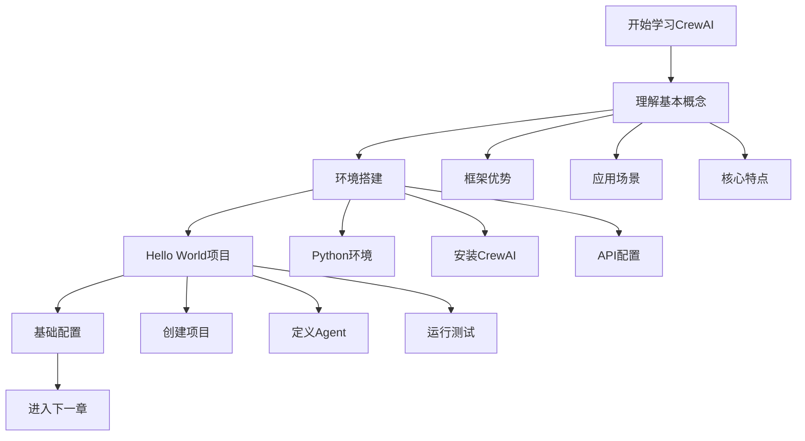
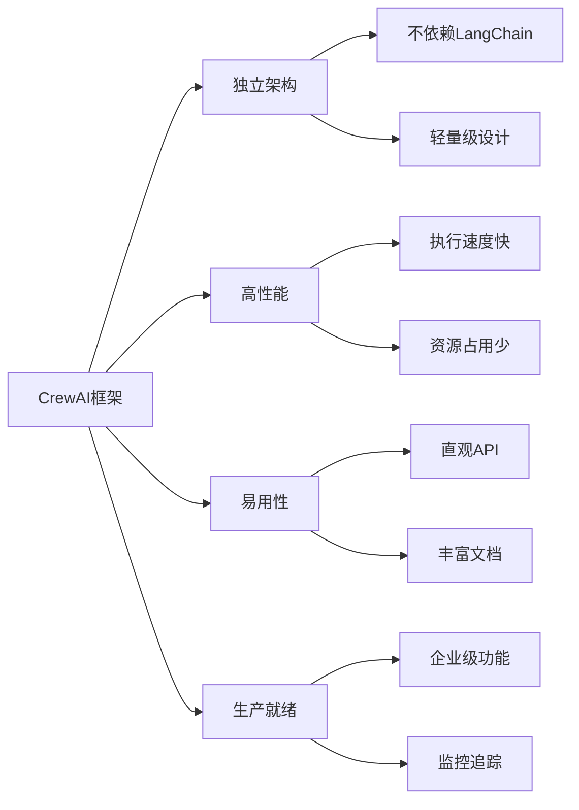
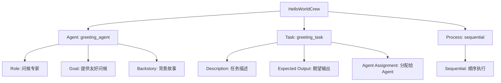
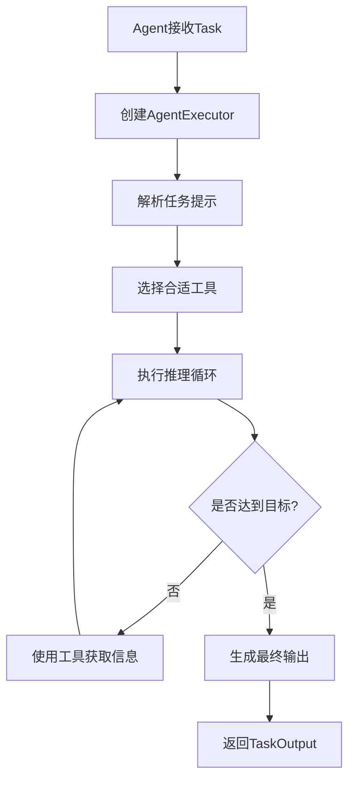
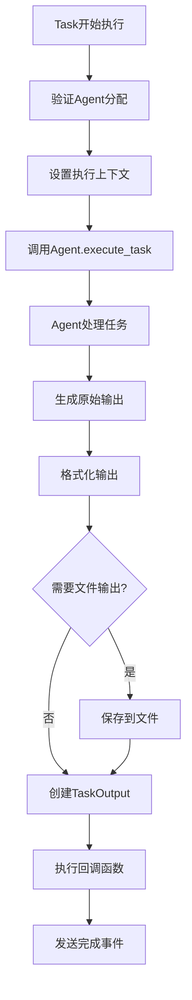
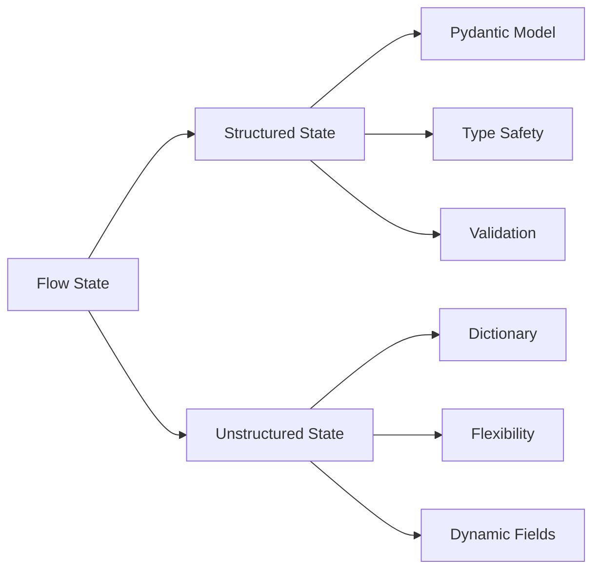
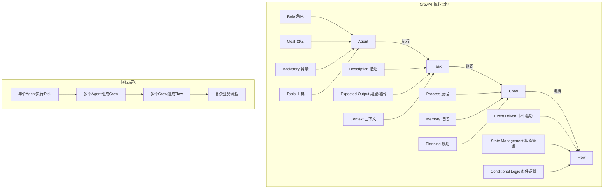

# 第1章：CrewAI框架概述与环境搭建

> CrewAI多智能体框架入门指南 - 从零开始掌握多智能体协作开发

## 📚 完整学习指南目录

- **[第1章：CrewAI框架概述与环境搭建](./第1章-CrewAI框架概述与环境搭建.md)** ← 当前章节
- [第2章：核心概念详解](./第2章-核心概念详解.md)
- [第3章：创建第一个智能体项目](./第3章-创建第一个智能体项目.md)
- [第4章：多智能体协作实战](./第4章-多智能体协作实战.md)
- [第5章：工具集成与自定义开发](./第5章-工具集成与自定义开发.md)
- [第6章：Flow工作流高级应用](./第6章-Flow工作流高级应用.md)
- [第7章：企业级功能与最佳实践](./第7章-企业级功能与最佳实践.md)
- [第8章：常见问题与调试技巧](./第8章-常见问题与调试技巧.md)

---

## 🎯 本章学习目标

- 理解CrewAI框架的核心价值和应用场景
- 掌握开发环境的搭建和配置
- 创建并运行第一个Hello World项目
- 建立对多智能体协作的基础认知

---

## 学习路径图



---

## 第1章：CrewAI框架概述与环境搭建

### 1.1 什么是CrewAI？

CrewAI是一个**独立构建的Python多智能体自动化框架**，专门用于编排角色扮演的自主AI智能体。它的核心理念是让多个AI智能体像人类团队一样协作，通过角色分工和任务协调来解决复杂问题。

#### 核心特点



#### 适用场景

- **内容创作团队**：研究员 + 写作者 + 编辑者
- **数据分析流水线**：数据收集 + 分析处理 + 报告生成
- **客户服务自动化**：问题分类 + 解决方案 + 回复优化
- **市场研究项目**：信息搜集 + 竞品分析 + 策略建议

### 1.2 框架优势分析

#### 🚀 技术优势

**1. 独立性与性能**
- 完全独立构建，不依赖LangChain等其他框架
- 在某些测试中比LangGraph快**5.76倍**
- 轻量级设计，资源占用更少

**2. 灵活性与控制**
- 支持高级简单配置和低级精细控制
- 可自定义Agent内部提示和行为逻辑
- 支持YAML配置和纯代码两种定义方式

**3. 生产就绪**
- 内置监控、追踪、安全功能
- 支持本地和云端部署
- 企业级功能完善

#### ⚖️ 对比分析

| 特性 | CrewAI | LangGraph | AutoGen |
|------|--------|-----------|---------|
| 独立性 | ✅ 完全独立 | ❌ 依赖LangChain | ✅ 相对独立 |
| 性能 | ✅ 高性能 | ⚠️ 中等 | ⚠️ 中等 |
| 易用性 | ✅ 直观API | ❌ 复杂配置 | ⚠️ 中等 |
| 流程控制 | ✅ 内置Process | ✅ 图结构 | ❌ 需额外编程 |
| 企业功能 | ✅ 完善 | ⚠️ 基础 | ⚠️ 基础 |

### 1.3 环境搭建

#### 系统要求

- **Python版本**：>=3.10, <3.14
- **操作系统**：Windows、macOS、Linux
- **内存**：建议4GB以上
- **网络**：需要访问LLM API（如OpenAI）

#### 安装步骤

**步骤1：安装CrewAI核心包**

```bash
# 基础安装
pip install crewai

# 包含工具的完整安装（推荐）
pip install 'crewai[tools]'
```

**步骤2：验证安装**

```bash
# 检查版本
crewai version

# 查看可用命令
crewai --help
```

**步骤3：安装可选依赖**

```bash
# 如果需要嵌入功能
pip install 'crewai[embeddings]'

# 如果需要AgentOps监控
pip install 'crewai[agentops]'

# 如果需要PDF处理
pip install 'crewai[pdfplumber]'
```

#### 常见安装问题

**问题1：ModuleNotFoundError: No module named 'tiktoken'**
```bash
# 解决方案
pip install 'crewai[embeddings]'
```

**问题2：Failed building wheel for tiktoken**
```bash
# 确保Rust编译器已安装，或使用预构建版本
pip install tiktoken --prefer-binary
```

### 1.4 基础配置

#### 环境变量配置

创建`.env`文件来存储API密钥和配置：

```bash
# .env 文件示例
OPENAI_API_KEY=sk-your-openai-api-key-here
SERPER_API_KEY=your-serper-dev-api-key-here

# 可选配置
MODEL=gpt-4o-mini
TEMPERATURE=0.7
MAX_TOKENS=2000
```

#### 项目结构

使用CLI创建标准项目结构：

```bash
# 创建新的Crew项目
crewai create crew my_first_crew
cd my_first_crew
```

生成的项目结构：
```
my_first_crew/
├── .env                    # 环境变量
├── .gitignore             # Git忽略文件
├── pyproject.toml         # 项目配置
├── README.md              # 项目说明
└── src/
    └── my_first_crew/
        ├── __init__.py
        ├── main.py        # 主入口
        ├── crew.py        # Crew定义
        ├── tools/         # 自定义工具
        │   ├── __init__.py
        │   └── custom_tool.py
        └── config/        # 配置文件
            ├── agents.yaml # Agent配置
            └── tasks.yaml  # Task配置
```

### 1.5 第一个Hello World示例

让我们创建一个简单的CrewAI项目来理解基本概念。

#### 创建项目

```bash
crewai create crew hello_world_crew
cd hello_world_crew
```

#### 配置环境变量

编辑`.env`文件：
```bash
OPENAI_API_KEY=your-openai-api-key-here
```

#### 定义Agent配置

编辑`src/hello_world_crew/config/agents.yaml`：

```yaml
# config/agents.yaml
greeting_agent:
  role: >
    友好的问候专家
  goal: >
    为用户提供温暖友好的问候
  backstory: >
    你是一个充满活力的问候专家，总是能够用最合适的方式
    向不同的人打招呼，让每个人都感到受欢迎。
```

#### 定义Task配置

编辑`src/hello_world_crew/config/tasks.yaml`：

```yaml
# config/tasks.yaml
greeting_task:
  description: >
    为用户 {user_name} 创建一个个性化的问候消息。
    问候应该友好、温暖，并且适合当前的时间。
  expected_output: >
    一条个性化的问候消息，包含用户姓名和适当的问候语。
  agent: greeting_agent
```

#### 实现Crew逻辑

编辑`src/hello_world_crew/crew.py`：

```python
# crew.py
from crewai import Agent, Crew, Process, Task
from crewai.project import CrewBase, agent, crew, task

@CrewBase
class HelloWorldCrew():
    """HelloWorld crew"""

    agents_config = 'config/agents.yaml'
    tasks_config = 'config/tasks.yaml'

    @agent
    def greeting_agent(self) -> Agent:
        return Agent(
            config=self.agents_config['greeting_agent'],
            verbose=True
        )

    @task
    def greeting_task(self) -> Task:
        return Task(
            config=self.tasks_config['greeting_task']
        )

    @crew
    def crew(self) -> Crew:
        """创建HelloWorld crew"""
        return Crew(
            agents=self.agents,  # 自动从@agent装饰器创建
            tasks=self.tasks,    # 自动从@task装饰器创建
            process=Process.sequential,
            verbose=True,
        )
```

#### 主程序入口

编辑`src/hello_world_crew/main.py`：

```python
#!/usr/bin/env python
# main.py
import sys
from hello_world_crew.crew import HelloWorldCrew

def run():
    """运行crew"""
    inputs = {
        'user_name': '小明'
    }

    result = HelloWorldCrew().crew().kickoff(inputs=inputs)
    print(f"\n🎉 结果: {result.raw}")

if __name__ == "__main__":
    run()
```

#### 运行项目

```bash
# 安装依赖（可选）
crewai install

# 运行项目
crewai run
# 或者
python src/hello_world_crew/main.py
```

#### 预期输出

```
🎉 结果: 你好，小明！欢迎来到CrewAI的世界！
希望你今天过得愉快，学习CrewAI的旅程充满乐趣！
```

### 1.6 理解基本概念

通过这个Hello World示例，我们接触了CrewAI的核心概念：



**关键要点：**
1. **Agent**：具有角色、目标和背景的智能体
2. **Task**：具体的工作任务，分配给特定Agent
3. **Crew**：Agent和Task的组合，定义协作方式
4. **Process**：定义任务执行顺序（Sequential/Hierarchical）

### 1.7 本章小结

在本章中，我们：

✅ 了解了CrewAI框架的核心特点和优势
✅ 完成了开发环境的搭建和配置
✅ 创建了第一个Hello World项目
✅ 理解了Agent、Task、Crew的基本概念

**下一步：** 在第2章中，我们将深入探讨CrewAI的四大核心概念，并通过源码分析来理解其内部工作机制。

### 1.8 实践练习

**练习1：修改问候语**
- 修改`agents.yaml`中的角色描述
- 让Agent用不同的语言风格问候（正式/非正式/幽默）

**练习2：添加时间感知**
- 在Task中添加当前时间信息
- 让问候语根据时间（早上/下午/晚上）变化

**练习3：多语言支持**
- 添加语言参数到inputs
- 让Agent用指定语言问候用户

---

## 第2章：核心概念详解

CrewAI框架的核心由四个主要概念组成：Agent（智能体）、Task（任务）、Crew（团队）和Flow（工作流）。理解这些概念及其相互关系是掌握CrewAI的关键。

### 2.1 Agent（智能体）

Agent是CrewAI中的核心执行单元，就像团队中的一个专业成员。每个Agent都有自己的角色、目标和背景故事，能够使用特定的工具来完成任务。

#### 2.1.1 Agent的核心属性

基于源码分析，Agent的关键属性包括：

```python
# 基于 src/crewai/agent.py 的核心属性
class Agent(BaseAgent):
    role: str           # 角色定义
    goal: str           # 目标描述
    backstory: str      # 背景故事
    tools: List[BaseTool]  # 可用工具
    llm: Any           # 语言模型
    verbose: bool      # 详细输出
    max_iter: int      # 最大迭代次数
    allow_delegation: bool  # 是否允许委派
```

#### 2.1.2 Agent的工作机制



#### 2.1.3 Agent源码深度解析

让我们看看Agent如何执行任务的核心代码：

<augment_code_snippet path="src/crewai/agent.py" mode="EXCERPT">
```python
def execute_task(
    self,
    task: Task,
    context: Optional[str] = None,
    tools: Optional[List[BaseTool]] = None,
) -> str:
    """Execute a task with the agent."""
    # 创建任务提示
    task_prompt = task.prompt()

    # 创建Agent执行器
    if self.agent_executor is None:
        self.create_agent_executor(tools)

    # 执行任务（支持超时控制）
    if self.max_execution_time is not None:
        result = self._execute_with_timeout(task_prompt, task, self.max_execution_time)
    else:
        result = self._execute_without_timeout(task_prompt, task)

    return result
```
</augment_code_snippet>

#### 2.1.4 Agent配置示例

**YAML配置方式：**
```yaml
# config/agents.yaml
researcher:
  role: >
    高级数据研究员
  goal: >
    发现和分析最新的市场趋势数据
  backstory: >
    你是一位经验丰富的数据研究员，擅长从各种数据源中
    提取有价值的洞察，并能够识别重要的市场模式。
  tools:
    - search_tool
    - data_analysis_tool
  verbose: true
  max_iter: 25
```

**Python代码方式：**
```python
from crewai import Agent
from crewai_tools import SerperDevTool

researcher = Agent(
    role="高级数据研究员",
    goal="发现和分析最新的市场趋势数据",
    backstory="""你是一位经验丰富的数据研究员，擅长从各种数据源中
    提取有价值的洞察，并能够识别重要的市场模式。""",
    tools=[SerperDevTool()],
    verbose=True,
    max_iter=25,
    allow_delegation=False
)
```

### 2.2 Task（任务）

Task代表需要完成的具体工作，它定义了要做什么、期望什么样的输出，以及由哪个Agent来执行。

#### 2.2.1 Task的核心属性

<augment_code_snippet path="src/crewai/task.py" mode="EXCERPT">
```python
class Task(BaseModel):
    description: str        # 任务描述
    expected_output: str    # 期望输出
    agent: Optional[BaseAgent]  # 执行Agent
    context: List["Task"]   # 上下文任务
    tools: List[BaseTool]   # 专用工具
    output_file: Optional[str]  # 输出文件
    callback: Optional[Any]     # 回调函数
    async_execution: bool   # 异步执行
```
</augment_code_snippet>

#### 2.2.2 Task执行流程



#### 2.2.3 Task执行机制源码分析

<augment_code_snippet path="src/crewai/task.py" mode="EXCERPT">
```python
def _execute_core(
    self,
    agent: Optional[BaseAgent],
    context: Optional[str],
    tools: Optional[List[Any]],
) -> TaskOutput:
    """运行任务的核心执行逻辑"""
    agent = agent or self.agent
    if not agent:
        raise Exception(f"任务 '{self.description}' 没有分配Agent")

    # 记录开始时间
    self.start_time = datetime.datetime.now()

    # 执行任务
    result = agent.execute_task(task=self, context=context, tools=tools)

    # 处理输出格式
    pydantic_output, json_output = self._export_output(result)

    # 创建任务输出对象
    task_output = TaskOutput(
        description=self.description,
        raw=result,
        pydantic=pydantic_output,
        json_dict=json_output,
        agent=agent.role
    )

    return task_output
```
</augment_code_snippet>

#### 2.2.4 Task配置示例

**YAML配置：**
```yaml
# config/tasks.yaml
research_task:
  description: >
    研究 {topic} 领域的最新发展趋势，收集相关数据和案例。
    重点关注技术创新、市场动态和竞争格局。
  expected_output: >
    一份包含以下内容的详细报告：
    1. 行业概况和发展趋势
    2. 关键技术创新点
    3. 主要竞争对手分析
    4. 市场机会和挑战
  agent: researcher
  tools:
    - search_tool
    - web_scraper
```

**Python代码：**
```python
from crewai import Task

research_task = Task(
    description="""研究 {topic} 领域的最新发展趋势，收集相关数据和案例。
    重点关注技术创新、市场动态和竞争格局。""",
    expected_output="""一份包含以下内容的详细报告：
    1. 行业概况和发展趋势
    2. 关键技术创新点
    3. 主要竞争对手分析
    4. 市场机会和挑战""",
    agent=researcher,
    output_file="research_report.md"
)
```

### 2.3 Crew（团队）

Crew是Agent和Task的组织者，定义了多个Agent如何协作完成一系列任务。它就像一个项目团队的管理框架。

#### 2.3.1 Crew的核心组件

```python
class Crew(BaseModel):
    agents: List[BaseAgent]     # 团队成员
    tasks: List[Task]          # 任务列表
    process: Process           # 执行流程
    verbose: bool              # 详细输出
    memory: bool               # 记忆功能
    planning: bool             # 规划功能
    manager_llm: Optional[Any] # 管理者LLM
```

#### 2.3.2 Crew执行流程

```mermaid
graph TD
    A[Crew.kickoff] --> B[验证配置]
    B --> C[初始化Agent]
    C --> D{选择执行流程}
    D -->|Sequential| E[顺序执行流程]
    D -->|Hierarchical| F[层级执行流程]
    E --> G[逐个执行Task]
    F --> H[Manager分配Task]
    G --> I[收集所有输出]
    H --> I
    I --> J[生成CrewOutput]

#### 2.3.3 Process类型详解

**Sequential Process（顺序流程）**
- 任务按顺序执行，前一个任务的输出作为后一个任务的上下文
- 适合有明确依赖关系的工作流
- 简单直观，易于理解和调试

**Hierarchical Process（层级流程）**
- 有一个Manager Agent负责任务分配和协调
- 支持更复杂的任务分解和并行执行
- 适合复杂项目管理场景

#### 2.3.4 Crew源码分析

<augment_code_snippet path="src/crewai/crew.py" mode="EXCERPT">
```python
def kickoff(self, inputs: Optional[Dict[str, Any]] = None) -> CrewOutput:
    """启动Crew执行"""
    # 前置回调处理
    for before_callback in self.before_kickoff_callbacks:
        if inputs is None:
            inputs = {}
        inputs = before_callback(inputs)

    # 插值处理输入
    if inputs is not None:
        self._inputs = inputs
        self._interpolate_inputs(inputs)

    # 根据流程类型执行
    if self.process == Process.sequential:
        result = self._run_sequential_process()
    elif self.process == Process.hierarchical:
        result = self._run_hierarchical_process()

    return result
```
</augment_code_snippet>

#### 2.3.5 Crew配置示例

```python
from crewai import Crew, Process

# 创建研究团队
research_crew = Crew(
    agents=[researcher, analyst, writer],
    tasks=[research_task, analysis_task, writing_task],
    process=Process.sequential,
    verbose=True,
    memory=True,
    planning=True
)

# 启动执行
result = research_crew.kickoff(inputs={"topic": "人工智能"})
```

### 2.4 Flow（工作流）

Flow是CrewAI的高级功能，用于构建复杂的事件驱动工作流。它提供了比Crew更精细的控制能力。

#### 2.4.1 Flow的核心特性

- **事件驱动**：基于装饰器的事件监听机制
- **状态管理**：支持结构化和非结构化状态
- **条件分支**：支持复杂的条件逻辑和路由
- **异步支持**：原生支持异步执行

#### 2.4.2 Flow装饰器系统

```python
from crewai.flow.flow import Flow, start, listen, router

class MyFlow(Flow):
    @start()
    def begin_flow(self):
        """流程起始点"""
        return "开始数据"

    @listen(begin_flow)
    def process_data(self, data):
        """监听begin_flow的输出"""
        return f"处理后的{data}"

    @router(process_data)
    def decide_next(self):
        """条件路由"""
        if self.state.get("condition"):
            return "path_a"
        return "path_b"

    @listen("path_a")
    def handle_path_a(self):
        """处理路径A"""
        pass
```

#### 2.4.3 Flow状态管理



**结构化状态示例：**
```python
from pydantic import BaseModel
from crewai.flow.flow import Flow

class MyState(BaseModel):
    counter: int = 0
    message: str = ""
    data: List[str] = []

class StructuredFlow(Flow[MyState]):
    @start()
    def initialize(self):
        self.state.counter = 1
        self.state.message = "开始处理"
```

**非结构化状态示例：**
```python
class UnstructuredFlow(Flow):
    @start()
    def initialize(self):
        self.state["counter"] = 1
        self.state["message"] = "开始处理"
        self.state["dynamic_field"] = "任意数据"
```

#### 2.4.4 Flow与Crew的集成

Flow可以将多个Crew组合在一起，实现更复杂的工作流：

```python
from crewai.flow.flow import Flow, start, listen

class MultiCrewFlow(Flow):
    @start()
    def research_phase(self):
        """研究阶段"""
        research_crew = Crew(agents=[researcher], tasks=[research_task])
        result = research_crew.kickoff()
        return result

    @listen(research_phase)
    def analysis_phase(self, research_result):
        """分析阶段"""
        analysis_crew = Crew(agents=[analyst], tasks=[analysis_task])
        result = analysis_crew.kickoff(inputs={"research_data": research_result.raw})
        return result

    @listen(analysis_phase)
    def writing_phase(self, analysis_result):
        """写作阶段"""
        writing_crew = Crew(agents=[writer], tasks=[writing_task])
        result = writing_crew.kickoff(inputs={"analysis_data": analysis_result.raw})
        return result
```

### 2.5 概念关系图



### 2.6 核心概念对比

| 概念 | 作用域 | 复杂度 | 适用场景 |
|------|--------|--------|----------|
| **Agent** | 单一角色 | 简单 | 专门技能任务 |
| **Task** | 单一任务 | 简单 | 具体工作项 |
| **Crew** | 团队协作 | 中等 | 多步骤项目 |
| **Flow** | 工作流程 | 复杂 | 企业级自动化 |

### 2.7 最佳实践建议

#### Agent设计原则
1. **角色明确**：每个Agent应该有清晰的专业领域
2. **目标具体**：目标描述要具体可衡量
3. **背景丰富**：详细的背景故事有助于更好的角色扮演
4. **工具匹配**：为Agent配备与其角色相符的工具

#### Task设计原则
1. **描述清晰**：任务描述要详细明确，避免歧义
2. **输出明确**：期望输出要具体，包含格式要求
3. **上下文合理**：合理设置任务间的依赖关系
4. **可验证性**：输出结果应该是可验证的

#### Crew组织原则
1. **角色互补**：团队成员技能应该互补
2. **流程合理**：选择合适的执行流程
3. **规模适中**：避免团队过大导致协调困难
4. **目标一致**：所有成员应该朝着共同目标努力

#### Flow设计原则
1. **事件清晰**：事件触发条件要明确
2. **状态一致**：保持状态管理的一致性
3. **错误处理**：考虑异常情况的处理
4. **性能优化**：合理使用异步执行

### 2.8 本章小结

在本章中，我们深入探讨了CrewAI的四大核心概念：

✅ **Agent**：具有角色、目标和工具的智能执行单元
✅ **Task**：定义具体工作内容和期望输出的任务单元
✅ **Crew**：组织Agent协作完成任务的团队框架
✅ **Flow**：构建复杂事件驱动工作流的高级功能

通过源码分析和实际示例，我们理解了这些概念的内部工作机制和相互关系。这为后续的实践应用奠定了坚实的理论基础。

**下一步：** 在第3章中，我们将动手创建第一个完整的CrewAI项目，将这些理论知识付诸实践。
```

---

## 第3章：创建第一个智能体项目

### 3.1 项目结构设计

### 3.2 定义Agent

### 3.3 创建Task

### 3.4 组建Crew

### 3.5 运行和测试

---

## 第4章：多智能体协作实战

### 4.1 Sequential流程实战

### 4.2 Hierarchical流程实战

### 4.3 Agent间通信机制

### 4.4 协作模式最佳实践

---

## 第5章：工具集成与自定义开发

### 5.1 内置工具介绍

### 5.2 第三方工具集成

### 5.3 自定义工具开发

### 5.4 工具使用最佳实践

---

## 第6章：Flow工作流高级应用

### 6.1 Flow基础概念

### 6.2 事件驱动架构

### 6.3 条件分支与路由

### 6.4 状态管理

### 6.5 复杂工作流设计

---

## 第7章：企业级功能与最佳实践

### 7.1 监控与观测

### 7.2 持久化存储

### 7.3 安全与权限

### 7.4 性能优化

### 7.5 部署策略

---

## 第8章：常见问题与调试技巧

### 8.1 常见错误及解决方案

### 8.2 调试工具和技巧

### 8.3 性能调优

### 8.4 故障排查

---

## 📖 学习建议

### 适合人群
- Python开发者
- AI/ML工程师
- 对多智能体系统感兴趣的开发者
- 企业自动化解决方案开发者

### 前置知识
- Python基础编程
- 基本的AI/LLM概念
- 异步编程基础（可选）

### 学习方式
1. **理论学习**：先理解概念，再看代码
2. **动手实践**：每章都有实践练习
3. **循序渐进**：按章节顺序学习
4. **项目驱动**：通过实际项目巩固知识

---

## 🔗 相关资源

- [CrewAI官方文档](https://docs.crewai.com)
- [CrewAI GitHub仓库](https://github.com/crewAIInc/crewAI)
- [CrewAI示例项目](https://github.com/crewAIInc/crewAI-examples)
- [CrewAI社区论坛](https://community.crewai.com)

---

## 📝 版本信息

- **文档版本**：v1.0
- **CrewAI版本**：基于最新源码分析
- **更新日期**：2025年6月
- **作者**：AI助手基于源码分析生成

---

*本指南将持续更新，确保与CrewAI框架的最新发展保持同步。*
