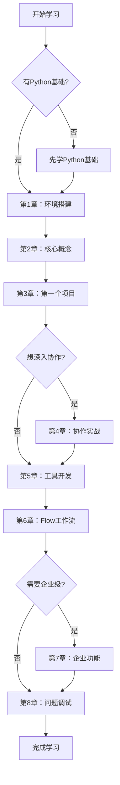

# CrewAI 多智能体框架学习指南

> 一份完整的CrewAI框架学习指南，从基础概念到企业级应用，助你掌握多智能体协作开发

## 📚 学习指南结构

### 📖 章节目录

| 章节 | 标题 | 主要内容 | 学习时长 |
|------|------|----------|----------|
| [第1章](./第1章-CrewAI框架概述与环境搭建.md) | CrewAI框架概述与环境搭建 | 框架介绍、优势分析、环境搭建 | 2-3小时 |
| [第2章](./第2章-核心概念详解.md) | 核心概念详解 | Agent、Task、Crew、Flow深度解析 | 3-4小时 |
| [第3章](./第3章-创建第一个智能体项目.md) | 创建第一个智能体项目 | 从零开始的完整项目实战 | 2-3小时 |
| [第4章](./第4章-多智能体协作实战.md) | 多智能体协作实战 | Sequential和Hierarchical流程 | 4-5小时 |
| [第5章](./第5章-工具集成与自定义开发.md) | 工具集成与自定义开发 | 内置工具、第三方集成、自定义工具 | 3-4小时 |
| [第6章](./第6章-Flow工作流高级应用.md) | Flow工作流高级应用 | 事件驱动、条件分支、状态管理 | 4-5小时 |
| [第7章](./第7章-企业级功能与最佳实践.md) | 企业级功能与最佳实践 | 监控、持久化、安全、部署 | 3-4小时 |
| [第8章](./第8章-常见问题与调试技巧.md) | 常见问题与调试技巧 | 故障排查、性能优化、最佳实践 | 2-3小时 |

**总学习时长：约23-31小时**

---

## 🎯 学习目标

### 初级目标（第1-3章）
- ✅ 理解CrewAI框架的核心概念
- ✅ 掌握基本的Agent、Task、Crew使用
- ✅ 能够创建简单的多智能体项目

### 中级目标（第4-6章）
- ✅ 掌握复杂的多智能体协作模式
- ✅ 熟练使用各种工具和自定义开发
- ✅ 理解和应用Flow工作流

### 高级目标（第7-8章）
- ✅ 具备企业级项目开发能力
- ✅ 掌握性能优化和故障排查
- ✅ 能够设计和实施生产级解决方案

---

## 🛤️ 学习路径



---

## 📋 前置知识要求

### 必需技能
- **Python编程**：基础语法、面向对象、异步编程
- **命令行操作**：基本的终端/命令行使用
- **API概念**：了解REST API和API密钥使用

### 推荐技能
- **AI/LLM基础**：了解大语言模型的基本概念
- **YAML配置**：熟悉YAML文件格式
- **Git版本控制**：基本的Git操作

### 开发环境
- **Python版本**：3.10 - 3.13
- **操作系统**：Windows、macOS、Linux
- **IDE推荐**：VS Code、PyCharm
- **内存要求**：建议8GB以上

---

## 🔧 学习准备

### 1. 环境检查
```bash
# 检查Python版本
python --version

# 检查pip版本
pip --version
```

### 2. 创建学习目录
```bash
mkdir crewai-learning
cd crewai-learning
```

### 3. 准备API密钥
- OpenAI API Key（必需）
- Serper.dev API Key（搜索功能）
- 其他第三方服务API（可选）

---

## 📚 学习资源

### 官方资源
- [CrewAI官方文档](https://docs.crewai.com)
- [CrewAI GitHub仓库](https://github.com/crewAIInc/crewAI)
- [CrewAI示例项目](https://github.com/crewAIInc/crewAI-examples)

### 社区资源
- [CrewAI社区论坛](https://community.crewai.com)
- [CrewAI Discord](https://discord.gg/crewai)
- [学习课程](https://learn.crewai.com)

### 相关工具
- [CrewAI Tools](https://github.com/crewAIInc/crewAI-tools)
- [LangChain](https://langchain.com)（参考对比）
- [LiteLLM](https://litellm.ai)（LLM集成）

---

## 🎓 学习方式建议

### 理论学习
1. **先读概念**：每章先理解理论概念
2. **看源码分析**：理解内部实现机制
3. **对比学习**：与其他框架对比理解

### 实践练习
1. **跟随示例**：完整跟随每个代码示例
2. **修改实验**：在示例基础上进行修改实验
3. **独立项目**：每章结束后独立完成练习项目

### 进阶应用
1. **组合应用**：将多章知识组合应用
2. **实际项目**：应用到实际业务场景
3. **社区贡献**：参与开源项目贡献

---

## ✅ 学习检查清单

### 第1章完成标志
- [ ] 成功安装CrewAI
- [ ] 运行Hello World示例
- [ ] 理解基本概念

### 第2章完成标志
- [ ] 理解四大核心概念
- [ ] 能够解释Agent工作机制
- [ ] 掌握配置方法

### 第3章完成标志
- [ ] 独立创建完整项目
- [ ] 成功运行多Agent协作
- [ ] 理解项目结构

### 第4章完成标志
- [ ] 掌握Sequential流程
- [ ] 理解Hierarchical流程
- [ ] 能够选择合适的协作模式

### 第5章完成标志
- [ ] 使用多种内置工具
- [ ] 集成第三方工具
- [ ] 开发自定义工具

### 第6章完成标志
- [ ] 创建Flow工作流
- [ ] 实现条件分支
- [ ] 管理复杂状态

### 第7章完成标志
- [ ] 配置监控系统
- [ ] 实现持久化存储
- [ ] 部署生产环境

### 第8章完成标志
- [ ] 掌握调试技巧
- [ ] 解决常见问题
- [ ] 优化性能表现

---

## 📞 获取帮助

### 遇到问题时
1. **查看文档**：先查阅相关章节和官方文档
2. **搜索社区**：在社区论坛搜索类似问题
3. **提问求助**：在社区或GitHub提出具体问题
4. **实验调试**：通过实验和调试理解问题

### 学习交流
- 加入CrewAI社区讨论
- 分享学习心得和项目
- 参与开源贡献
- 帮助其他学习者

---

## 📝 版本信息

- **指南版本**：v1.0
- **CrewAI版本**：基于最新源码（v0.130.0+）
- **更新日期**：2025年6月
- **维护状态**：持续更新

---

**开始你的CrewAI学习之旅吧！** 🚀

从 [第1章：CrewAI框架概述与环境搭建](./第1章-CrewAI框架概述与环境搭建.md) 开始。
