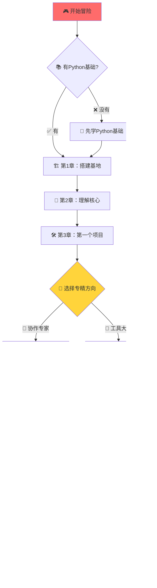

# CrewAI学习指南 - 概述

> 🎯 欢迎来到CrewAI多智能体框架的学习世界！这里将带你从零开始，掌握最前沿的AI协作技术。

## 🌟 什么是CrewAI？

CrewAI是一个**独立构建的Python多智能体自动化框架**，专门用于编排角色扮演的自主AI智能体。想象一下，你可以创建一个AI团队，每个成员都有自己的专业技能，他们能够像人类团队一样协作，共同解决复杂问题。

### 🎮 为什么学习CrewAI如同打游戏？

学习CrewAI就像在玩一个策略游戏：

- **🏗️ 建造阶段**：设计你的AI智能体，就像招募不同职业的角色
- **⚔️ 战斗阶段**：让智能体们协作执行任务，观看他们的精彩表现
- **📈 升级阶段**：优化协作策略，解锁更强大的功能
- **🏆 成就系统**：从简单项目到企业级应用，不断挑战新高度

## 🚀 框架核心优势

### ⚡ 性能卓越
- **独立架构**：完全独立构建，不依赖LangChain等其他框架
- **超高性能**：在某些测试中比LangGraph快**5.76倍**
- **轻量设计**：资源占用少，运行效率高

### 🎯 易用性强
- **直观API**：简洁明了的编程接口
- **双重配置**：支持YAML配置和纯代码两种方式
- **丰富文档**：完善的学习资源和社区支持

### 🏢 生产就绪
- **企业级功能**：内置监控、追踪、安全功能
- **灵活部署**：支持本地和云端部署
- **社区认证**：超过10万开发者通过社区课程认证

## 📚 学习指南特色

### 🎪 游戏化学习体验
- **轻松有趣**：用游戏化的方式讲解复杂概念
- **循序渐进**：从新手村到终极Boss，步步进阶
- **成就感满满**：每章都有实际可运行的项目成果

### 🔍 深度源码分析
- **内部机制**：深入理解CrewAI的工作原理
- **实际代码**：基于真实源码进行详细解释
- **最佳实践**：总结企业级开发经验

### 📊 可视化学习
- **Mermaid图表**：用图表展示概念关系和流程
- **架构图解**：清晰展示系统架构和数据流
- **交互演示**：通过实例理解抽象概念

## 🎯 学习目标设定

### 🥉 初级目标（第1-3章）
完成后你将能够：
- ✅ 理解CrewAI框架的核心概念和优势
- ✅ 熟练搭建开发环境和项目结构
- ✅ 创建基本的Agent、Task、Crew组合
- ✅ 运行简单的多智能体协作项目

### 🥈 中级目标（第4-6章）
完成后你将能够：
- ✅ 掌握Sequential和Hierarchical协作模式
- ✅ 集成和开发各种工具扩展智能体能力
- ✅ 设计复杂的Flow工作流程
- ✅ 处理事件驱动和条件分支逻辑

### 🥇 高级目标（第7-8章）
完成后你将能够：
- ✅ 构建企业级的AI自动化系统
- ✅ 实现监控、安全、部署等生产功能
- ✅ 独立解决复杂问题和性能优化
- ✅ 设计和实施大规模AI协作解决方案

## 🛤️ 学习路径规划

## 📖 如何使用本指南

### 📋 学习准备清单
- [ ] **Python 3.10+** 环境
- [ ] **基础编程经验**（变量、函数、类）
- [ ] **API使用经验**（推荐，不是必需）
- [ ] **AI/LLM基础概念**（推荐了解）
- [ ] **学习时间**：每周5-10小时，共4-6周

### 🎯 学习方法建议

#### 🔄 三步学习法
1. **📖 理论学习**：先理解概念和原理
2. **💻 动手实践**：跟随代码示例操作
3. **🔧 独立练习**：完成章节末尾的练习题

#### 🎪 游戏化学习技巧
- **🏅 设定小目标**：每天完成一个小节
- **🎁 奖励机制**：完成练习后给自己小奖励
- **👥 组队学习**：找朋友一起学习讨论
- **📝 记录成长**：写学习笔记和心得

### 📊 学习进度追踪

每章学习完成后，检查以下标准：

#### ✅ 理论掌握
- 能够用自己的话解释核心概念
- 理解各组件之间的关系
- 知道何时使用哪种方法

#### ✅ 实践能力
- 能够独立编写相关代码
- 成功运行章节示例
- 完成练习题目

#### ✅ 应用思维
- 能够分析实际问题
- 设计合理的解决方案
- 具备调试和优化能力

## 🎨 文档阅读指南

### 📝 内容结构说明
- **🎯 章节目标**：明确学习重点
- **📋 知识大纲**：整体内容概览
- **🧠 概念讲解**：深入理论分析
- **💻 代码示例**：实际操作演示
- **🔍 源码分析**：内部机制解析
- **🎮 实践练习**：动手巩固知识
- **📚 本章小结**：知识点总结

### 🎨 特殊标记说明
- **🎮 游戏化比喻**：用游戏概念解释技术
- **⚠️ 重要提示**：需要特别注意的内容
- **💡 最佳实践**：推荐的做法和经验
- **🔧 调试技巧**：问题解决方法
- **🚀 进阶内容**：高级功能和优化

## 🤝 获取帮助和支持

### 📞 遇到问题时
1. **📖 查阅文档**：先查看相关章节和官方文档
2. **🔍 搜索社区**：在CrewAI社区论坛搜索类似问题
3. **💬 提问求助**：在社区或GitHub提出具体问题
4. **🧪 实验调试**：通过实验和调试理解问题

### 🌐 学习资源
- **官方文档**：[docs.crewai.com](https://docs.crewai.com)
- **GitHub仓库**：[github.com/crewAIInc/crewAI](https://github.com/crewAIInc/crewAI)
- **社区课程**：[learn.crewai.com](https://learn.crewai.com)
- **社区论坛**：[community.crewai.com](https://community.crewai.com)

## 🎉 开始你的CrewAI冒险

准备好了吗？让我们开始这场精彩的AI智能体开发之旅！

从 [第1章：CrewAI框架概述与环境搭建](./CrewAI学习指南-第1章.md) 开始你的冒险吧！

---

> 💡 **学习提示**：不要急于求成，享受学习过程中的每一个"啊哈"时刻。CrewAI的世界很精彩，慢慢探索会有更多收获！
