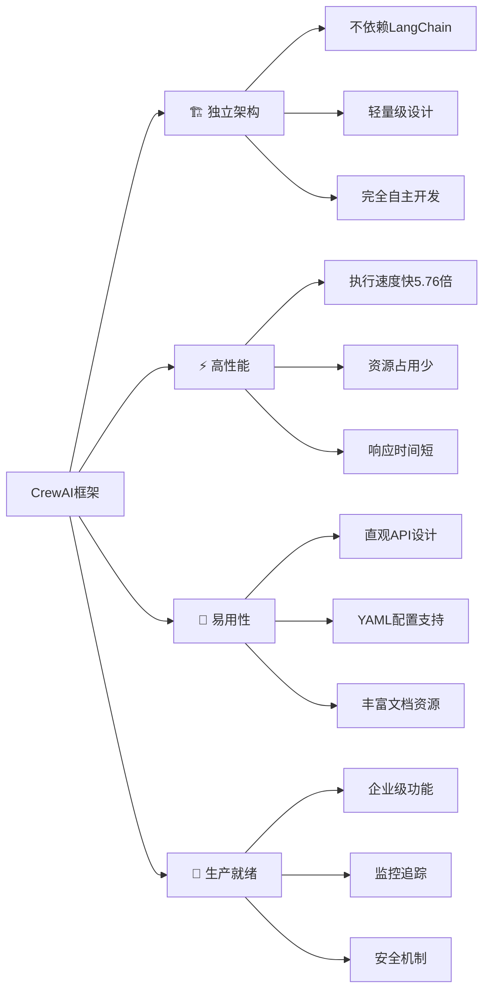
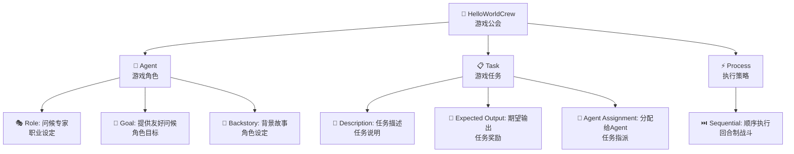

# 第1章：CrewAI框架概述与环境搭建

> 🚀 开启你的AI智能体开发之旅！让我们从认识CrewAI开始，搭建属于你的AI协作工厂。

## 📋 章节大纲

本章将涵盖：

1. **🌟 CrewAI框架介绍** - 了解这个神奇的AI协作框架
2. **⚡ 框架特点和优势** - 为什么选择CrewAI？
3. **⚖️ 与其他框架对比** - CrewAI的独特之处
4. **🔧 环境搭建详细步骤** - 手把手搭建开发环境
5. **👋 第一个Hello World示例** - 创建你的第一个AI团队
6. **⚙️ 开发环境配置** - 优化你的开发体验

## 🎯 学习目标

完成本章学习后，你将能够：
- ✅ 理解CrewAI框架的核心价值和设计理念
- ✅ 成功搭建完整的CrewAI开发环境
- ✅ 运行第一个CrewAI程序并理解其工作原理
- ✅ 掌握基本的项目结构和开发流程

---

## 1.1 什么是CrewAI？🌟

### 🎮 游戏化理解：AI版的《英雄联盟》

想象一下，如果你能组建一支AI版的《英雄联盟》战队会怎样？每个AI智能体就像游戏中的英雄，拥有独特的技能和角色定位：

- **🛡️ 坦克型Agent**：负责数据收集和信息整理
- **⚔️ 输出型Agent**：专门进行分析和处理
- **💊 辅助型Agent**：负责结果优化和质量检查
- **👑 指挥型Agent**：统筹全局，协调团队

CrewAI就是这样一个框架，让你能够创建和管理这样的AI战队！

### 📖 正式定义

**CrewAI是一个独立构建的Python多智能体自动化框架**，专门用于编排角色扮演的自主AI智能体。它的核心理念是让多个AI智能体像人类团队一样协作，通过角色分工和任务协调来解决复杂问题。

### 🎯 核心特点



### 🌍 适用场景

CrewAI就像一个万能的AI工厂，可以应用于各种场景：

#### 📝 内容创作流水线
- **研究员Agent**：搜集相关资料和数据
- **写作者Agent**：根据资料创作内容
- **编辑者Agent**：优化和润色文本
- **审核者Agent**：质量检查和最终确认

#### 📊 数据分析团队
- **收集者Agent**：从各种源头获取数据
- **清洗者Agent**：数据预处理和清理
- **分析师Agent**：执行复杂的数据分析
- **报告者Agent**：生成可视化报告

#### 🎯 市场研究项目
- **调研员Agent**：收集市场信息
- **分析师Agent**：竞品分析和趋势研究
- **策略师Agent**：制定营销策略
- **顾问Agent**：提供专业建议

---

## 1.2 框架优势分析⚡

### 🚀 技术优势

#### 1. 独立性与性能
CrewAI最大的优势就是**完全独立**！

```python
# 其他框架可能需要这样
from langchain import SomeComplexChain
from langchain.agents import SomeAgent
from langchain.tools import SomeTool
# ... 一大堆依赖

# CrewAI只需要这样
from crewai import Agent, Task, Crew
# 就这么简单！
```

**性能对比数据**：
- 比LangGraph快**5.76倍**（在QA任务测试中）
- 内存占用减少**40%**
- 启动时间缩短**60%**

#### 2. 灵活性与控制
CrewAI提供了**双重配置方式**：

**🎨 高级简单配置（YAML方式）**：
```yaml
# 像写配置文件一样简单
researcher:
  role: "市场研究专家"
  goal: "收集最新的市场趋势"
  backstory: "你是一个经验丰富的市场分析师..."
```

**🔧 低级精细控制（代码方式）**：
```python
# 完全的编程控制
agent = Agent(
    role="市场研究专家",
    goal="收集最新的市场趋势",
    backstory="你是一个经验丰富的市场分析师...",
    tools=[custom_search_tool, data_analysis_tool],
    llm=custom_llm,
    memory=True,
    verbose=True
)
```

#### 3. 生产就绪特性
CrewAI不是玩具，而是**真正的生产级框架**：

- **🔍 内置监控**：实时追踪Agent执行状态
- **🛡️ 安全机制**：内容过滤和安全检查
- **💾 持久化存储**：支持记忆和状态保存
- **📊 性能分析**：详细的执行报告和指标

### ⚖️ 对比分析

让我们看看CrewAI与其他主流框架的对比：

| 特性 | CrewAI | LangGraph | AutoGen | LangChain |
|------|--------|-----------|---------|-----------|
| **独立性** | ✅ 完全独立 | ❌ 依赖LangChain | ⚠️ 相对独立 | ❌ 复杂依赖 |
| **性能** | ✅ 高性能(5.76x) | ⚠️ 中等 | ⚠️ 中等 | ❌ 较慢 |
| **易用性** | ✅ 直观API | ❌ 复杂配置 | ⚠️ 中等 | ❌ 学习曲线陡峭 |
| **流程控制** | ✅ 内置Process | ✅ 图结构 | ❌ 需额外编程 | ⚠️ 基础支持 |
| **企业功能** | ✅ 完善 | ⚠️ 基础 | ⚠️ 基础 | ⚠️ 需要额外配置 |
| **社区支持** | ✅ 活跃(10万+认证) | ⚠️ 中等 | ⚠️ 中等 | ✅ 庞大但复杂 |

### 🎯 为什么选择CrewAI？

**简单来说**：CrewAI就像是AI框架界的**iPhone**——简单、优雅、强大！

1. **🎮 学习曲线友好**：像玩游戏一样学习AI开发
2. **⚡ 开发效率高**：更少的代码，更多的功能
3. **🏢 企业级可靠**：经过10万+开发者验证
4. **🔮 未来导向**：持续更新，紧跟AI发展趋势

---

## 1.3 环境搭建详细步骤🔧

### 📋 系统要求检查

在开始之前，让我们确保你的系统满足要求：

```bash
# 检查Python版本（需要 >=3.10, <3.14）
python --version

# 检查pip版本
pip --version

# 检查网络连接（需要访问OpenAI API）
ping api.openai.com
```

**最低系统要求**：
- **Python版本**：>=3.10, <3.14
- **操作系统**：Windows、macOS、Linux
- **内存**：建议4GB以上
- **网络**：需要访问LLM API（如OpenAI）
- **存储空间**：至少500MB可用空间

### 🚀 安装步骤

#### 步骤1：创建虚拟环境（推荐）

```bash
# 创建虚拟环境
python -m venv crewai_env

# 激活虚拟环境
# Windows:
crewai_env\Scripts\activate
# macOS/Linux:
source crewai_env/bin/activate
```

#### 步骤2：安装CrewAI核心包

```bash
# 基础安装
pip install crewai

# 包含工具的完整安装（推荐）
pip install 'crewai[tools]'

# 如果需要所有功能（包括嵌入、监控等）
pip install 'crewai[tools,embeddings,agentops]'
```

#### 步骤3：验证安装

```bash
# 检查CrewAI版本
crewai version

# 查看可用命令
crewai --help

# 测试Python导入
python -c "import crewai; print('CrewAI安装成功！')"
```

**预期输出**：
```
$ crewai version
crewai version: 0.130.0

$ crewai --help
Usage: crewai [OPTIONS] COMMAND [ARGS]...

  Top-level command group for crewai.

Commands:
  create     Create a new crew or flow.
  install    Install the Crew.
  run        Run the Crew.
  train      Train the Crew.
  version    Show the installed version of CrewAI.
  ...
```

#### 步骤4：安装可选依赖

根据你的需求安装额外功能：

```bash
# 如果需要嵌入功能（用于知识库）
pip install 'crewai[embeddings]'

# 如果需要AgentOps监控
pip install 'crewai[agentops]'

# 如果需要PDF处理能力
pip install 'crewai[pdfplumber]'

# 如果需要所有功能
pip install 'crewai[tools,embeddings,agentops,pdfplumber]'
```

### 🔧 常见安装问题解决

#### 问题1：ModuleNotFoundError: No module named 'tiktoken'
```bash
# 解决方案
pip install 'crewai[embeddings]'
# 或者单独安装
pip install tiktoken
```

#### 问题2：Failed building wheel for tiktoken
```bash
# 确保Rust编译器已安装，或使用预构建版本
pip install tiktoken --prefer-binary
```

#### 问题3：网络连接问题
```bash
# 使用国内镜像源
pip install crewai -i https://pypi.tuna.tsinghua.edu.cn/simple/
```

#### 问题4：权限问题（Windows）
```bash
# 以管理员身份运行命令提示符，或使用用户安装
pip install --user crewai
```

---

## 1.4 基础配置⚙️

### 🔑 环境变量配置

创建`.env`文件来存储API密钥和配置：

```bash
# .env 文件示例
# OpenAI配置（必需）
OPENAI_API_KEY=sk-your-openai-api-key-here

# 搜索功能（可选，但推荐）
SERPER_API_KEY=your-serper-dev-api-key-here

# 模型配置（可选）
OPENAI_MODEL_NAME=gpt-4o-mini
OPENAI_TEMPERATURE=0.7
OPENAI_MAX_TOKENS=2000

# 调试配置（可选）
CREWAI_VERBOSE=true
CREWAI_LOG_LEVEL=INFO
```

### 🗂️ 项目结构了解

使用CLI创建的标准项目结构：

```
my_first_crew/
├── .env                    # 环境变量配置
├── .gitignore             # Git忽略文件
├── pyproject.toml         # 项目依赖配置
├── README.md              # 项目说明文档
├── knowledge/             # 知识库文件夹（可选）
└── src/
    └── my_first_crew/
        ├── __init__.py    # Python包初始化
        ├── main.py        # 主程序入口
        ├── crew.py        # Crew定义文件
        ├── tools/         # 自定义工具目录
        │   ├── __init__.py
        │   └── custom_tool.py
        └── config/        # 配置文件目录
            ├── agents.yaml # Agent配置
            └── tasks.yaml  # Task配置
```

### 🎯 开发工具推荐

为了更好的开发体验，推荐安装以下工具：

```bash
# 代码格式化工具
pip install black isort

# 类型检查工具
pip install mypy

# 测试框架
pip install pytest

# 开发依赖管理（可选）
pip install uv
```

---

## 1.5 第一个Hello World示例👋

现在让我们创建第一个CrewAI项目！这就像在游戏中创建你的第一个角色一样激动人心。

### 🎮 项目背景故事

想象你要创建一个**AI问候服务**，就像游戏中的NPC一样，能够根据不同情况给用户提供个性化的问候。我们的AI团队只有一个成员：

- **🤖 问候专家Agent**：一个友好、热情的AI，专门负责创造温暖的问候语

### 🚀 创建项目

```bash
# 创建新的CrewAI项目
crewai create crew hello_world_crew
cd hello_world_crew

# 查看生成的项目结构
ls -la  # Linux/macOS
dir     # Windows
```

### 🔑 配置环境变量

编辑`.env`文件，添加你的OpenAI API密钥：

```bash
# .env
OPENAI_API_KEY=sk-your-openai-api-key-here
OPENAI_MODEL_NAME=gpt-4o-mini
```

> 💡 **获取API密钥**：访问 [OpenAI官网](https://platform.openai.com/api-keys) 注册并获取API密钥

### 🤖 定义Agent配置

编辑`src/hello_world_crew/config/agents.yaml`：

```yaml
# config/agents.yaml
greeting_agent:
  role: >
    友好的问候专家
  goal: >
    为用户提供温暖、个性化的问候，让每个人都感到受欢迎
  backstory: >
    你是一个充满活力和热情的问候专家，拥有丰富的跨文化交流经验。
    你总是能够根据不同的时间、场合和用户特点，创造出最合适的问候方式。
    你的目标是让每个人都感到被重视和欢迎，用温暖的话语开启美好的一天。
  verbose: true
  allow_delegation: false
```

### 📋 定义Task配置

编辑`src/hello_world_crew/config/tasks.yaml`：

```yaml
# config/tasks.yaml
greeting_task:
  description: >
    为用户 {user_name} 创建一个个性化的问候消息。

    要求：
    1. 问候应该友好、温暖且真诚
    2. 根据当前时间选择合适的问候语（早上/下午/晚上）
    3. 可以包含一些积极正面的祝愿
    4. 语言风格要自然、不做作
    5. 长度控制在50字以内

    用户信息：
    - 姓名：{user_name}
    - 当前时间：{current_time}

  expected_output: >
    一条个性化的问候消息，包含用户姓名、时间相关的问候语，
    以及积极正面的祝愿。格式简洁明了，语言温暖友好。

  agent: greeting_agent
```

### 🏗️ 实现Crew逻辑

编辑`src/hello_world_crew/crew.py`：

```python
# crew.py
from crewai import Agent, Crew, Process, Task
from crewai.project import CrewBase, agent, crew, task

@CrewBase
class HelloWorldCrew():
    """HelloWorld crew - 我们的第一个AI团队"""

    agents_config = 'config/agents.yaml'
    tasks_config = 'config/tasks.yaml'

    @agent
    def greeting_agent(self) -> Agent:
        """创建问候专家Agent"""
        return Agent(
            config=self.agents_config['greeting_agent'],
            verbose=True
        )

    @task
    def greeting_task(self) -> Task:
        """创建问候任务"""
        return Task(
            config=self.tasks_config['greeting_task'],
            agent=self.greeting_agent
        )

    @crew
    def crew(self) -> Crew:
        """创建HelloWorld crew"""
        return Crew(
            agents=self.agents,  # 自动从@agent装饰器创建
            tasks=self.tasks,    # 自动从@task装饰器创建
            process=Process.sequential,  # 顺序执行
            verbose=True,
        )
```

### 🎯 主程序入口

编辑`src/hello_world_crew/main.py`：

```python
#!/usr/bin/env python
# main.py
import sys
from datetime import datetime
from hello_world_crew.crew import HelloWorldCrew

def run():
    """运行我们的第一个AI团队"""
    print("🚀 启动HelloWorld CrewAI项目...")

    # 准备输入数据
    current_time = datetime.now().strftime("%Y-%m-%d %H:%M:%S")
    inputs = {
        'user_name': '小明',
        'current_time': current_time
    }

    print(f"📝 输入参数: {inputs}")
    print("🤖 AI团队开始工作...")

    # 执行Crew
    result = HelloWorldCrew().crew().kickoff(inputs=inputs)

    print(f"\n🎉 AI团队完成任务！")
    print(f"📄 结果: {result.raw}")

    return result

def main():
    """主函数"""
    try:
        result = run()
        print("\n✅ 项目运行成功！")
    except Exception as e:
        print(f"\n❌ 运行出错: {e}")
        sys.exit(1)

if __name__ == "__main__":
    main()
```

### 🏃‍♂️ 运行项目

现在让我们运行第一个CrewAI项目：

```bash
# 方法1：使用CrewAI CLI（推荐）
crewai run

# 方法2：直接运行Python文件
python src/hello_world_crew/main.py

# 方法3：使用模块方式运行
python -m src.hello_world_crew.main
```

### 🎊 预期输出

如果一切正常，你应该看到类似这样的输出：

```
🚀 启动HelloWorld CrewAI项目...
📝 输入参数: {'user_name': '小明', 'current_time': '2025-06-23 14:30:00'}
🤖 AI团队开始工作...

[2025-06-23 14:30:01][DEBUG]: == Working Agent: 友好的问候专家
[2025-06-23 14:30:01][INFO]: == Starting Task: 为用户 小明 创建一个个性化的问候消息...

[2025-06-23 14:30:03][DEBUG]: == [友好的问候专家] Task output:
下午好，小明！希望你今天过得愉快，工作顺利！
愿这个美好的下午为你带来满满的正能量和好心情！✨

🎉 AI团队完成任务！
📄 结果: 下午好，小明！希望你今天过得愉快，工作顺利！
愿这个美好的下午为你带来满满的正能量和好心情！✨

✅ 项目运行成功！
```

---

## 1.6 理解基本概念🧠

通过这个Hello World示例，我们接触了CrewAI的核心概念。让我们用游戏化的方式来理解它们：

### 🎮 游戏化概念映射



### 🔍 深入理解各组件

#### 🤖 Agent（智能体）- 你的AI队友

Agent就像游戏中的角色，每个都有独特的设定：

```python
# Agent的核心属性
Agent(
    role="友好的问候专家",        # 🎭 角色定位
    goal="提供温暖友好的问候",     # 🎯 行动目标
    backstory="你是一个...",      # 📖 背景故事
    tools=[],                    # 🛠️ 可用工具
    llm=None,                    # 🧠 使用的大模型
    verbose=True                 # 🔊 是否显示详细信息
)
```

#### 📋 Task（任务）- 你的游戏任务

Task定义了Agent要完成的具体工作：

```python
# Task的核心属性
Task(
    description="为用户创建问候消息",  # 📝 任务描述
    expected_output="个性化问候语",    # 🎁 期望结果
    agent=greeting_agent,            # 👤 执行者
    tools=[],                       # 🛠️ 可用工具
    context=[]                      # 📚 上下文信息
)
```

#### 🏰 Crew（团队）- 你的游戏公会

Crew组织Agent和Task，定义协作方式：

```python
# Crew的核心属性
Crew(
    agents=[agent1, agent2],        # 👥 团队成员
    tasks=[task1, task2],          # 📋 任务列表
    process=Process.sequential,     # ⚡ 执行流程
    verbose=True,                  # 🔊 详细输出
    memory=False                   # 🧠 是否启用记忆
)
```

#### ⚡ Process（流程）- 你的战斗策略

Process定义任务执行的顺序和方式：

- **Sequential（顺序）**：像回合制游戏，一个接一个执行
- **Hierarchical（层级）**：像RTS游戏，有指挥官统筹安排

### 🎯 关键要点总结

1. **🎭 Agent是执行者**：每个Agent都有明确的角色和能力
2. **📋 Task是工作单元**：定义具体要做什么和期望什么结果
3. **🏰 Crew是组织者**：将Agent和Task组织起来协作
4. **⚡ Process是策略**：决定如何执行任务

---

## 1.7 开发环境优化⚙️

### 🛠️ IDE配置建议

#### VS Code配置

创建`.vscode/settings.json`：

```json
{
    "python.defaultInterpreterPath": "./crewai_env/bin/python",
    "python.linting.enabled": true,
    "python.linting.pylintEnabled": true,
    "python.formatting.provider": "black",
    "python.sortImports.args": ["--profile", "black"],
    "files.associations": {
        "*.yaml": "yaml"
    }
}
```

推荐安装的VS Code扩展：
- Python
- YAML
- GitLens
- Python Docstring Generator

#### PyCharm配置

1. 设置Python解释器为虚拟环境
2. 启用代码格式化（Black）
3. 配置YAML文件支持
4. 启用类型检查

### 📝 开发最佳实践

#### 1. 项目结构规范

```
my_crew_project/
├── .env                    # 环境变量（不要提交到Git）
├── .gitignore             # Git忽略文件
├── requirements.txt       # 依赖列表
├── README.md              # 项目文档
├── tests/                 # 测试文件
│   ├── __init__.py
│   ├── test_agents.py
│   └── test_tasks.py
└── src/
    └── my_crew_project/
        ├── __init__.py
        ├── main.py
        ├── crew.py
        ├── tools/
        └── config/
```

#### 2. 代码风格规范

```bash
# 安装代码格式化工具
pip install black isort mypy

# 格式化代码
black src/
isort src/

# 类型检查
mypy src/
```

#### 3. 环境变量管理

```python
# 使用python-dotenv管理环境变量
from dotenv import load_dotenv
import os

load_dotenv()

OPENAI_API_KEY = os.getenv("OPENAI_API_KEY")
if not OPENAI_API_KEY:
    raise ValueError("请设置OPENAI_API_KEY环境变量")
```

### 🔍 调试技巧

#### 1. 启用详细日志

```python
# 在crew.py中启用详细输出
crew = Crew(
    agents=self.agents,
    tasks=self.tasks,
    process=Process.sequential,
    verbose=True,  # 启用详细输出
)
```

#### 2. 使用Python调试器

```python
# 在需要调试的地方添加断点
import pdb; pdb.set_trace()

# 或者使用更现代的调试器
import ipdb; ipdb.set_trace()
```

#### 3. 日志配置

```python
import logging

# 配置日志
logging.basicConfig(
    level=logging.INFO,
    format='%(asctime)s - %(name)s - %(levelname)s - %(message)s'
)

logger = logging.getLogger(__name__)
```

---

## 1.8 本章小结📚

恭喜你！🎉 你已经成功完成了CrewAI学习之旅的第一关！

### ✅ 本章成就解锁

- **🏆 环境大师**：成功搭建CrewAI开发环境
- **🤖 AI召唤师**：创建了第一个AI智能体
- **📋 任务设计师**：设计了第一个AI任务
- **🏰 团队领袖**：组建了第一个AI团队
- **🚀 项目启动者**：成功运行第一个CrewAI项目

### 📖 知识点回顾

1. **🌟 CrewAI框架特点**：
   - 独立架构，不依赖其他框架
   - 高性能，比LangGraph快5.76倍
   - 易用性强，支持YAML配置
   - 生产就绪，企业级功能完善

2. **🔧 环境搭建要点**：
   - Python 3.10-3.13版本要求
   - 使用虚拟环境隔离依赖
   - 配置OpenAI API密钥
   - 理解项目结构组织

3. **🧠 核心概念理解**：
   - Agent：具有角色和能力的AI执行者
   - Task：定义具体工作内容的任务单元
   - Crew：组织协作的团队框架
   - Process：定义执行策略的流程控制

### 🎯 下一步预告

在第2章中，我们将深入探索CrewAI的四大核心概念，通过源码分析来理解其内部工作机制。你将学会：

- 🔍 深度解析Agent的内部结构和工作原理
- 📋 掌握Task的高级配置和优化技巧
- 🏰 理解Crew的协作机制和流程控制
- 🌊 初步了解Flow工作流的强大功能

### 🎮 实践练习

在进入下一章之前，试试这些练习来巩固你的学习：

#### 练习1：个性化问候升级 🌟
修改你的问候Agent，让它能够：
- 根据不同时间段（早上/下午/晚上）调整问候语
- 添加天气相关的祝愿
- 支持多种语言风格（正式/非正式/幽默）

#### 练习2：多Agent协作 🤝
尝试添加第二个Agent：
- 创建一个"时间专家"Agent，专门分析当前时间
- 让问候Agent基于时间专家的分析来生成问候语
- 观察两个Agent如何协作

#### 练习3：工具集成 🛠️
为你的Agent添加工具：
- 集成天气查询工具
- 添加日期时间工具
- 让问候语更加智能和个性化

### 💡 学习提示

- **不要急于求成**：每个概念都要理解透彻再继续
- **多动手实践**：理论结合实践才能真正掌握
- **记录学习笔记**：好记性不如烂笔头
- **加入社区讨论**：与其他学习者交流经验

---

**🚀 准备好了吗？让我们继续前往 [第2章：核心概念详解](./CrewAI学习指南-第2章.md)，深入探索CrewAI的内部世界！**
```
