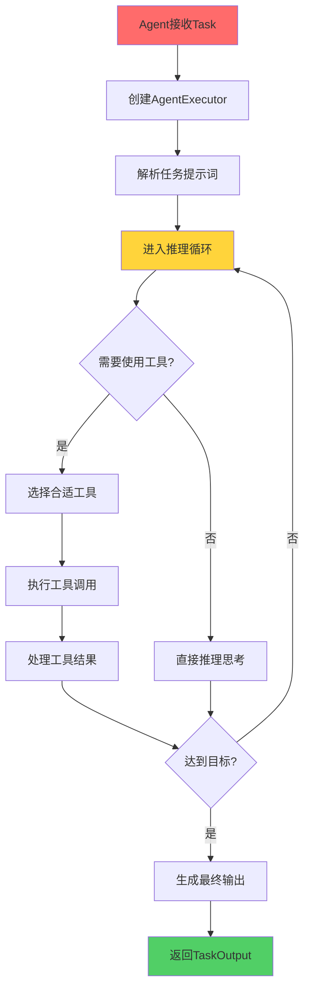
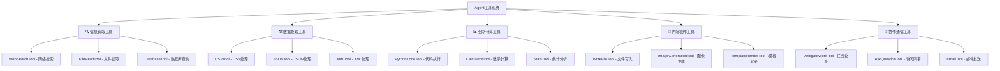
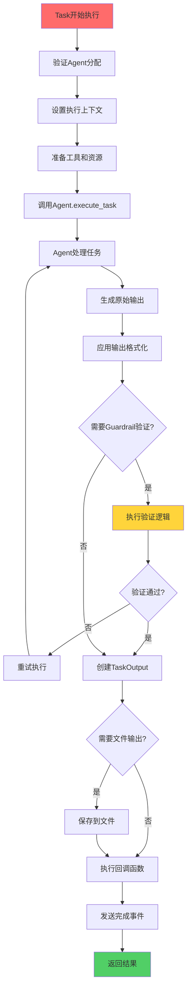
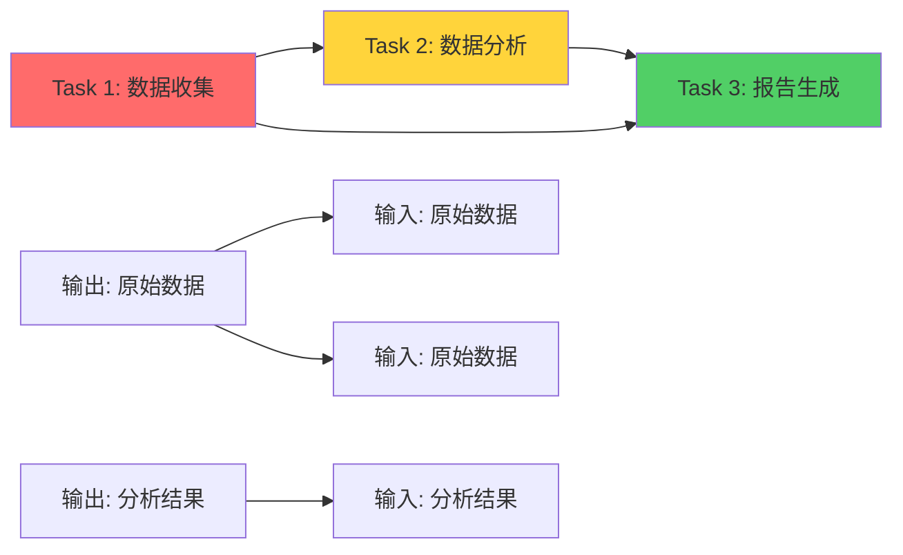
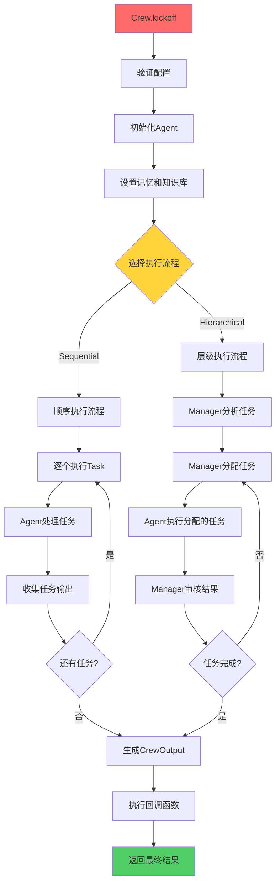

# 第2章：核心概念详解

> 🧠 深入CrewAI的大脑！理解Agent、Task、Crew、Flow四大核心概念，掌握多智能体协作的精髓。

## 📋 章节大纲

本章将深入讲解：

1. **🤖 Agent（智能体）** - 你的AI工作伙伴
2. **📋 Task（任务）** - 明确的工作指令
3. **🏰 Crew（团队）** - 协作的组织架构
4. **🌊 Flow（流程）** - 高级工作流控制
5. **🔍 源码分析与内部机制** - 深入理解工作原理
6. **⚙️ 配置方法和最佳实践** - 实战经验总结

## 🎯 学习目标

完成本章学习后，你将能够：
- ✅ 深度理解CrewAI四大核心概念的设计理念
- ✅ 掌握各组件的高级配置方法和参数调优
- ✅ 理解内部工作机制和执行流程
- ✅ 能够设计合理的多智能体协作架构
- ✅ 具备调试和优化CrewAI应用的能力

---

## 2.1 Agent（智能体）- 你的AI工作伙伴🤖

### 🎮 游戏化理解：RPG角色系统

想象Agent就像RPG游戏中的角色，每个角色都有：

- **🎭 职业（Role）**：法师、战士、盗贼等
- **🎯 使命（Goal）**：拯救世界、寻找宝藏等
- **📖 背景故事（Backstory）**：角色的成长经历
- **🛠️ 技能装备（Tools）**：魔法、武器、道具等
- **🧠 智力等级（LLM）**：决定角色的思考能力
- **⚡ 行动力（Max Iter）**：每回合能执行的动作数

### 📖 Agent的核心属性

基于源码分析，Agent的关键属性包括：

<augment_code_snippet path="src/crewai/agent.py" mode="EXCERPT">
````python
class Agent(BaseAgent):
    # 核心身份属性
    role: str = Field(description="角色定义")
    goal: str = Field(description="目标描述")
    backstory: str = Field(description="背景故事")

    # 能力配置
    tools: Optional[List[BaseTool]] = Field(default_factory=list)
    llm: Any = Field(default=None, description="语言模型")
    max_iter: int = Field(default=25, description="最大迭代次数")

    # 行为控制
    verbose: bool = Field(default=False, description="详细输出模式")
    allow_delegation: bool = Field(default=False, description="允许委派任务")
    max_execution_time: Optional[int] = Field(default=None)

    # 高级功能
    memory: bool = Field(default=False, description="启用记忆功能")
    reasoning: bool = Field(default=False, description="启用推理规划")
    multimodal: bool = Field(default=False, description="多模态支持")
````
</augment_code_snippet>

### 🔍 Agent工作机制深度解析

#### 1. Agent执行流程



#### 2. Agent内部组件

<augment_code_snippet path="src/crewai/agent.py" mode="EXCERPT">
````python
def _create_agent_executor(self, tools=None) -> None:
    """创建Agent执行器"""
    self.agent_executor = CrewAgentExecutor(
        llm=self.llm,                    # 🧠 大语言模型
        task=task,                       # 📋 当前任务
        agent=self,                      # 🤖 Agent自身
        crew=self.crew,                  # 🏰 所属团队
        tools=parsed_tools,              # 🛠️ 可用工具
        prompt=prompt,                   # 💬 提示词模板
        max_iter=self.max_iter,          # ⚡ 最大迭代次数
        tools_handler=self.tools_handler, # 🔧 工具处理器
        step_callback=self.step_callback, # 📞 步骤回调
    )
````
</augment_code_snippet>

### 🎯 Agent配置最佳实践

#### 1. 角色设计原则

**🎭 Role（角色）设计**：
```python
# ❌ 模糊的角色定义
role = "助手"

# ✅ 具体明确的角色定义
role = "专业的Python数据分析师"
role = "经验丰富的市场研究专家"
role = "创意文案写作专家"
```

**🎯 Goal（目标）设计**：
```python
# ❌ 抽象的目标
goal = "帮助用户"

# ✅ 具体可衡量的目标
goal = "分析销售数据，识别增长趋势，提供可行的业务建议"
goal = "研究竞争对手策略，总结市场机会和威胁"
goal = "创作吸引人的产品文案，提高转化率"
```

**📖 Backstory（背景故事）设计**：
```python
# ✅ 丰富的背景故事
backstory = """
你是一位拥有10年经验的数据科学家，曾在多家知名科技公司工作。
你擅长使用Python进行数据分析，熟悉机器学习算法，
对业务理解深刻，能够将复杂的数据洞察转化为简单易懂的商业建议。
你的分析总是基于数据事实，逻辑清晰，结论可靠。
"""
```

#### 2. 高级配置示例

```python
# 🚀 高级Agent配置示例
senior_analyst = Agent(
    role="高级数据分析师",
    goal="深度分析业务数据，发现隐藏的商业洞察",
    backstory="""
    你是一位资深的数据分析专家，拥有15年的行业经验。
    你曾帮助多家企业通过数据驱动决策实现业务增长。
    你的分析不仅准确，而且总能发现别人忽略的重要趋势。
    """,

    # 🛠️ 工具配置
    tools=[
        PythonCodeTool(),      # Python代码执行
        DataVisualizationTool(), # 数据可视化
        StatisticalAnalysisTool(), # 统计分析
    ],

    # 🧠 模型配置
    llm=ChatOpenAI(model="gpt-4o", temperature=0.1),

    # ⚡ 性能配置
    max_iter=30,              # 增加迭代次数用于复杂分析
    max_execution_time=300,   # 5分钟超时

    # 🎯 行为配置
    verbose=True,             # 显示详细过程
    allow_delegation=False,   # 不允许委派（专注分析）

    # 🧠 高级功能
    memory=True,              # 启用记忆功能
    reasoning=True,           # 启用推理规划

    # 🛡️ 安全配置
    max_retry_limit=3,        # 最大重试次数
)
```

### 🔧 Agent工具系统

#### 1. 工具类型分类



#### 2. 自定义工具开发

```python
from crewai.tools import BaseTool
from typing import Type
from pydantic import BaseModel, Field

class WeatherQueryInput(BaseModel):
    """天气查询工具的输入模型"""
    city: str = Field(description="要查询天气的城市名称")

class WeatherQueryTool(BaseTool):
    name: str = "天气查询工具"
    description: str = "查询指定城市的当前天气信息"
    args_schema: Type[BaseModel] = WeatherQueryInput

    def _run(self, city: str) -> str:
        """执行天气查询"""
        # 这里实现实际的天气查询逻辑
        # 可以调用天气API
        return f"{city}的当前天气：晴天，温度25°C，湿度60%"

# 使用自定义工具
weather_agent = Agent(
    role="天气播报员",
    goal="提供准确的天气信息",
    backstory="你是专业的气象分析师...",
    tools=[WeatherQueryTool()],
    verbose=True
)
```

### 💡 Agent性能优化技巧

#### 1. 提示词优化

```python
# 🎯 优化Agent的系统提示词
optimized_agent = Agent(
    role="数据分析专家",
    goal="进行深度数据分析",
    backstory="""
    你是一位经验丰富的数据分析师。在分析时请遵循以下步骤：
    1. 首先理解数据的结构和含义
    2. 识别数据中的模式和异常
    3. 使用适当的统计方法进行分析
    4. 得出基于数据的结论
    5. 提供可行的业务建议

    请始终保持客观、准确，并解释你的分析逻辑。
    """,
    verbose=True
)
```

#### 2. 记忆系统配置

```python
# 🧠 启用Agent记忆功能
memory_agent = Agent(
    role="客户服务专家",
    goal="提供个性化的客户服务",
    backstory="你能记住与客户的历史交互...",
    memory=True,  # 启用记忆功能
    verbose=True
)
```

#### 3. 多模态能力

```python
# 🎨 多模态Agent配置
multimodal_agent = Agent(
    role="内容创作专家",
    goal="创作图文并茂的内容",
    backstory="你能处理文本、图像等多种媒体...",
    multimodal=True,  # 启用多模态
    tools=[
        ImageAnalysisTool(),
        TextToImageTool(),
        ImageEditTool()
    ],
    verbose=True
)
```

---

## 2.2 Task（任务）- 明确的工作指令📋

### 🎮 游戏化理解：任务系统

Task就像游戏中的任务系统：

- **📝 任务描述（Description）**：告诉玩家要做什么
- **🎁 任务奖励（Expected Output）**：完成后能获得什么
- **👤 任务发布者（Agent）**：谁来执行这个任务
- **📚 前置任务（Context）**：需要先完成哪些任务
- **🛠️ 特殊道具（Tools）**：完成任务需要的特殊工具
- **⏰ 时间限制（Deadline）**：任务的截止时间

### 📖 Task的核心属性

<augment_code_snippet path="src/crewai/task.py" mode="EXCERPT">
````python
class Task(BaseModel):
    # 核心定义
    description: str = Field(description="任务的具体描述")
    expected_output: str = Field(description="期望输出的明确定义")

    # 执行配置
    agent: Optional[BaseAgent] = Field(default=None, description="负责执行的Agent")
    context: Union[List["Task"], None] = Field(description="上下文任务列表")
    tools: Optional[List[BaseTool]] = Field(description="任务专用工具")

    # 输出格式
    output_json: Optional[Type[BaseModel]] = Field(description="JSON输出模型")
    output_pydantic: Optional[Type[BaseModel]] = Field(description="Pydantic输出模型")
    output_file: Optional[str] = Field(description="输出文件路径")

    # 执行控制
    async_execution: Optional[bool] = Field(default=False, description="异步执行")
    human_input: Optional[bool] = Field(default=False, description="需要人工审核")

    # 安全和质量
    guardrail: Optional[Callable] = Field(description="输出验证函数")
    max_retries: int = Field(default=3, description="最大重试次数")
````
</augment_code_snippet>

### 🔍 Task执行机制深度解析

#### 1. Task执行流程



#### 2. Task内部执行逻辑

<augment_code_snippet path="src/crewai/task.py" mode="EXCERPT">
````python
def _execute_core(
    self,
    agent: Optional[BaseAgent],
    context: Optional[str],
    tools: Optional[List[Any]],
) -> TaskOutput:
    """运行任务的核心执行逻辑"""
    # 1. 验证Agent分配
    agent = agent or self.agent
    if not agent:
        raise Exception(f"任务 '{self.description}' 没有分配Agent")

    # 2. 记录开始时间
    self.start_time = datetime.datetime.now()

    # 3. 设置上下文和工具
    self.prompt_context = context
    tools = tools or self.tools or []

    # 4. 执行任务
    result = agent.execute_task(task=self, context=context, tools=tools)

    # 5. 处理输出格式
    pydantic_output, json_output = self._export_output(result)

    # 6. 创建任务输出对象
    task_output = TaskOutput(
        description=self.description,
        raw=result,
        pydantic=pydantic_output,
        json_dict=json_output,
        agent=agent.role
    )

    return task_output
````
</augment_code_snippet>

### 🎯 Task设计最佳实践

#### 1. 任务描述设计原则

**📝 Description（任务描述）设计**：

```python
# ❌ 模糊的任务描述
description = "分析数据"

# ✅ 具体详细的任务描述
description = """
分析过去6个月的销售数据，重点关注以下方面：
1. 识别销售趋势和季节性模式
2. 分析不同产品类别的表现
3. 找出表现最好和最差的销售渠道
4. 识别异常值和潜在的数据质量问题
5. 计算关键指标：增长率、转化率、客单价等

数据文件位置：/data/sales_data.csv
分析时间范围：2024年1月-6月
"""
```

**🎁 Expected Output（期望输出）设计**：

```python
# ❌ 模糊的期望输出
expected_output = "分析报告"

# ✅ 明确具体的期望输出
expected_output = """
一份结构化的销售数据分析报告，包含：

1. 执行摘要（200字以内）
2. 数据概览和质量评估
3. 销售趋势分析（包含图表说明）
4. 产品类别表现对比
5. 销售渠道效果分析
6. 关键指标计算结果
7. 发现的问题和异常
8. 业务建议和下一步行动

格式要求：
- 使用Markdown格式
- 包含数据表格
- 提供图表描述（如果有）
- 总长度控制在2000字以内
"""
```

#### 2. 高级Task配置示例

```python
from pydantic import BaseModel
from typing import List, Dict

# 📊 定义结构化输出模型
class SalesAnalysisOutput(BaseModel):
    summary: str
    total_revenue: float
    growth_rate: float
    top_products: List[str]
    recommendations: List[str]

# 🎯 高级Task配置
advanced_analysis_task = Task(
    name="销售数据深度分析",
    description="""
    对Q2销售数据进行全面分析，包括：
    1. 收入趋势分析
    2. 产品表现评估
    3. 客户行为洞察
    4. 市场机会识别

    数据源：sales_q2_2024.csv
    分析维度：时间、产品、地区、客户群体
    """,

    expected_output="""
    结构化的分析报告，包含关键指标、趋势图表、
    业务洞察和可执行的建议。
    """,

    # 🤖 指定执行Agent
    agent=senior_analyst,

    # 📚 设置上下文任务
    context=[data_collection_task, data_cleaning_task],

    # 🛠️ 专用工具
    tools=[
        PythonCodeTool(),
        DataVisualizationTool(),
        StatisticalAnalysisTool()
    ],

    # 📄 结构化输出
    output_pydantic=SalesAnalysisOutput,
    output_file="sales_analysis_report.json",

    # ⚙️ 执行配置
    async_execution=False,
    human_input=True,  # 需要人工审核

    # 🛡️ 质量保证
    guardrail=validate_analysis_output,
    max_retries=3,

    # 📞 回调函数
    callback=lambda output: send_notification(output)
)
```

### 🔗 Task上下文系统

#### 1. 上下文链式传递

```python
# 📋 创建任务链
data_collection = Task(
    description="收集销售数据",
    expected_output="清洁的销售数据CSV文件",
    agent=data_collector
)

data_analysis = Task(
    description="分析销售数据，基于收集到的数据进行深度分析",
    expected_output="数据分析报告",
    agent=data_analyst,
    context=[data_collection]  # 依赖前一个任务的输出
)

report_generation = Task(
    description="基于分析结果生成最终报告",
    expected_output="完整的业务报告",
    agent=report_writer,
    context=[data_collection, data_analysis]  # 依赖多个任务的输出
)
```

#### 2. 上下文数据流



### 📊 Task输出格式化

#### 1. 结构化输出

```python
from pydantic import BaseModel
from typing import List, Optional

class ProductAnalysis(BaseModel):
    product_name: str
    revenue: float
    growth_rate: float
    market_share: float

class MarketReport(BaseModel):
    report_date: str
    total_revenue: float
    top_products: List[ProductAnalysis]
    summary: str
    recommendations: List[str]

# 📊 使用结构化输出的Task
structured_task = Task(
    description="生成市场分析报告",
    expected_output="结构化的市场分析数据",
    agent=market_analyst,
    output_pydantic=MarketReport,  # 指定输出模型
    verbose=True
)
```

#### 2. 文件输出

```python
# 📁 文件输出Task
file_output_task = Task(
    description="生成销售报告并保存到文件",
    expected_output="保存到文件的销售报告",
    agent=report_agent,
    output_file="reports/sales_report_{timestamp}.md",  # 自动生成文件名
    verbose=True
)
```

### 🛡️ Task质量保证

#### 1. Guardrail验证

```python
def validate_analysis_output(task_output) -> tuple[bool, str]:
    """验证分析输出的质量"""
    content = task_output.raw

    # 检查必要内容
    required_sections = ["摘要", "数据分析", "结论", "建议"]
    missing_sections = []

    for section in required_sections:
        if section not in content:
            missing_sections.append(section)

    if missing_sections:
        return False, f"缺少必要章节: {', '.join(missing_sections)}"

    # 检查内容长度
    if len(content) < 500:
        return False, "报告内容过短，需要更详细的分析"

    # 检查是否包含数据
    if "数据" not in content and "分析" not in content:
        return False, "报告缺少数据分析内容"

    return True, "输出质量验证通过"

# 🛡️ 带质量验证的Task
quality_assured_task = Task(
    description="生成高质量的分析报告",
    expected_output="符合质量标准的分析报告",
    agent=senior_analyst,
    guardrail=validate_analysis_output,
    max_retries=3,
    verbose=True
)
```

#### 2. 人工审核

```python
# 👤 需要人工审核的Task
human_review_task = Task(
    description="生成重要的战略建议报告",
    expected_output="经过人工审核的战略建议",
    agent=strategy_consultant,
    human_input=True,  # 启用人工审核
    verbose=True
)
```

---

## 2.3 Crew（团队）- 协作的组织架构🏰

### 🎮 游戏化理解：公会系统

Crew就像游戏中的公会或战队：

- **👥 公会成员（Agents）**：不同职业的玩家角色
- **📋 公会任务（Tasks）**：需要团队协作完成的挑战
- **⚡ 战术策略（Process）**：团队作战的执行方式
- **🧠 公会记忆（Memory）**：记录团队的历史经验
- **👑 公会管理（Manager）**：统筹指挥的领导者
- **🎯 公会目标（Goal）**：团队共同追求的成就

### 📖 Crew的核心属性

<augment_code_snippet path="src/crewai/crew.py" mode="EXCERPT">
````python
class Crew(BaseModel):
    # 核心组成
    agents: List[BaseAgent] = Field(default_factory=list, description="团队成员列表")
    tasks: List[Task] = Field(default_factory=list, description="任务列表")

    # 执行策略
    process: Process = Field(default=Process.sequential, description="执行流程")
    manager_llm: Optional[Any] = Field(default=None, description="管理者LLM")
    manager_agent: Optional[BaseAgent] = Field(default=None, description="自定义管理者")

    # 团队能力
    memory: bool = Field(default=False, description="启用团队记忆")
    planning: bool = Field(default=False, description="启用规划功能")
    knowledge_sources: Optional[List[BaseKnowledgeSource]] = Field(default=None)

    # 行为控制
    verbose: bool = Field(default=False, description="详细输出模式")
    cache: bool = Field(default=True, description="启用缓存")
    max_rpm: Optional[int] = Field(default=None, description="最大请求频率")

    # 回调和监控
    task_callback: Optional[Any] = Field(default=None, description="任务回调")
    step_callback: Optional[Any] = Field(default=None, description="步骤回调")
````
</augment_code_snippet>

### 🔍 Crew执行机制深度解析

#### 1. Crew执行流程



#### 2. Process执行模式对比

<augment_code_snippet path="src/crewai/process.py" mode="EXCERPT">
````python
class Process(str, Enum):
    """执行流程类型"""
    sequential = "sequential"      # 顺序执行
    hierarchical = "hierarchical"  # 层级执行
    # consensual = "consensual"    # 共识执行（计划中）
````
</augment_code_snippet>

**Sequential（顺序执行）**：
- 任务按照定义顺序依次执行
- 每个任务的输出作为下一个任务的上下文
- 适合有明确依赖关系的工作流

**Hierarchical（层级执行）**：
- 由Manager Agent统筹安排任务分配
- Manager根据Agent能力动态分配任务
- 适合复杂的项目管理场景

### 🎯 Crew配置最佳实践

#### 1. Sequential流程配置

```python
# 📋 顺序执行的Crew配置
sequential_crew = Crew(
    name="数据分析团队",

    # 👥 团队成员（按执行顺序）
    agents=[
        data_collector,    # 数据收集专家
        data_analyst,      # 数据分析师
        report_writer      # 报告撰写员
    ],

    # 📋 任务列表（按执行顺序）
    tasks=[
        collect_data_task,    # 收集数据
        analyze_data_task,    # 分析数据
        write_report_task     # 撰写报告
    ],

    # ⚡ 执行配置
    process=Process.sequential,
    verbose=True,

    # 🧠 团队能力
    memory=True,           # 启用团队记忆
    cache=True,            # 启用结果缓存

    # 📞 监控回调
    task_callback=log_task_completion,
    step_callback=log_agent_steps
)
```

#### 2. Hierarchical流程配置

```python
# 👑 层级管理的Crew配置
hierarchical_crew = Crew(
    name="产品开发团队",

    # 👥 团队成员（不需要特定顺序）
    agents=[
        product_manager,     # 产品经理
        ui_designer,         # UI设计师
        backend_developer,   # 后端开发
        frontend_developer,  # 前端开发
        qa_tester           # 测试工程师
    ],

    # 📋 任务池（Manager会动态分配）
    tasks=[
        requirement_analysis,
        ui_design_task,
        backend_development,
        frontend_development,
        testing_task
    ],

    # ⚡ 层级执行配置
    process=Process.hierarchical,
    manager_llm=ChatOpenAI(model="gpt-4o", temperature=0.1),  # 管理者LLM

    # 🧠 高级功能
    memory=True,
    planning=True,         # 启用规划功能
    verbose=True,

    # 📊 性能控制
    max_rpm=10,           # 限制请求频率
)
```

#### 3. 自定义Manager Agent

```python
# 👑 自定义管理者Agent
project_manager = Agent(
    role="项目经理",
    goal="协调团队成员，确保项目按时高质量完成",
    backstory="""
    你是一位经验丰富的项目经理，擅长：
    1. 分析项目需求和任务复杂度
    2. 根据团队成员的专长分配任务
    3. 监控项目进度和质量
    4. 协调团队沟通和解决冲突
    5. 确保项目目标的达成
    """,
    tools=[
        ProjectPlanningTool(),
        TaskAssignmentTool(),
        ProgressTrackingTool()
    ],
    verbose=True
)

# 使用自定义Manager的Crew
custom_manager_crew = Crew(
    agents=[developer1, developer2, designer, tester],
    tasks=[task1, task2, task3, task4],
    process=Process.hierarchical,
    manager_agent=project_manager,  # 使用自定义管理者
    verbose=True
)
```

### 🧠 Crew记忆系统

#### 1. 记忆类型配置

```python
# 🧠 完整记忆系统配置
memory_crew = Crew(
    agents=[researcher, analyst, writer],
    tasks=[research_task, analysis_task, writing_task],

    # 启用记忆功能
    memory=True,
    memory_config={
        "provider": "chroma",           # 向量数据库
        "config": {
            "host": "localhost",
            "port": 8000,
            "collection_name": "crew_memory"
        }
    },

    # 记忆类型配置
    long_term_memory=True,    # 长期记忆
    short_term_memory=True,   # 短期记忆
    entity_memory=True,       # 实体记忆

    verbose=True
)
```

#### 2. 知识库集成

```python
from crewai.knowledge import Knowledge
from crewai.knowledge.source import TextFileSource, WebsiteSource

# 📚 知识库配置
knowledge_crew = Crew(
    agents=[expert_agent],
    tasks=[knowledge_task],

    # 知识源配置
    knowledge_sources=[
        TextFileSource(path="docs/company_policies.txt"),
        WebsiteSource(url="https://company.com/knowledge-base"),
        TextFileSource(path="data/historical_reports.md")
    ],

    # 嵌入配置
    embedder={
        "provider": "openai",
        "config": {
            "model": "text-embedding-3-small"
        }
    },

    verbose=True
)
```

### 🔄 Crew执行模式

#### 1. 同步执行

```python
# 🔄 标准同步执行
def run_crew_sync():
    result = crew.kickoff(inputs={"topic": "AI市场分析"})
    print(f"执行结果: {result.raw}")
    return result

# 执行
result = run_crew_sync()
```

#### 2. 异步执行

```python
import asyncio

# ⚡ 异步执行
async def run_crew_async():
    result = await crew.kickoff_async(inputs={"topic": "AI市场分析"})
    print(f"异步执行结果: {result.raw}")
    return result

# 执行
result = asyncio.run(run_crew_async())
```

#### 3. 批量执行

```python
# 📦 批量处理多个输入
inputs_list = [
    {"topic": "AI市场分析"},
    {"topic": "区块链趋势"},
    {"topic": "云计算发展"}
]

# 批量执行
results = crew.kickoff_for_each(inputs=inputs_list)
for i, result in enumerate(results):
    print(f"结果 {i+1}: {result.raw}")
```

### 📊 Crew监控和回调

#### 1. 任务级回调

```python
def task_completion_callback(task_output):
    """任务完成回调"""
    print(f"✅ 任务完成: {task_output.description}")
    print(f"📊 执行时间: {task_output.execution_time}")
    print(f"🤖 执行Agent: {task_output.agent}")

    # 发送通知
    send_notification(f"任务完成: {task_output.description}")

    # 记录日志
    log_task_completion(task_output)

# 配置回调
monitored_crew = Crew(
    agents=[agent1, agent2],
    tasks=[task1, task2],
    task_callback=task_completion_callback,
    verbose=True
)
```

#### 2. 步骤级回调

```python
def step_execution_callback(step_output):
    """步骤执行回调"""
    print(f"🔄 步骤: {step_output.action}")
    print(f"💭 思考: {step_output.thought}")
    print(f"🛠️ 工具: {step_output.tool}")

    # 实时监控
    update_progress_dashboard(step_output)

# 配置步骤回调
detailed_crew = Crew(
    agents=[agent1, agent2],
    tasks=[task1, task2],
    step_callback=step_execution_callback,
    verbose=True
)
```

---

## 2.4 Flow（流程）- 高级工作流控制🌊

### 🎮 游戏化理解：事件系统

Flow就像游戏中的复杂事件系统：

- **🎬 触发器（@start）**：游戏开始的触发条件
- **👂 监听器（@listen）**：监听特定事件的发生
- **🔀 路由器（@router）**：根据条件选择不同路径
- **🔗 条件组合（and_/or_）**：复杂的触发条件组合
- **💾 状态管理（State）**：游戏世界的状态数据
- **🔄 事件循环**：持续监听和响应事件

### 📖 Flow的核心特性

<augment_code_snippet path="src/crewai/flow/flow.py" mode="EXCERPT">
````python
class Flow(Generic[T], metaclass=FlowMeta):
    """Flow基类，支持事件驱动的工作流"""

    # 装饰器系统
    _start_methods: List[str] = []              # 启动方法
    _listeners: Dict[str, tuple] = {}           # 监听器映射
    _routers: Set[str] = set()                  # 路由器集合
    _router_paths: Dict[str, List[str]] = {}    # 路由路径

    # 状态管理
    initial_state: Union[Type[T], T, None] = None
    _state: T                                   # 当前状态

    # 执行控制
    _method_outputs: List[Any] = []             # 方法输出历史
    _method_execution_counts: Dict[str, int] = {} # 执行计数
    _pending_and_listeners: Dict[str, Set[str]] = {} # 待处理监听器
````
</augment_code_snippet>

### 🔍 Flow装饰器系统

#### 1. 基础装饰器

```python
from crewai.flow.flow import Flow, start, listen, router
from pydantic import BaseModel

class ProjectState(BaseModel):
    """项目状态模型"""
    project_name: str = ""
    requirements: str = ""
    design_complete: bool = False
    development_complete: bool = False
    testing_complete: bool = False
    confidence_score: float = 0.0

class ProjectFlow(Flow[ProjectState]):
    """项目开发流程"""

    @start()
    def initiate_project(self):
        """🎬 项目启动"""
        print("🚀 项目启动")
        self.state.project_name = "AI助手项目"
        return "项目已启动"

    @listen(initiate_project)
    def gather_requirements(self):
        """👂 需求收集"""
        print("📋 收集项目需求")
        # 这里可以调用Crew来收集需求
        requirements_crew = Crew(
            agents=[business_analyst],
            tasks=[requirements_task]
        )
        result = requirements_crew.kickoff()
        self.state.requirements = result.raw
        return "需求收集完成"

    @listen(gather_requirements)
    def design_system(self):
        """🎨 系统设计"""
        print("🎨 进行系统设计")
        design_crew = Crew(
            agents=[system_architect, ui_designer],
            tasks=[architecture_task, ui_design_task]
        )
        result = design_crew.kickoff(inputs={"requirements": self.state.requirements})
        self.state.design_complete = True
        return result

    @router(design_system)
    def decide_development_approach(self):
        """🔀 决定开发方式"""
        if self.state.confidence_score > 0.8:
            return "parallel_development"
        else:
            return "sequential_development"

    @listen("parallel_development")
    def parallel_development(self):
        """⚡ 并行开发"""
        print("⚡ 启动并行开发")
        # 前后端并行开发
        frontend_crew = Crew(agents=[frontend_dev], tasks=[frontend_tasks])
        backend_crew = Crew(agents=[backend_dev], tasks=[backend_tasks])

        # 异步执行
        frontend_result = frontend_crew.kickoff_async()
        backend_result = backend_crew.kickoff_async()

        self.state.development_complete = True
        return "并行开发完成"

    @listen("sequential_development")
    def sequential_development(self):
        """📋 顺序开发"""
        print("📋 启动顺序开发")
        dev_crew = Crew(
            agents=[backend_dev, frontend_dev],
            tasks=[backend_task, frontend_task],
            process=Process.sequential
        )
        result = dev_crew.kickoff()
        self.state.development_complete = True
        return result
```

#### 2. 高级条件组合

```python
from crewai.flow.flow import and_, or_

class AdvancedFlow(Flow[ProjectState]):
    """高级条件流程"""

    @start()
    def start_process(self):
        return "流程开始"

    @listen(start_process)
    def task_a(self):
        print("执行任务A")
        return "A完成"

    @listen(start_process)
    def task_b(self):
        print("执行任务B")
        return "B完成"

    @listen(start_process)
    def task_c(self):
        print("执行任务C")
        return "C完成"

    # 🔗 AND条件：等待A和B都完成
    @listen(and_(task_a, task_b))
    def task_d(self):
        print("任务A和B都完成，执行任务D")
        return "D完成"

    # 🔗 OR条件：A或C任一完成即可
    @listen(or_(task_a, task_c))
    def task_e(self):
        print("任务A或C完成，执行任务E")
        return "E完成"

    # 🔗 复杂条件组合
    @listen(and_(task_d, or_(task_e, task_c)))
    def final_task(self):
        print("复杂条件满足，执行最终任务")
        return "流程完成"
```

### 🎯 Flow状态管理

#### 1. 结构化状态

```python
from pydantic import BaseModel
from typing import List, Dict, Optional
from datetime import datetime

class TaskStatus(BaseModel):
    """任务状态"""
    name: str
    status: str  # pending, running, completed, failed
    start_time: Optional[datetime] = None
    end_time: Optional[datetime] = None
    result: Optional[str] = None

class ProjectFlowState(BaseModel):
    """项目流程状态"""
    project_id: str
    project_name: str
    current_phase: str
    tasks: List[TaskStatus] = []
    team_members: List[str] = []
    resources: Dict[str, str] = {}
    metrics: Dict[str, float] = {}
    created_at: datetime = datetime.now()
    updated_at: datetime = datetime.now()

class StatefulFlow(Flow[ProjectFlowState]):
    """状态管理流程"""

    def __init__(self):
        super().__init__()
        # 初始化状态
        self.state.project_id = "proj_001"
        self.state.project_name = "AI客服系统"
        self.state.current_phase = "planning"

    @start()
    def initialize_project(self):
        """初始化项目"""
        self.state.current_phase = "requirements"
        self.state.team_members = ["Alice", "Bob", "Charlie"]
        self.state.updated_at = datetime.now()

        # 添加初始任务
        self.state.tasks.append(TaskStatus(
            name="需求分析",
            status="pending"
        ))

        return "项目初始化完成"

    @listen(initialize_project)
    def execute_requirements_phase(self):
        """执行需求阶段"""
        # 更新任务状态
        for task in self.state.tasks:
            if task.name == "需求分析":
                task.status = "running"
                task.start_time = datetime.now()

        # 执行需求分析Crew
        requirements_crew = Crew(
            agents=[business_analyst],
            tasks=[requirements_analysis_task]
        )
        result = requirements_crew.kickoff()

        # 更新状态
        for task in self.state.tasks:
            if task.name == "需求分析":
                task.status = "completed"
                task.end_time = datetime.now()
                task.result = result.raw

        self.state.current_phase = "design"
        self.state.metrics["requirements_score"] = 0.85
        self.state.updated_at = datetime.now()

        return result
```

#### 2. 状态持久化

```python
from crewai.flow.persistence import FlowPersistence

class PersistentFlow(Flow[ProjectFlowState]):
    """持久化流程"""

    def __init__(self, persistence_backend=None):
        # 配置持久化后端
        persistence = persistence_backend or FlowPersistence(
            provider="file",  # 或 "redis", "database"
            config={
                "file_path": "flow_states.json"
            }
        )
        super().__init__(persistence=persistence)

    @start()
    def start_with_persistence(self):
        """带持久化的启动"""
        print(f"流程ID: {self.flow_id}")
        self.state.project_name = "持久化项目"

        # 状态会自动保存
        return "持久化流程启动"

    @listen(start_with_persistence)
    def long_running_task(self):
        """长时间运行的任务"""
        import time

        for i in range(5):
            print(f"处理步骤 {i+1}/5")
            self.state.metrics[f"step_{i+1}"] = (i+1) * 0.2
            time.sleep(1)  # 模拟长时间处理

            # 状态自动保存，可以随时恢复

        return "长任务完成"

# 使用持久化流程
flow = PersistentFlow()
result = flow.kickoff()

# 从保存的状态恢复
restored_flow = PersistentFlow()
result = restored_flow.kickoff(inputs={"id": flow.flow_id})
```

### 🔄 Flow与Crew集成

#### 1. 多Crew协调

```python
class MultiCrewFlow(Flow[ProjectState]):
    """多Crew协调流程"""

    @start()
    def research_phase(self):
        """🔍 研究阶段"""
        research_crew = Crew(
            agents=[market_researcher, competitor_analyst],
            tasks=[market_research_task, competitor_analysis_task],
            process=Process.sequential
        )
        result = research_crew.kickoff()
        self.state.research_data = result.raw
        return result

    @listen(research_phase)
    def analysis_phase(self):
        """📊 分析阶段"""
        analysis_crew = Crew(
            agents=[data_analyst, business_analyst],
            tasks=[data_analysis_task, business_analysis_task],
            process=Process.parallel
        )
        result = analysis_crew.kickoff(inputs={
            "research_data": self.state.research_data
        })
        self.state.analysis_result = result.raw
        return result

    @router(analysis_phase)
    def determine_strategy(self):
        """🎯 确定策略"""
        # 根据分析结果决定下一步
        if "high_potential" in self.state.analysis_result:
            return "aggressive_strategy"
        elif "moderate_potential" in self.state.analysis_result:
            return "balanced_strategy"
        else:
            return "conservative_strategy"

    @listen("aggressive_strategy")
    def aggressive_execution(self):
        """⚡ 激进执行"""
        execution_crew = Crew(
            agents=[product_manager, marketing_specialist, sales_rep],
            tasks=[product_launch_task, marketing_campaign_task, sales_task],
            process=Process.hierarchical,
            manager_llm=ChatOpenAI(model="gpt-4o")
        )
        return execution_crew.kickoff(inputs={
            "strategy": "aggressive",
            "analysis": self.state.analysis_result
        })
```

#### 2. 动态Crew创建

```python
class DynamicCrewFlow(Flow[ProjectState]):
    """动态Crew创建流程"""

    def create_specialized_crew(self, task_type: str, complexity: str):
        """根据任务类型和复杂度创建专门的Crew"""

        if task_type == "data_analysis":
            if complexity == "high":
                return Crew(
                    agents=[senior_data_scientist, ml_engineer, statistician],
                    tasks=[advanced_analysis_task],
                    process=Process.hierarchical
                )
            else:
                return Crew(
                    agents=[data_analyst],
                    tasks=[basic_analysis_task],
                    process=Process.sequential
                )

        elif task_type == "content_creation":
            if complexity == "high":
                return Crew(
                    agents=[content_strategist, copywriter, editor, designer],
                    tasks=[strategy_task, writing_task, editing_task, design_task],
                    process=Process.sequential
                )
            else:
                return Crew(
                    agents=[copywriter],
                    tasks=[simple_writing_task],
                    process=Process.sequential
                )

    @start()
    def analyze_requirements(self):
        """分析需求"""
        self.state.task_type = "data_analysis"
        self.state.complexity = "high"
        return "需求分析完成"

    @listen(analyze_requirements)
    def execute_with_dynamic_crew(self):
        """使用动态Crew执行"""
        crew = self.create_specialized_crew(
            self.state.task_type,
            self.state.complexity
        )

        result = crew.kickoff(inputs={
            "requirements": self.state.requirements
        })

        return result
```

---

## 2.5 本章小结📚

恭喜你！🎉 你已经深入掌握了CrewAI的四大核心概念！

### ✅ 本章成就解锁

- **🤖 Agent大师**：深度理解Agent的工作机制和配置方法
- **📋 Task设计师**：掌握Task的高级配置和质量保证
- **🏰 Crew指挥官**：熟练运用不同的协作模式
- **🌊 Flow架构师**：理解事件驱动的工作流设计
- **🔍 源码探索者**：洞察CrewAI的内部工作原理

### 📖 核心知识回顾

1. **🤖 Agent（智能体）**：
   - 具有角色、目标、背景的AI执行单元
   - 支持工具使用、记忆、推理等高级功能
   - 通过AgentExecutor实现复杂的推理循环

2. **📋 Task（任务）**：
   - 定义具体工作内容和期望输出
   - 支持上下文传递、结构化输出、质量验证
   - 通过Guardrail确保输出质量

3. **🏰 Crew（团队）**：
   - 组织Agent协作完成复杂任务
   - 支持Sequential和Hierarchical执行模式
   - 提供记忆、知识库、监控等团队功能

4. **🌊 Flow（工作流）**：
   - 事件驱动的高级工作流控制
   - 支持复杂的条件逻辑和状态管理
   - 可以协调多个Crew实现复杂业务流程

### 🎯 实践要点

- **设计原则**：角色明确、目标具体、输出清晰
- **性能优化**：合理配置参数、启用缓存、控制资源
- **错误处理**：多层容错、智能重试、优雅降级
- **监控调试**：性能监控、执行跟踪、瓶颈分析

### 🎮 实践练习

在进入下一章之前，试试这些练习来巩固学习：

#### 练习1：设计专业Agent团队 🤖
创建一个包含3个不同角色Agent的团队：
- 数据收集专家
- 分析师
- 报告撰写员

#### 练习2：实现复杂Task链 📋
设计一个包含5个相互依赖Task的工作流：
- 每个Task都有明确的输入输出
- 使用结构化输出格式
- 添加质量验证机制

#### 练习3：构建Flow工作流 🌊
创建一个事件驱动的Flow：
- 包含条件分支逻辑
- 集成多个Crew
- 实现状态持久化

---

**🎉 准备好了吗？让我们前往 [第3章：创建第一个智能体项目](./CrewAI学习指南-第3章.md)，开始真正的实战开发！**