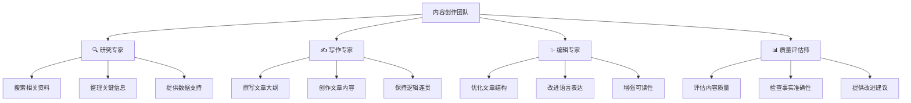

# 第3章：创建第一个智能体项目

> 🛠️ 动手时间到！从零开始构建你的第一个CrewAI项目，体验多智能体协作的魅力。

## 📋 章节大纲

本章将手把手教你：

1. **🏗️ 项目规划与设计** - 设计一个实用的AI项目
2. **🚀 项目创建与配置** - 使用CLI创建标准项目结构
3. **🤖 Agent团队设计** - 创建专业的AI智能体团队
4. **📋 Task工作流设计** - 设计高效的任务执行流程
5. **🏰 Crew协作配置** - 组建协作无间的AI团队
6. **🔧 工具集成开发** - 为Agent添加实用工具
7. **🏃‍♂️ 运行调试优化** - 测试、调试和性能优化
8. **📊 结果分析改进** - 分析结果并持续改进

## 🎯 学习目标

完成本章学习后，你将能够：
- ✅ 独立设计和创建完整的CrewAI项目
- ✅ 掌握标准的项目组织结构和开发流程
- ✅ 熟练配置Agent、Task、Crew的各种参数
- ✅ 集成工具扩展Agent的能力
- ✅ 具备调试和优化CrewAI应用的技能
- ✅ 理解实际业务场景的AI解决方案设计

---

## 3.1 项目规划与设计🏗️

### 🎮 游戏化理解：策划游戏

创建CrewAI项目就像策划一款游戏：

- **🎯 游戏目标**：明确项目要解决什么问题
- **👥 角色设定**：设计不同技能的AI角色
- **📋 任务系统**：规划角色要完成的任务
- **🎪 游戏流程**：设计整个游戏的进行方式
- **🛠️ 道具系统**：为角色配备必要的工具
- **🏆 成就系统**：定义成功的标准

### 🎯 项目选择：AI内容创作助手

我们将创建一个**AI内容创作助手**项目，这是一个实用且有趣的应用场景：

**项目背景**：
帮助内容创作者（博主、营销人员、学生等）快速生成高质量的文章内容。

**核心功能**：
1. 📚 **研究收集**：自动搜索和整理相关资料
2. 📝 **内容创作**：基于资料生成结构化文章
3. ✨ **内容优化**：润色和改进文章质量
4. 📊 **质量评估**：评估内容质量并提供改进建议

### 🎭 AI团队角色设计



### 📋 工作流程设计

**Sequential（顺序）执行流程**：

1. **🔍 研究阶段**：研究专家收集相关资料
2. **✍️ 创作阶段**：写作专家基于资料创作内容
3. **✨ 编辑阶段**：编辑专家优化内容质量
4. **📊 评估阶段**：质量评估师评估并提供反馈

### 🛠️ 工具需求分析

为了让AI团队更强大，我们需要集成以下工具：

- **🔍 搜索工具**：网络搜索获取最新信息
- **📄 文件工具**：读写文件保存内容
- **🧮 计算工具**：进行数据计算和分析
- **🌐 网页工具**：抓取网页内容
- **📊 分析工具**：文本分析和质量评估

---

## 3.2 项目创建与配置🚀

### 🎯 使用CLI创建项目

```bash
# 创建新的CrewAI项目
crewai create crew content_creator_ai
cd content_creator_ai

# 查看项目结构
tree  # Linux/macOS
dir /s  # Windows
```

**生成的项目结构**：
```
content_creator_ai/
├── .env                    # 环境变量配置
├── .gitignore             # Git忽略文件
├── pyproject.toml         # 项目依赖配置
├── README.md              # 项目说明文档
├── knowledge/             # 知识库文件夹（可选）
└── src/
    └── content_creator_ai/
        ├── __init__.py    # Python包初始化
        ├── main.py        # 主程序入口
        ├── crew.py        # Crew定义文件
        ├── tools/         # 自定义工具目录
        │   ├── __init__.py
        │   └── custom_tool.py
        └── config/        # 配置文件目录
            ├── agents.yaml # Agent配置
            └── tasks.yaml  # Task配置
```

### 🔑 环境配置

编辑`.env`文件，配置必要的API密钥：

```bash
# .env - 环境变量配置
# OpenAI配置（必需）
OPENAI_API_KEY=sk-your-openai-api-key-here
OPENAI_MODEL_NAME=gpt-4o-mini

# 搜索功能配置（推荐）
SERPER_API_KEY=your-serper-dev-api-key-here

# 可选配置
OPENAI_TEMPERATURE=0.7
OPENAI_MAX_TOKENS=2000

# 调试配置
CREWAI_VERBOSE=true
CREWAI_LOG_LEVEL=INFO
```

> 💡 **获取API密钥**：
> - OpenAI API: [platform.openai.com/api-keys](https://platform.openai.com/api-keys)
> - Serper API: [serper.dev](https://serper.dev) (免费额度：2500次搜索/月)

### 📦 依赖管理

编辑`pyproject.toml`，添加项目依赖：

```toml
[tool.poetry]
name = "content-creator-ai"
version = "0.1.0"
description = "AI内容创作助手"
authors = ["Your Name <your.email@example.com>"]

[tool.poetry.dependencies]
python = ">=3.10,<=3.13"
crewai = {extras = ["tools"], version = "^0.130.0"}
python-dotenv = "^1.0.0"

# 可选依赖
beautifulsoup4 = "^4.12.0"  # 网页解析
requests = "^2.31.0"        # HTTP请求
pandas = "^2.0.0"           # 数据处理

[tool.poetry.group.dev.dependencies]
pytest = "^7.0.0"
black = "^23.0.0"
isort = "^5.12.0"
mypy = "^1.5.0"

[build-system]
requires = ["poetry-core"]
build-backend = "poetry.core.masonry.api"
```

### 🔧 安装依赖

```bash
# 安装项目依赖
crewai install

# 或者使用pip（如果没有poetry）
pip install -e .
```

---

## 3.3 Agent团队设计🤖

### 🎭 Agent配置文件

编辑`src/content_creator_ai/config/agents.yaml`：

```yaml
# config/agents.yaml - Agent配置文件
researcher:
  role: >
    资深研究专家
  goal: >
    深入研究指定主题，收集最新、最准确、最相关的信息和数据，
    为内容创作提供坚实的事实基础和丰富的素材支持
  backstory: >
    你是一位拥有10年经验的专业研究员，曾在知名智库和研究机构工作。
    你擅长快速定位权威信息源，善于从海量信息中提取关键洞察，
    对数据的准确性和时效性有着极高的要求。你的研究报告总是逻辑清晰、
    数据翔实，为决策提供有力支撑。你熟悉各种研究方法和工具，
    能够从多个角度全面分析问题。
  verbose: true
  allow_delegation: false

writer:
  role: >
    创意写作专家
  goal: >
    基于研究资料创作引人入胜、结构清晰、内容丰富的高质量文章，
    确保内容既有深度又有可读性，能够有效传达核心信息
  backstory: >
    你是一位才华横溢的资深写作专家，拥有15年的内容创作经验。
    你曾为多家知名媒体和企业撰写文章，擅长将复杂的概念转化为
    通俗易懂的表达。你的文章总是结构严谨、逻辑清晰，同时富有
    感染力和说服力。你深谙不同文体的写作技巧，能够根据目标
    受众调整写作风格，让每篇文章都能精准触达读者内心。
  verbose: true
  allow_delegation: false

editor:
  role: >
    专业内容编辑
  goal: >
    全面优化文章内容，提升语言表达质量，完善文章结构，
    确保内容的准确性、一致性和专业性，打造完美的阅读体验
  backstory: >
    你是一位经验丰富的专业编辑，拥有12年的内容编辑经验。
    你曾在顶级出版社和媒体机构担任主编，对语言文字有着敏锐的
    感知力和极高的标准。你擅长发现文章中的逻辑漏洞、语言问题
    和结构缺陷，能够在保持作者原意的基础上大幅提升内容质量。
    你的编辑总是精准到位，让每篇文章都能达到出版级别的标准。
  verbose: true
  allow_delegation: false

quality_assessor:
  role: >
    内容质量评估师
  goal: >
    客观评估内容质量，从多个维度进行专业分析，
    提供具体可行的改进建议，确保内容达到最高标准
  backstory: >
    你是一位权威的内容质量评估专家，拥有丰富的内容审核和
    质量管理经验。你曾为多家知名企业建立内容质量标准体系，
    对内容的各个维度都有深入的理解和严格的标准。你能够从
    准确性、可读性、逻辑性、创新性等多个角度全面评估内容，
    提供的建议总是中肯而实用，帮助内容创作者不断提升水平。
  verbose: true
  allow_delegation: false
```

### 🎯 Agent实现代码

编辑`src/content_creator_ai/crew.py`：

```python
# crew.py - Crew实现文件
from crewai import Agent, Crew, Process, Task
from crewai.project import CrewBase, agent, crew, task
from crewai_tools import SerperDevTool, FileWriterTool, FileReadTool

@CrewBase
class ContentCreatorAiCrew():
    """内容创作AI团队"""

    agents_config = 'config/agents.yaml'
    tasks_config = 'config/tasks.yaml'

    def __init__(self) -> None:
        # 初始化工具
        self.search_tool = SerperDevTool()
        self.file_writer = FileWriterTool()
        self.file_reader = FileReadTool()

    @agent
    def researcher(self) -> Agent:
        """创建研究专家Agent"""
        return Agent(
            config=self.agents_config['researcher'],
            tools=[self.search_tool, self.file_writer],
            verbose=True,
            max_iter=5,
            memory=True
        )

    @agent
    def writer(self) -> Agent:
        """创建写作专家Agent"""
        return Agent(
            config=self.agents_config['writer'],
            tools=[self.file_reader, self.file_writer],
            verbose=True,
            max_iter=5,
            memory=True
        )

    @agent
    def editor(self) -> Agent:
        """创建编辑专家Agent"""
        return Agent(
            config=self.agents_config['editor'],
            tools=[self.file_reader, self.file_writer],
            verbose=True,
            max_iter=3,
            memory=True
        )

    @agent
    def quality_assessor(self) -> Agent:
        """创建质量评估师Agent"""
        return Agent(
            config=self.agents_config['quality_assessor'],
            tools=[self.file_reader],
            verbose=True,
            max_iter=3,
            memory=True
        )
```

---

## 3.4 Task工作流设计📋

### 📝 Task配置文件

编辑`src/content_creator_ai/config/tasks.yaml`：

```yaml
# config/tasks.yaml - Task配置文件
research_task:
  description: >
    深入研究主题：{topic}

    请执行以下研究任务：
    1. 使用搜索工具收集关于"{topic}"的最新信息和数据
    2. 重点关注以下方面：
       - 基本概念和定义
       - 最新发展趋势和动态
       - 关键数据和统计信息
       - 专家观点和案例分析
       - 相关技术或方法介绍
    3. 整理和分析收集到的信息
    4. 识别最有价值和最相关的内容
    5. 将研究结果保存到文件中

    研究要求：
    - 确保信息的准确性和时效性
    - 从多个角度全面分析主题
    - 提供具体的数据和案例支持
    - 标注信息来源和可信度

  expected_output: >
    一份结构化的研究报告，包含：
    1. 主题概述和核心定义
    2. 最新发展趋势和重要动态
    3. 关键数据、统计信息和图表说明
    4. 专家观点和权威分析
    5. 典型案例和实际应用
    6. 相关技术、方法或工具介绍
    7. 信息来源列表和可信度评估

    报告应保存为Markdown格式，结构清晰，内容详实，
    为后续的内容创作提供充分的素材支持。

  agent: researcher

writing_task:
  description: >
    基于研究报告，创作关于"{topic}"的高质量文章

    写作要求：
    1. 仔细阅读研究专家提供的研究报告
    2. 创作一篇关于"{topic}"的深度文章
    3. 文章结构要求：
       - 引人入胜的标题和开头
       - 清晰的文章大纲和逻辑结构
       - 3-5个主要章节，每章节800-1200字
       - 具体的案例和数据支撑
       - 有见地的分析和观点
       - 实用的建议或总结
    4. 写作风格：
       - 语言通俗易懂，避免过于专业的术语
       - 逻辑清晰，层次分明
       - 内容丰富，有深度有广度
       - 适合目标受众：{target_audience}

    目标受众：{target_audience}
    文章长度：3000-5000字

  expected_output: >
    一篇完整的高质量文章，包含：
    1. 吸引人的标题
    2. 引人入胜的开头段落
    3. 清晰的文章结构和大纲
    4. 3-5个主要章节，内容详实
    5. 具体的案例、数据和实例
    6. 深入的分析和独到的见解
    7. 实用的建议或行动指南
    8. 简洁有力的结尾

    文章应保存为Markdown格式，总长度3000-5000字，
    语言流畅，逻辑清晰，内容有价值。

  agent: writer
  context: [research_task]

editing_task:
  description: >
    全面编辑和优化文章内容

    编辑任务：
    1. 仔细阅读写作专家创作的文章
    2. 从以下维度进行全面编辑：

       结构优化：
       - 检查文章整体结构是否合理
       - 优化段落组织和逻辑流程
       - 确保各部分内容衔接自然

       语言改进：
       - 优化语言表达，提升可读性
       - 修正语法错误和表达不当
       - 统一文章风格和语调

       内容完善：
       - 补充必要的细节和说明
       - 删除冗余和重复内容
       - 确保信息准确性和逻辑一致性

       格式规范：
       - 统一标题格式和层级
       - 优化列表和段落格式
       - 确保Markdown格式正确

    3. 保持原文的核心观点和风格
    4. 将编辑后的文章保存到新文件

  expected_output: >
    一篇经过专业编辑的优质文章，具备：
    1. 完美的结构和逻辑流程
    2. 流畅自然的语言表达
    3. 准确无误的语法和用词
    4. 统一规范的格式和风格
    5. 丰富而精准的内容
    6. 优秀的可读性和吸引力

    编辑后的文章应该在保持原意的基础上，
    显著提升整体质量和专业水准。

  agent: editor
  context: [writing_task]

quality_assessment_task:
  description: >
    对最终文章进行全面质量评估

    评估任务：
    1. 仔细阅读编辑后的最终文章
    2. 从以下维度进行专业评估：

       内容质量（30分）：
       - 信息准确性和时效性
       - 内容深度和广度
       - 观点独特性和价值

       结构逻辑（25分）：
       - 文章结构合理性
       - 逻辑流程清晰度
       - 段落组织有效性

       语言表达（25分）：
       - 语言流畅性和准确性
       - 表达清晰度和可读性
       - 风格一致性和专业性

       实用价值（20分）：
       - 对目标受众的价值
       - 实用性和可操作性
       - 启发性和指导意义

    3. 提供具体的评分和详细反馈
    4. 给出改进建议和优化方向

  expected_output: >
    一份详细的质量评估报告，包含：
    1. 总体评分（满分100分）和等级评定
    2. 各维度详细评分和分析
    3. 文章优点和亮点总结
    4. 存在问题和不足分析
    5. 具体改进建议和优化方向
    6. 对目标受众适用性的评估
    7. 与同类文章的对比分析

    评估报告应客观公正，建议具体可行，
    为内容创作提供专业指导。

  agent: quality_assessor
  context: [editing_task]
```

### 📋 Task实现代码

继续编辑`src/content_creator_ai/crew.py`，添加Task定义：

```python
    @task
    def research_task(self) -> Task:
        """创建研究任务"""
        return Task(
            config=self.tasks_config['research_task'],
            agent=self.researcher,
            output_file='research_report.md'
        )

    @task
    def writing_task(self) -> Task:
        """创建写作任务"""
        return Task(
            config=self.tasks_config['writing_task'],
            agent=self.writer,
            context=[self.research_task],
            output_file='article_draft.md'
        )

    @task
    def editing_task(self) -> Task:
        """创建编辑任务"""
        return Task(
            config=self.tasks_config['editing_task'],
            agent=self.editor,
            context=[self.writing_task],
            output_file='article_final.md'
        )

    @task
    def quality_assessment_task(self) -> Task:
        """创建质量评估任务"""
        return Task(
            config=self.tasks_config['quality_assessment_task'],
            agent=self.quality_assessor,
            context=[self.editing_task],
            output_file='quality_report.md'
        )
```

---

## 3.5 Crew协作配置🏰

### 🎯 Crew实现

继续编辑`src/content_creator_ai/crew.py`，添加Crew定义：

```python
    @crew
    def crew(self) -> Crew:
        """创建内容创作AI团队"""
        return Crew(
            agents=self.agents,  # 自动从@agent装饰器创建
            tasks=self.tasks,    # 自动从@task装饰器创建
            process=Process.sequential,  # 顺序执行
            verbose=True,
            memory=True,         # 启用团队记忆
            cache=True,          # 启用缓存
            max_rpm=10,          # 限制API调用频率
            share_crew=False     # 不共享到CrewAI平台
        )
```

### 🎯 主程序入口

编辑`src/content_creator_ai/main.py`：

```python
#!/usr/bin/env python
# main.py - 主程序入口
import sys
import os
from datetime import datetime
from content_creator_ai.crew import ContentCreatorAiCrew

def run():
    """运行内容创作AI团队"""
    print("🚀 启动AI内容创作助手...")

    # 获取用户输入
    topic = input("📝 请输入要创作的主题: ").strip()
    if not topic:
        topic = "人工智能在教育领域的应用"  # 默认主题

    target_audience = input("👥 请输入目标受众 (默认: 技术爱好者): ").strip()
    if not target_audience:
        target_audience = "技术爱好者"

    # 准备输入数据
    inputs = {
        'topic': topic,
        'target_audience': target_audience,
        'timestamp': datetime.now().strftime("%Y-%m-%d %H:%M:%S")
    }

    print(f"\n📋 创作参数:")
    print(f"   主题: {topic}")
    print(f"   受众: {target_audience}")
    print(f"   时间: {inputs['timestamp']}")
    print("\n🤖 AI团队开始工作...")

    try:
        # 执行Crew
        result = ContentCreatorAiCrew().crew().kickoff(inputs=inputs)

        print(f"\n🎉 内容创作完成！")
        print(f"📄 最终结果: {result.raw}")

        # 显示生成的文件
        print(f"\n📁 生成的文件:")
        output_files = [
            'research_report.md',
            'article_draft.md',
            'article_final.md',
            'quality_report.md'
        ]

        for file in output_files:
            if os.path.exists(file):
                print(f"   ✅ {file}")
            else:
                print(f"   ❌ {file} (未生成)")

        return result

    except Exception as e:
        print(f"\n❌ 执行出错: {e}")
        print("💡 请检查API密钥配置和网络连接")
        return None

def main():
    """主函数"""
    try:
        result = run()
        if result:
            print("\n✅ 项目运行成功！")
            print("📖 查看生成的文件了解详细结果")
        else:
            print("\n❌ 项目运行失败")
            sys.exit(1)
    except KeyboardInterrupt:
        print("\n\n⏹️ 用户中断执行")
        sys.exit(0)
    except Exception as e:
        print(f"\n❌ 未知错误: {e}")
        sys.exit(1)

if __name__ == "__main__":
    main()
```

---

## 3.6 工具集成开发🔧

### 🛠️ 自定义工具开发

创建自定义工具来扩展Agent能力。编辑`src/content_creator_ai/tools/custom_tool.py`：

```python
# tools/custom_tool.py - 自定义工具
from crewai.tools import BaseTool
from typing import Type, Any
from pydantic import BaseModel, Field
import requests
from bs4 import BeautifulSoup
import re

class WebScrapingInput(BaseModel):
    """网页抓取工具输入模型"""
    url: str = Field(description="要抓取的网页URL")
    max_length: int = Field(default=5000, description="最大内容长度")

class WebScrapingTool(BaseTool):
    name: str = "网页内容抓取工具"
    description: str = "抓取指定网页的文本内容，用于获取详细信息"
    args_schema: Type[BaseModel] = WebScrapingInput

    def _run(self, url: str, max_length: int = 5000) -> str:
        """执行网页抓取"""
        try:
            # 发送HTTP请求
            headers = {
                'User-Agent': 'Mozilla/5.0 (Windows NT 10.0; Win64; x64) AppleWebKit/537.36'
            }
            response = requests.get(url, headers=headers, timeout=10)
            response.raise_for_status()

            # 解析HTML
            soup = BeautifulSoup(response.content, 'html.parser')

            # 移除脚本和样式
            for script in soup(["script", "style"]):
                script.decompose()

            # 提取文本
            text = soup.get_text()

            # 清理文本
            lines = (line.strip() for line in text.splitlines())
            chunks = (phrase.strip() for line in lines for phrase in line.split("  "))
            text = ' '.join(chunk for chunk in chunks if chunk)

            # 限制长度
            if len(text) > max_length:
                text = text[:max_length] + "..."

            return f"网页内容 ({url}):\n{text}"

        except Exception as e:
            return f"抓取网页失败: {str(e)}"

class TextAnalysisInput(BaseModel):
    """文本分析工具输入模型"""
    text: str = Field(description="要分析的文本内容")

class TextAnalysisTool(BaseTool):
    name: str = "文本分析工具"
    description: str = "分析文本的基本统计信息，如字数、段落数、关键词等"
    args_schema: Type[BaseModel] = TextAnalysisInput

    def _run(self, text: str) -> str:
        """执行文本分析"""
        try:
            # 基本统计
            char_count = len(text)
            word_count = len(text.split())
            paragraph_count = len([p for p in text.split('\n\n') if p.strip()])
            sentence_count = len(re.findall(r'[.!?]+', text))

            # 简单关键词提取（基于词频）
            words = re.findall(r'\b\w+\b', text.lower())
            word_freq = {}
            for word in words:
                if len(word) > 3:  # 只考虑长度大于3的词
                    word_freq[word] = word_freq.get(word, 0) + 1

            # 获取前10个高频词
            top_words = sorted(word_freq.items(), key=lambda x: x[1], reverse=True)[:10]

            # 生成分析报告
            analysis = f"""
文本分析报告:
- 字符数: {char_count:,}
- 词数: {word_count:,}
- 段落数: {paragraph_count}
- 句子数: {sentence_count}
- 平均句长: {word_count/max(sentence_count, 1):.1f} 词/句

高频词汇:
{chr(10).join([f"- {word}: {count}次" for word, count in top_words])}

可读性评估:
- 词汇丰富度: {len(set(words))/max(len(words), 1):.2%}
- 平均词长: {sum(len(w) for w in words)/max(len(words), 1):.1f} 字符
"""
            return analysis.strip()

        except Exception as e:
            return f"文本分析失败: {str(e)}"
```

### 🔧 工具集成到Agent

更新`src/content_creator_ai/crew.py`，集成自定义工具：

```python
# 在文件顶部添加导入
from .tools.custom_tool import WebScrapingTool, TextAnalysisTool

# 在__init__方法中初始化自定义工具
def __init__(self) -> None:
    # 初始化内置工具
    self.search_tool = SerperDevTool()
    self.file_writer = FileWriterTool()
    self.file_reader = FileReadTool()

    # 初始化自定义工具
    self.web_scraping_tool = WebScrapingTool()
    self.text_analysis_tool = TextAnalysisTool()

# 更新Agent定义，添加自定义工具
@agent
def researcher(self) -> Agent:
    """创建研究专家Agent"""
    return Agent(
        config=self.agents_config['researcher'],
        tools=[
            self.search_tool,
            self.file_writer,
            self.web_scraping_tool  # 添加网页抓取工具
        ],
        verbose=True,
        max_iter=5,
        memory=True
    )

@agent
def quality_assessor(self) -> Agent:
    """创建质量评估师Agent"""
    return Agent(
        config=self.agents_config['quality_assessor'],
        tools=[
            self.file_reader,
            self.text_analysis_tool  # 添加文本分析工具
        ],
        verbose=True,
        max_iter=3,
        memory=True
    )
```
---

## 3.7 运行调试优化🏃‍♂️

### 🚀 运行项目

现在让我们运行完整的项目：

```bash
# 进入项目目录
cd content_creator_ai

# 确保环境变量已配置
cat .env  # 检查API密钥

# 运行项目
crewai run

# 或者直接运行Python文件
python src/content_creator_ai/main.py
```

### 🎊 预期执行流程

如果一切正常，你应该看到类似这样的执行过程：

```
🚀 启动AI内容创作助手...
📝 请输入要创作的主题: 人工智能在医疗诊断中的应用
👥 请输入目标受众 (默认: 技术爱好者): 医疗从业者

📋 创作参数:
   主题: 人工智能在医疗诊断中的应用
   受众: 医疗从业者
   时间: 2025-06-23 15:30:00

🤖 AI团队开始工作...

[2025-06-23 15:30:01][DEBUG]: == Working Agent: 资深研究专家
[2025-06-23 15:30:01][INFO]: == Starting Task: 深入研究主题：人工智能在医疗诊断中的应用

[2025-06-23 15:30:15][DEBUG]: == [资深研究专家] Task output:
研究报告已完成，包含最新的AI医疗诊断技术发展趋势...

[2025-06-23 15:30:16][DEBUG]: == Working Agent: 创意写作专家
[2025-06-23 15:30:16][INFO]: == Starting Task: 基于研究报告，创作关于"人工智能在医疗诊断中的应用"的高质量文章

[2025-06-23 15:30:45][DEBUG]: == [创意写作专家] Task output:
文章初稿已完成，包含5个主要章节，总计4200字...

[2025-06-23 15:30:46][DEBUG]: == Working Agent: 专业内容编辑
[2025-06-23 15:30:46][INFO]: == Starting Task: 全面编辑和优化文章内容

[2025-06-23 15:31:10][DEBUG]: == [专业内容编辑] Task output:
文章编辑完成，优化了结构和语言表达...

[2025-06-23 15:31:11][DEBUG]: == Working Agent: 内容质量评估师
[2025-06-23 15:31:11][INFO]: == Starting Task: 对最终文章进行全面质量评估

[2025-06-23 15:31:25][DEBUG]: == [内容质量评估师] Task output:
质量评估完成，总分92分，文章质量优秀...

🎉 内容创作完成！
📄 最终结果: 质量评估完成，总分92分，文章质量优秀...

📁 生成的文件:
   ✅ research_report.md
   ✅ article_draft.md
   ✅ article_final.md
   ✅ quality_report.md

✅ 项目运行成功！
📖 查看生成的文件了解详细结果
```

### 🔍 调试技巧

#### 1. 常见问题排查

**问题1：API密钥错误**
```bash
❌ 执行出错: Invalid API key provided

# 解决方案：
# 1. 检查.env文件中的API密钥
cat .env | grep OPENAI_API_KEY

# 2. 确保API密钥格式正确
# OPENAI_API_KEY=sk-xxxxxxxxxxxxxxxxxxxxxxxxxxxxxxxxxxxxxxxxxxxxxxxx
```

**问题2：网络连接问题**
```bash
❌ 执行出错: Connection timeout

# 解决方案：
# 1. 检查网络连接
ping api.openai.com

# 2. 检查代理设置（如果使用代理）
export https_proxy=http://your-proxy:port
```

**问题3：依赖包缺失**
```bash
❌ ModuleNotFoundError: No module named 'crewai_tools'

# 解决方案：
pip install 'crewai[tools]'
```

#### 2. 调试模式配置

在`.env`文件中启用详细调试：

```bash
# 调试配置
CREWAI_VERBOSE=true
CREWAI_LOG_LEVEL=DEBUG
OPENAI_LOG_LEVEL=debug

# 性能监控
CREWAI_TELEMETRY_OPT_OUT=false
```

#### 3. 日志分析

创建日志分析脚本`debug_helper.py`：

```python
# debug_helper.py - 调试辅助工具
import re
import sys
from datetime import datetime

def analyze_logs(log_file="crewai.log"):
    """分析CrewAI执行日志"""
    try:
        with open(log_file, 'r', encoding='utf-8') as f:
            content = f.read()

        # 提取关键信息
        agents = re.findall(r'Working Agent: (.+)', content)
        tasks = re.findall(r'Starting Task: (.+)', content)
        errors = re.findall(r'ERROR: (.+)', content)

        print("📊 日志分析报告")
        print(f"🤖 执行的Agent: {len(set(agents))}")
        for agent in set(agents):
            print(f"   - {agent}")

        print(f"📋 执行的Task: {len(tasks)}")
        for i, task in enumerate(tasks, 1):
            print(f"   {i}. {task[:50]}...")

        if errors:
            print(f"❌ 发现错误: {len(errors)}")
            for error in errors:
                print(f"   - {error}")
        else:
            print("✅ 未发现错误")

    except FileNotFoundError:
        print("❌ 日志文件不存在")

if __name__ == "__main__":
    analyze_logs()
```

### ⚡ 性能优化

#### 1. Agent性能优化

```python
# 优化Agent配置
@agent
def optimized_researcher(self) -> Agent:
    """优化的研究专家Agent"""
    return Agent(
        config=self.agents_config['researcher'],
        tools=[self.search_tool, self.file_writer],

        # 性能优化配置
        max_iter=3,              # 减少迭代次数
        max_execution_time=180,  # 3分钟超时

        # LLM优化
        llm=ChatOpenAI(
            model="gpt-4o-mini",  # 使用更快的模型
            temperature=0.1,      # 降低随机性
            max_tokens=1500       # 限制输出长度
        ),

        verbose=False,           # 生产环境关闭详细输出
        memory=False,            # 简单任务关闭记忆
    )
```

#### 2. 并行执行优化

```python
# 创建并行执行版本
@crew
def parallel_crew(self) -> Crew:
    """并行执行的Crew（适合独立任务）"""
    return Crew(
        agents=self.agents,
        tasks=[
            # 可以并行执行的任务
            self.research_task,
            self.preliminary_analysis_task
        ],
        process=Process.sequential,  # 即使是sequential也会尽可能并行
        max_rpm=20,                  # 提高API调用频率
        cache=True,                  # 启用缓存
        verbose=False
    )
```

#### 3. 缓存策略

```python
# 启用智能缓存
import hashlib
import json
import os

class SmartCache:
    """智能缓存管理"""

    def __init__(self, cache_dir="cache"):
        self.cache_dir = cache_dir
        os.makedirs(cache_dir, exist_ok=True)

    def get_cache_key(self, inputs):
        """生成缓存键"""
        content = json.dumps(inputs, sort_keys=True)
        return hashlib.md5(content.encode()).hexdigest()

    def get(self, inputs):
        """获取缓存"""
        key = self.get_cache_key(inputs)
        cache_file = os.path.join(self.cache_dir, f"{key}.json")

        if os.path.exists(cache_file):
            with open(cache_file, 'r', encoding='utf-8') as f:
                return json.load(f)
        return None

    def set(self, inputs, result):
        """设置缓存"""
        key = self.get_cache_key(inputs)
        cache_file = os.path.join(self.cache_dir, f"{key}.json")

        with open(cache_file, 'w', encoding='utf-8') as f:
            json.dump(result, f, ensure_ascii=False, indent=2)

# 在main.py中使用缓存
cache = SmartCache()

def run_with_cache():
    """带缓存的运行函数"""
    inputs = get_user_inputs()

    # 检查缓存
    cached_result = cache.get(inputs)
    if cached_result:
        print("🎯 使用缓存结果")
        return cached_result

    # 执行Crew
    result = ContentCreatorAiCrew().crew().kickoff(inputs=inputs)

    # 保存到缓存
    cache.set(inputs, result.raw)

    return result
```

---

## 3.8 结果分析改进📊

### 📈 结果质量评估

#### 1. 自动化质量检查

创建质量检查脚本`quality_checker.py`：

```python
# quality_checker.py - 质量检查工具
import os
import re
from typing import Dict, List

class ContentQualityChecker:
    """内容质量检查器"""

    def __init__(self):
        self.quality_metrics = {}

    def check_file_quality(self, file_path: str) -> Dict:
        """检查文件质量"""
        if not os.path.exists(file_path):
            return {"error": "文件不存在"}

        with open(file_path, 'r', encoding='utf-8') as f:
            content = f.read()

        return {
            "file_size": len(content),
            "word_count": len(content.split()),
            "paragraph_count": len([p for p in content.split('\n\n') if p.strip()]),
            "has_title": bool(re.search(r'^#\s+.+', content, re.MULTILINE)),
            "has_structure": bool(re.search(r'^#{2,}\s+.+', content, re.MULTILINE)),
            "readability_score": self.calculate_readability(content)
        }

    def calculate_readability(self, text: str) -> float:
        """计算可读性分数（简化版）"""
        sentences = len(re.findall(r'[.!?]+', text))
        words = len(text.split())

        if sentences == 0:
            return 0.0

        avg_sentence_length = words / sentences

        # 简化的可读性评分（理想句长15-20词）
        if 15 <= avg_sentence_length <= 20:
            return 1.0
        elif 10 <= avg_sentence_length <= 25:
            return 0.8
        elif 5 <= avg_sentence_length <= 30:
            return 0.6
        else:
            return 0.4

    def generate_quality_report(self) -> str:
        """生成质量报告"""
        files_to_check = [
            'research_report.md',
            'article_draft.md',
            'article_final.md',
            'quality_report.md'
        ]

        report = "# 内容质量检查报告\n\n"

        for file_path in files_to_check:
            metrics = self.check_file_quality(file_path)

            if "error" in metrics:
                report += f"## {file_path}\n❌ {metrics['error']}\n\n"
                continue

            report += f"## {file_path}\n"
            report += f"- 文件大小: {metrics['file_size']:,} 字符\n"
            report += f"- 词数: {metrics['word_count']:,}\n"
            report += f"- 段落数: {metrics['paragraph_count']}\n"
            report += f"- 有标题: {'✅' if metrics['has_title'] else '❌'}\n"
            report += f"- 有结构: {'✅' if metrics['has_structure'] else '❌'}\n"
            report += f"- 可读性: {metrics['readability_score']:.1%}\n\n"

        return report

# 使用示例
if __name__ == "__main__":
    checker = ContentQualityChecker()
    report = checker.generate_quality_report()

    with open('quality_check_report.md', 'w', encoding='utf-8') as f:
        f.write(report)

    print("📊 质量检查完成，报告已保存到 quality_check_report.md")
```

#### 2. 用户反馈收集

创建反馈收集脚本`feedback_collector.py`：

```python
# feedback_collector.py - 反馈收集工具
import json
import os
from datetime import datetime
from typing import Dict

class FeedbackCollector:
    """用户反馈收集器"""

    def __init__(self, feedback_file="feedback.json"):
        self.feedback_file = feedback_file
        self.feedback_data = self.load_feedback()

    def load_feedback(self) -> list:
        """加载现有反馈"""
        if os.path.exists(self.feedback_file):
            with open(self.feedback_file, 'r', encoding='utf-8') as f:
                return json.load(f)
        return []

    def save_feedback(self):
        """保存反馈数据"""
        with open(self.feedback_file, 'w', encoding='utf-8') as f:
            json.dump(self.feedback_data, f, ensure_ascii=False, indent=2)

    def collect_feedback(self, topic: str, result_files: List[str]) -> Dict:
        """收集用户反馈"""
        print("\n📝 请对本次内容创作进行评价：")

        # 整体满意度
        while True:
            try:
                overall_rating = int(input("整体满意度 (1-5分): "))
                if 1 <= overall_rating <= 5:
                    break
                print("请输入1-5之间的数字")
            except ValueError:
                print("请输入有效数字")

        # 各维度评分
        dimensions = {
            "research_quality": "研究质量",
            "writing_quality": "写作质量",
            "content_accuracy": "内容准确性",
            "usefulness": "实用性"
        }

        ratings = {}
        for key, name in dimensions.items():
            while True:
                try:
                    rating = int(input(f"{name} (1-5分): "))
                    if 1 <= rating <= 5:
                        ratings[key] = rating
                        break
                    print("请输入1-5之间的数字")
                except ValueError:
                    print("请输入有效数字")

        # 文字反馈
        comments = input("其他建议或意见 (可选): ").strip()

        # 保存反馈
        feedback = {
            "timestamp": datetime.now().isoformat(),
            "topic": topic,
            "overall_rating": overall_rating,
            "dimension_ratings": ratings,
            "comments": comments,
            "result_files": result_files
        }

        self.feedback_data.append(feedback)
        self.save_feedback()

        print("✅ 反馈已保存，感谢您的评价！")
        return feedback

    def analyze_feedback(self) -> str:
        """分析反馈趋势"""
        if not self.feedback_data:
            return "暂无反馈数据"

        # 计算平均分
        total_feedback = len(self.feedback_data)
        avg_overall = sum(f["overall_rating"] for f in self.feedback_data) / total_feedback

        # 各维度平均分
        dimensions = ["research_quality", "writing_quality", "content_accuracy", "usefulness"]
        avg_dimensions = {}

        for dim in dimensions:
            scores = [f["dimension_ratings"].get(dim, 0) for f in self.feedback_data]
            avg_dimensions[dim] = sum(scores) / len(scores) if scores else 0

        # 生成分析报告
        report = f"""# 用户反馈分析报告

## 总体统计
- 反馈数量: {total_feedback}
- 平均满意度: {avg_overall:.1f}/5.0

## 各维度评分
- 研究质量: {avg_dimensions['research_quality']:.1f}/5.0
- 写作质量: {avg_dimensions['writing_quality']:.1f}/5.0
- 内容准确性: {avg_dimensions['content_accuracy']:.1f}/5.0
- 实用性: {avg_dimensions['usefulness']:.1f}/5.0

## 改进建议
"""

        # 找出评分最低的维度
        lowest_dim = min(avg_dimensions.items(), key=lambda x: x[1])
        report += f"- 重点改进: {lowest_dim[0]} (当前评分: {lowest_dim[1]:.1f})\n"

        # 最近的评论
        recent_comments = [f["comments"] for f in self.feedback_data[-5:] if f["comments"]]
        if recent_comments:
            report += "\n## 最近用户评论\n"
            for comment in recent_comments:
                report += f"- {comment}\n"

        return report

# 集成到main.py
def main_with_feedback():
    """带反馈收集的主函数"""
    collector = FeedbackCollector()

    # 运行内容创作
    result = run()

    if result:
        # 收集反馈
        output_files = ['research_report.md', 'article_final.md', 'quality_report.md']
        feedback = collector.collect_feedback(
            topic=inputs.get('topic', ''),
            result_files=output_files
        )

        # 生成反馈分析
        analysis = collector.analyze_feedback()
        with open('feedback_analysis.md', 'w', encoding='utf-8') as f:
            f.write(analysis)
```
### 🔄 持续改进策略

#### 1. 版本迭代管理

创建版本管理脚本`version_manager.py`：

```python
# version_manager.py - 版本管理工具
import json
import os
import shutil
from datetime import datetime
from typing import Dict, List

class VersionManager:
    """项目版本管理器"""

    def __init__(self, project_dir="."):
        self.project_dir = project_dir
        self.versions_dir = os.path.join(project_dir, "versions")
        self.version_file = os.path.join(project_dir, "version_history.json")

        os.makedirs(self.versions_dir, exist_ok=True)
        self.version_history = self.load_version_history()

    def load_version_history(self) -> List[Dict]:
        """加载版本历史"""
        if os.path.exists(self.version_file):
            with open(self.version_file, 'r', encoding='utf-8') as f:
                return json.load(f)
        return []

    def save_version_history(self):
        """保存版本历史"""
        with open(self.version_file, 'w', encoding='utf-8') as f:
            json.dump(self.version_history, f, ensure_ascii=False, indent=2)

    def create_version(self, description: str, changes: List[str]) -> str:
        """创建新版本"""
        version_num = len(self.version_history) + 1
        version_id = f"v{version_num:03d}"
        timestamp = datetime.now().isoformat()

        # 创建版本目录
        version_dir = os.path.join(self.versions_dir, version_id)
        os.makedirs(version_dir, exist_ok=True)

        # 备份关键文件
        files_to_backup = [
            "src/content_creator_ai/crew.py",
            "src/content_creator_ai/config/agents.yaml",
            "src/content_creator_ai/config/tasks.yaml",
            "src/content_creator_ai/main.py"
        ]

        for file_path in files_to_backup:
            if os.path.exists(file_path):
                dest_path = os.path.join(version_dir, os.path.basename(file_path))
                shutil.copy2(file_path, dest_path)

        # 记录版本信息
        version_info = {
            "version_id": version_id,
            "timestamp": timestamp,
            "description": description,
            "changes": changes,
            "files_backed_up": files_to_backup
        }

        self.version_history.append(version_info)
        self.save_version_history()

        print(f"✅ 版本 {version_id} 创建成功")
        return version_id

    def list_versions(self):
        """列出所有版本"""
        print("📋 版本历史:")
        for version in self.version_history:
            print(f"  {version['version_id']} - {version['timestamp'][:10]}")
            print(f"    描述: {version['description']}")
            print(f"    变更: {len(version['changes'])} 项")
            print()

# 使用示例
if __name__ == "__main__":
    vm = VersionManager()

    # 创建版本
    vm.create_version(
        description="初始版本 - 基础内容创作功能",
        changes=[
            "实现了4个核心Agent",
            "添加了顺序执行流程",
            "集成了搜索和文件工具",
            "完成了基本的质量评估"
        ]
    )

    # 列出版本
    vm.list_versions()
```

#### 2. A/B测试框架

```python
# ab_testing.py - A/B测试框架
import random
import json
import os
from typing import Dict, Any

class ABTestManager:
    """A/B测试管理器"""

    def __init__(self):
        self.test_configs = {}
        self.test_results = {}
        self.load_test_data()

    def load_test_data(self):
        """加载测试数据"""
        if os.path.exists("ab_test_results.json"):
            with open("ab_test_results.json", 'r', encoding='utf-8') as f:
                self.test_results = json.load(f)

    def save_test_data(self):
        """保存测试数据"""
        with open("ab_test_results.json", 'w', encoding='utf-8') as f:
            json.dump(self.test_results, f, ensure_ascii=False, indent=2)

    def create_test(self, test_name: str, variant_a: Dict, variant_b: Dict):
        """创建A/B测试"""
        self.test_configs[test_name] = {
            "variant_a": variant_a,
            "variant_b": variant_b,
            "results": {"a": [], "b": []}
        }

    def get_variant(self, test_name: str, user_id: str = None) -> str:
        """获取用户应该使用的变体"""
        if user_id:
            # 基于用户ID的一致性分配
            hash_value = hash(user_id) % 100
            return "a" if hash_value < 50 else "b"
        else:
            # 随机分配
            return random.choice(["a", "b"])

    def record_result(self, test_name: str, variant: str, metrics: Dict):
        """记录测试结果"""
        if test_name not in self.test_results:
            self.test_results[test_name] = {"a": [], "b": []}

        self.test_results[test_name][variant].append(metrics)
        self.save_test_data()

    def analyze_test(self, test_name: str) -> Dict:
        """分析测试结果"""
        if test_name not in self.test_results:
            return {"error": "测试不存在"}

        results_a = self.test_results[test_name]["a"]
        results_b = self.test_results[test_name]["b"]

        if not results_a or not results_b:
            return {"error": "数据不足"}

        # 计算平均指标
        def avg_metric(results, metric):
            values = [r.get(metric, 0) for r in results]
            return sum(values) / len(values) if values else 0

        analysis = {
            "sample_size": {"a": len(results_a), "b": len(results_b)},
            "quality_score": {
                "a": avg_metric(results_a, "quality_score"),
                "b": avg_metric(results_b, "quality_score")
            },
            "execution_time": {
                "a": avg_metric(results_a, "execution_time"),
                "b": avg_metric(results_b, "execution_time")
            },
            "user_satisfaction": {
                "a": avg_metric(results_a, "user_satisfaction"),
                "b": avg_metric(results_b, "user_satisfaction")
            }
        }

        # 确定获胜者
        quality_winner = "a" if analysis["quality_score"]["a"] > analysis["quality_score"]["b"] else "b"
        speed_winner = "a" if analysis["execution_time"]["a"] < analysis["execution_time"]["b"] else "b"
        satisfaction_winner = "a" if analysis["user_satisfaction"]["a"] > analysis["user_satisfaction"]["b"] else "b"

        analysis["winners"] = {
            "quality": quality_winner,
            "speed": speed_winner,
            "satisfaction": satisfaction_winner
        }

        return analysis

# 集成到主程序
def run_with_ab_test():
    """带A/B测试的运行函数"""
    ab_manager = ABTestManager()

    # 创建测试：不同的Agent配置
    ab_manager.create_test(
        "agent_optimization",
        variant_a={"max_iter": 5, "temperature": 0.7},
        variant_b={"max_iter": 3, "temperature": 0.1}
    )

    # 获取用户变体
    variant = ab_manager.get_variant("agent_optimization")

    # 根据变体运行不同配置
    if variant == "a":
        print("🅰️ 使用变体A配置")
        # 使用配置A
    else:
        print("🅱️ 使用变体B配置")
        # 使用配置B

    # 运行并记录结果
    start_time = time.time()
    result = run_crew_with_config(variant)
    execution_time = time.time() - start_time

    # 记录测试结果
    ab_manager.record_result(
        "agent_optimization",
        variant,
        {
            "quality_score": extract_quality_score(result),
            "execution_time": execution_time,
            "user_satisfaction": get_user_rating()
        }
    )
```

---

## 3.9 本章小结📚

恭喜你！🎉 你已经成功创建了第一个完整的CrewAI项目！

### ✅ 本章成就解锁

- **🏗️ 项目架构师**：设计了完整的AI内容创作系统
- **🤖 Agent训练师**：创建了4个专业的AI智能体
- **📋 任务设计师**：设计了高效的工作流程
- **🔧 工具开发者**：集成并开发了自定义工具
- **🏰 团队指挥官**：组建了协作无间的AI团队
- **🔍 调试专家**：掌握了调试和优化技能
- **📊 质量管理师**：建立了质量评估体系

### 📖 核心知识回顾

1. **🏗️ 项目规划**：
   - 明确项目目标和功能需求
   - 设计合理的AI团队角色分工
   - 规划高效的工作流程

2. **🤖 Agent设计**：
   - 使用YAML配置文件定义Agent
   - 为不同Agent配置专门的工具
   - 优化Agent性能和行为参数

3. **📋 Task工作流**：
   - 设计清晰的任务描述和期望输出
   - 建立任务间的依赖关系
   - 实现结构化输出和质量验证

4. **🔧 工具集成**：
   - 使用内置工具扩展Agent能力
   - 开发自定义工具满足特殊需求
   - 合理分配工具给不同Agent

5. **🏰 Crew协作**：
   - 配置Sequential执行流程
   - 启用记忆和缓存功能
   - 设置性能和安全参数

6. **🔍 调试优化**：
   - 掌握常见问题的排查方法
   - 实现性能监控和日志分析
   - 应用缓存和并行优化策略

7. **📊 质量管理**：
   - 建立自动化质量检查机制
   - 收集和分析用户反馈
   - 实现版本管理和A/B测试

### 🎯 实际应用价值

通过本章的学习，你创建的AI内容创作助手具有以下实用价值：

- **📚 研究效率**：自动搜索和整理相关资料，节省大量时间
- **✍️ 创作质量**：基于充分研究生成高质量文章内容
- **✨ 专业编辑**：自动优化语言表达和文章结构
- **📊 质量保证**：多维度评估确保内容质量
- **🔄 持续改进**：通过反馈和测试不断优化系统

### 🚀 下一步预告

在第4章中，我们将深入探索多智能体协作的高级模式，学习：

- 🤝 **Hierarchical协作模式**：Manager Agent统筹管理
- ⚡ **并行执行策略**：提升系统执行效率
- 🔀 **动态任务分配**：根据Agent能力智能分配
- 🎯 **复杂业务场景**：处理更复杂的实际应用

### 🎮 实践练习

在进入下一章之前，试试这些练习来巩固学习：

#### 练习1：扩展功能 🚀
为你的内容创作助手添加新功能：
- 添加图片生成Agent
- 集成社交媒体发布功能
- 实现多语言内容创作

#### 练习2：性能优化 ⚡
优化系统性能：
- 实现智能缓存策略
- 添加并行执行支持
- 优化API调用频率

#### 练习3：质量提升 📊
提升内容质量：
- 添加事实核查Agent
- 实现SEO优化功能
- 集成抄袭检测工具

#### 练习4：用户体验 🎨
改善用户体验：
- 添加Web界面
- 实现实时进度显示
- 支持批量处理功能

---

**🎉 准备好了吗？让我们前往 [第4章：多智能体协作实战](./CrewAI学习指南-第4章.md)，探索更高级的协作模式！**