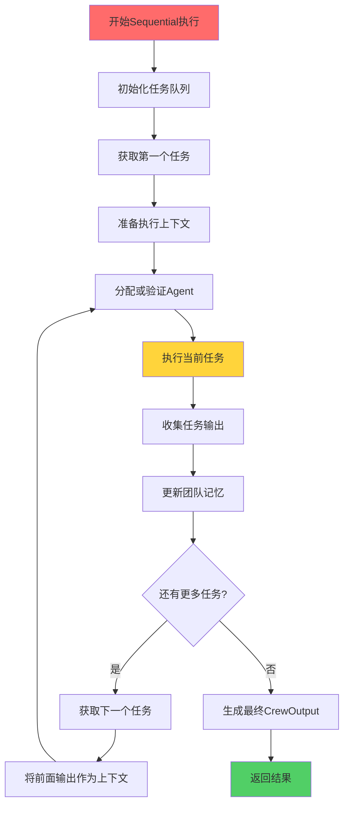
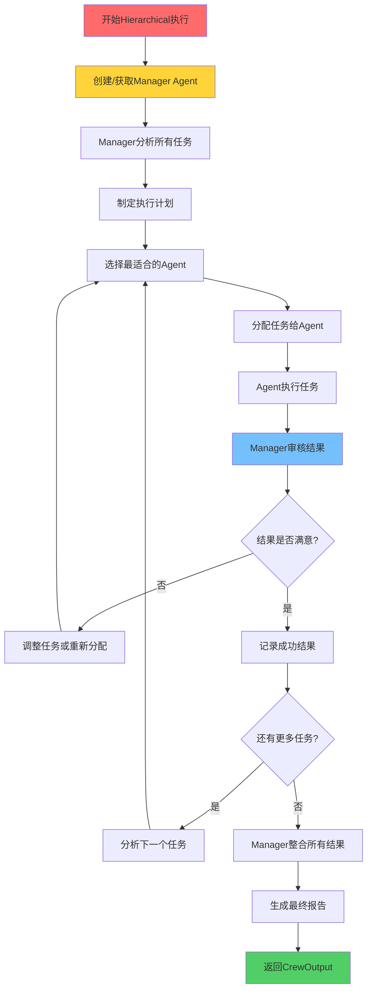
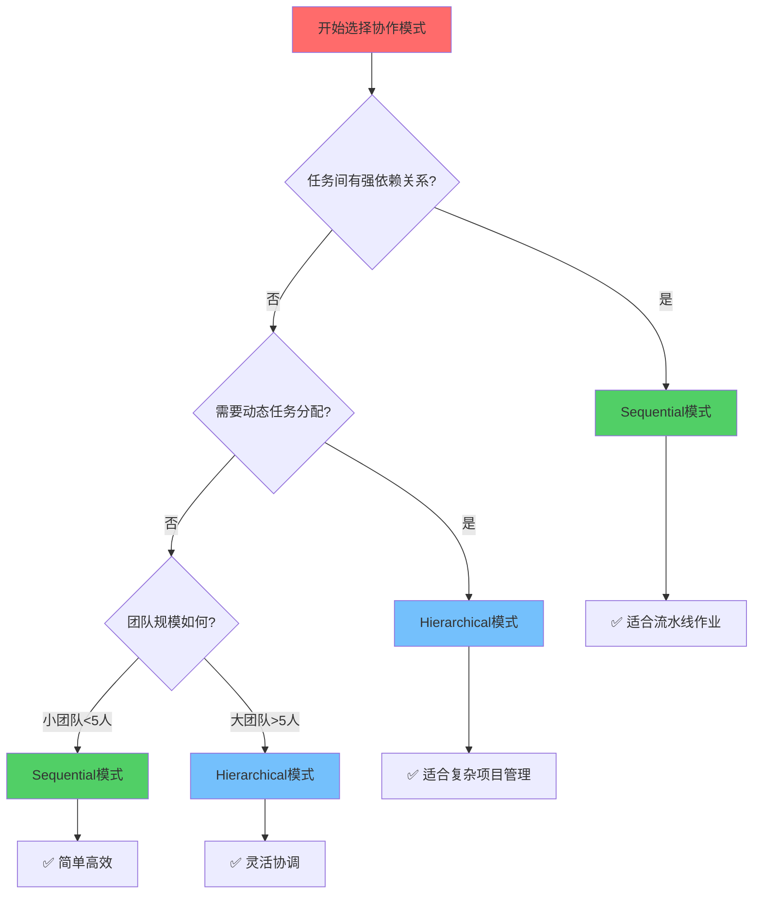

# 第4章：多智能体协作实战

> 🤝 团队合作的艺术！掌握Sequential和Hierarchical协作模式，让AI智能体们高效协作。

## 📋 章节大纲

本章将深入探讨：

1. **🔄 Sequential协作模式深度解析** - 掌握顺序执行的精髓
2. **👑 Hierarchical协作模式实战** - 学会层级管理的艺术
3. **🎯 协作模式选择策略** - 为不同场景选择最佳模式
4. **🚀 并行执行与性能优化** - 提升协作效率的高级技巧
5. **🔀 动态任务分配机制** - 智能化的任务调度
6. **🛡️ 错误处理和容错机制** - 构建稳定可靠的协作系统
7. **📊 协作监控与分析** - 实时监控团队表现
8. **🎪 复杂业务场景实战** - 解决真实世界的挑战

## 🎯 学习目标

完成本章学习后，你将能够：
- ✅ 深度掌握Sequential和Hierarchical两种协作模式
- ✅ 根据业务需求选择最适合的协作策略
- ✅ 设计和实现复杂的多智能体交互系统
- ✅ 优化协作效率和系统稳定性
- ✅ 处理大规模、高并发的AI协作场景
- ✅ 构建企业级的AI协作解决方案

---

## 4.1 Sequential协作模式深度解析🔄

### 🎮 游戏化理解：接力赛跑

Sequential模式就像接力赛跑：

- **🏃‍♂️ 第一棒**：起跑选手负责开局
- **🏃‍♀️ 第二棒**：接棒选手继续推进
- **🏃‍♂️ 第三棒**：加速选手提升速度
- **🏃‍♀️ 第四棒**：冲刺选手完成终点

每个选手都要等前一个完成才能开始，但每个人的贡献都会传递给下一个人。

### 📖 Sequential模式核心机制

<augment_code_snippet path="src/crewai/crew.py" mode="EXCERPT">
````python
def _run_sequential_process(self) -> CrewOutput:
    """顺序执行流程"""
    task_outputs = []

    for i, task in enumerate(self.tasks):
        # 1. 准备上下文
        context = self._get_context(task, task_outputs)

        # 2. 分配Agent
        if not task.agent:
            task.agent = self._get_best_agent_for_task(task)

        # 3. 执行任务
        task_output = task.execute(
            agent=task.agent,
            context=context,
            tools=self._get_tools_for_task(task)
        )

        # 4. 收集输出
        task_outputs.append(task_output)

        # 5. 更新团队记忆
        if self.memory:
            self._update_memory(task_output)

    return CrewOutput(
        raw=task_outputs[-1].raw,
        tasks_outputs=task_outputs
    )
````
</augment_code_snippet>

### 🔍 Sequential执行流程详解



### 🎯 Sequential模式最佳实践

#### 1. 任务依赖设计

```python
# 📋 设计有明确依赖关系的任务链
from crewai import Agent, Task, Crew, Process
from crewai.project import CrewBase, agent, crew, task

@CrewBase
class DataAnalysisCrew():
    """数据分析Sequential团队"""

    @agent
    def data_collector(self) -> Agent:
        """数据收集专家"""
        return Agent(
            role="数据收集专家",
            goal="收集高质量、相关的数据",
            backstory="你是数据收集领域的专家，擅长从各种源头获取准确的数据...",
            tools=[WebSearchTool(), DatabaseTool(), APITool()],
            verbose=True
        )

    @agent
    def data_cleaner(self) -> Agent:
        """数据清洗专家"""
        return Agent(
            role="数据清洗专家",
            goal="清洗和预处理数据，确保数据质量",
            backstory="你是数据预处理专家，能够识别和处理数据中的问题...",
            tools=[PythonCodeTool(), DataValidationTool()],
            verbose=True
        )

    @agent
    def data_analyst(self) -> Agent:
        """数据分析师"""
        return Agent(
            role="数据分析师",
            goal="深入分析数据，发现有价值的洞察",
            backstory="你是经验丰富的数据分析师，擅长统计分析和模式识别...",
            tools=[PythonCodeTool(), VisualizationTool(), StatsTool()],
            verbose=True
        )

    @agent
    def report_writer(self) -> Agent:
        """报告撰写员"""
        return Agent(
            role="报告撰写员",
            goal="将分析结果转化为清晰易懂的报告",
            backstory="你是专业的技术写作专家，能够将复杂分析转化为商业洞察...",
            tools=[FileWriterTool(), TemplateRenderTool()],
            verbose=True
        )

    @task
    def collect_data_task(self) -> Task:
        """数据收集任务"""
        return Task(
            description="""
            收集关于{topic}的相关数据：
            1. 搜索最新的行业报告和统计数据
            2. 收集相关的新闻和市场信息
            3. 获取历史趋势数据
            4. 验证数据来源的可靠性
            5. 将收集的数据保存为结构化格式
            """,
            expected_output="""
            一个包含以下内容的数据集合：
            - 行业统计数据（CSV格式）
            - 市场报告摘要（JSON格式）
            - 新闻和事件时间线
            - 数据来源和可信度评估
            """,
            agent=self.data_collector,
            output_file="raw_data.json"
        )

    @task
    def clean_data_task(self) -> Task:
        """数据清洗任务"""
        return Task(
            description="""
            清洗和预处理收集到的数据：
            1. 检查数据完整性和一致性
            2. 处理缺失值和异常值
            3. 标准化数据格式
            4. 去除重复和无关数据
            5. 创建清洗后的数据集
            """,
            expected_output="""
            清洗后的高质量数据集，包含：
            - 完整性检查报告
            - 数据质量评估
            - 清洗操作日志
            - 标准化的数据文件
            """,
            agent=self.data_cleaner,
            context=[self.collect_data_task],  # 依赖数据收集任务
            output_file="cleaned_data.json"
        )

    @task
    def analyze_data_task(self) -> Task:
        """数据分析任务"""
        return Task(
            description="""
            对清洗后的数据进行深入分析：
            1. 执行描述性统计分析
            2. 识别趋势和模式
            3. 进行相关性分析
            4. 创建数据可视化
            5. 提取关键洞察
            """,
            expected_output="""
            完整的数据分析结果，包含：
            - 统计分析报告
            - 趋势分析和预测
            - 可视化图表
            - 关键发现和洞察
            """,
            agent=self.data_analyst,
            context=[self.clean_data_task],  # 依赖数据清洗任务
            output_file="analysis_results.json"
        )

    @task
    def generate_report_task(self) -> Task:
        """报告生成任务"""
        return Task(
            description="""
            基于分析结果生成专业报告：
            1. 创建执行摘要
            2. 详细描述分析方法和结果
            3. 提供商业建议和行动计划
            4. 包含支撑图表和数据
            5. 确保报告的专业性和可读性
            """,
            expected_output="""
            一份完整的分析报告，包含：
            - 执行摘要
            - 详细分析结果
            - 商业建议
            - 支撑数据和图表
            - 下一步行动计划
            """,
            agent=self.report_writer,
            context=[self.analyze_data_task],  # 依赖数据分析任务
            output_file="final_report.md"
        )

    @crew
    def crew(self) -> Crew:
        """创建Sequential数据分析团队"""
        return Crew(
            agents=self.agents,
            tasks=self.tasks,
            process=Process.sequential,  # 顺序执行
            verbose=True,
            memory=True,  # 启用记忆以传递上下文
            cache=True,   # 启用缓存提升效率
        )
```

#### 2. 上下文传递优化

```python
# 🔗 优化上下文传递机制
class ContextOptimizedTask(Task):
    """优化上下文传递的任务"""

    def __init__(self, **kwargs):
        super().__init__(**kwargs)
        self.context_filter = kwargs.get('context_filter', None)
        self.context_transform = kwargs.get('context_transform', None)

    def get_filtered_context(self, context_outputs):
        """获取过滤后的上下文"""
        if not self.context_filter:
            return context_outputs

        filtered_context = []
        for output in context_outputs:
            if self.context_filter(output):
                if self.context_transform:
                    output = self.context_transform(output)
                filtered_context.append(output)

        return filtered_context

# 使用示例
def filter_data_context(output):
    """只传递数据相关的上下文"""
    return "data" in output.description.lower()

def transform_context(output):
    """转换上下文格式"""
    return {
        "summary": output.summary,
        "key_data": output.json_dict.get("key_metrics", {}),
        "timestamp": output.timestamp
    }

optimized_task = ContextOptimizedTask(
    description="基于前面的数据分析结果...",
    expected_output="优化的分析报告",
    agent=analyst_agent,
    context_filter=filter_data_context,
    context_transform=transform_context
)
```

#### 3. 错误恢复机制

```python
# 🛡️ Sequential模式的错误恢复
class ResilientSequentialCrew(Crew):
    """具有错误恢复能力的Sequential Crew"""

    def __init__(self, **kwargs):
        super().__init__(**kwargs)
        self.max_retries = kwargs.get('max_retries', 3)
        self.fallback_agents = kwargs.get('fallback_agents', {})

    def _execute_task_with_retry(self, task, context, attempt=1):
        """带重试的任务执行"""
        try:
            return task.execute(context=context)
        except Exception as e:
            if attempt < self.max_retries:
                print(f"⚠️ 任务执行失败，尝试第{attempt+1}次重试...")

                # 尝试使用备用Agent
                if task.agent.role in self.fallback_agents:
                    original_agent = task.agent
                    task.agent = self.fallback_agents[task.agent.role]
                    print(f"🔄 切换到备用Agent: {task.agent.role}")

                    try:
                        result = task.execute(context=context)
                        task.agent = original_agent  # 恢复原Agent
                        return result
                    except Exception:
                        task.agent = original_agent

                # 简化任务重试
                simplified_task = self._simplify_task(task)
                return self._execute_task_with_retry(simplified_task, context, attempt + 1)
            else:
                raise Exception(f"任务执行失败，已达到最大重试次数: {e}")

    def _simplify_task(self, task):
        """简化任务描述"""
        simplified_description = f"简化版本：{task.description[:200]}..."
        return Task(
            description=simplified_description,
            expected_output="简化的输出结果",
            agent=task.agent
        )

# 使用示例
resilient_crew = ResilientSequentialCrew(
    agents=[agent1, agent2, agent3],
    tasks=[task1, task2, task3],
    process=Process.sequential,
    max_retries=3,
    fallback_agents={
        "数据分析师": backup_analyst,
        "报告撰写员": backup_writer
    }
)
```
---

## 4.2 Hierarchical协作模式实战👑

### 🎮 游戏化理解：RTS指挥系统

Hierarchical模式就像即时战略游戏（RTS）中的指挥系统：

- **👑 指挥官**：统筹全局，制定战略
- **⚔️ 战斗单位**：执行具体任务
- **📊 情报系统**：收集和分析信息
- **🔄 动态调度**：根据战况调整策略

指挥官不直接战斗，而是分析局势、分配任务、协调资源。

### 📖 Hierarchical模式核心机制

<augment_code_snippet path="src/crewai/crew.py" mode="EXCERPT">
````python
def _run_hierarchical_process(self) -> CrewOutput:
    """层级执行流程"""
    # 1. 创建或获取Manager
    manager = self.manager_agent or self._create_manager()

    # 2. Manager分析任务
    task_plan = manager.plan_tasks(self.tasks)

    # 3. 动态分配和执行
    for planned_task in task_plan:
        best_agent = manager.select_agent(planned_task, self.agents)
        result = planned_task.execute(agent=best_agent)

        # Manager审核结果
        if not manager.validate_result(result):
            # 重新分配或调整
            continue

    return CrewOutput(raw=final_result)
````
</augment_code_snippet>

### 🔍 Hierarchical执行流程详解



### 🎯 Hierarchical模式实战案例

#### 1. 自定义Manager Agent

```python
# 👑 创建专业的项目经理Agent
from crewai import Agent, Task, Crew, Process
from crewai_tools import FileWriterTool, FileReadTool

class ProjectManagerAgent(Agent):
    """专业项目经理Agent"""

    def __init__(self):
        super().__init__(
            role="高级项目经理",
            goal="协调团队资源，确保项目高质量按时完成",
            backstory="""
            你是一位拥有15年经验的高级项目经理，曾成功管理过多个大型AI项目。
            你的核心能力包括：

            1. 任务分解和优先级排序
            2. 团队成员能力评估和任务匹配
            3. 项目进度监控和风险管理
            4. 质量控制和标准制定
            5. 跨部门沟通和协调

            你总是能够：
            - 快速识别项目的关键路径和瓶颈
            - 根据团队成员的专长合理分配任务
            - 在保证质量的前提下优化执行效率
            - 及时发现和解决项目中的问题
            - 确保所有交付物符合预期标准
            """,
            tools=[
                ProjectPlanningTool(),
                TaskAssignmentTool(),
                QualityControlTool(),
                ProgressTrackingTool()
            ],
            allow_delegation=True,  # 允许委派任务
            verbose=True,
            max_iter=10,
            memory=True
        )

    def analyze_task_complexity(self, task):
        """分析任务复杂度"""
        complexity_factors = {
            "description_length": len(task.description),
            "expected_output_detail": len(task.expected_output),
            "tools_required": len(task.tools) if task.tools else 0,
            "context_dependencies": len(task.context) if task.context else 0
        }

        # 简单的复杂度评分算法
        complexity_score = (
            complexity_factors["description_length"] * 0.1 +
            complexity_factors["expected_output_detail"] * 0.1 +
            complexity_factors["tools_required"] * 10 +
            complexity_factors["context_dependencies"] * 15
        )

        if complexity_score < 50:
            return "简单"
        elif complexity_score < 150:
            return "中等"
        else:
            return "复杂"

    def select_best_agent(self, task, available_agents):
        """为任务选择最佳Agent"""
        agent_scores = {}

        for agent in available_agents:
            score = 0

            # 基于角色匹配度评分
            if self._role_matches_task(agent.role, task.description):
                score += 50

            # 基于工具匹配度评分
            if hasattr(agent, 'tools') and agent.tools:
                tool_match_score = self._calculate_tool_match(agent.tools, task)
                score += tool_match_score

            # 基于历史表现评分（如果有记录）
            if hasattr(agent, 'performance_history'):
                score += agent.performance_history.get('average_score', 0) * 10

            agent_scores[agent] = score

        # 返回得分最高的Agent
        return max(agent_scores.items(), key=lambda x: x[1])[0]

    def _role_matches_task(self, role, task_description):
        """检查角色是否匹配任务"""
        role_keywords = {
            "研究": ["研究", "调查", "搜索", "收集", "分析"],
            "写作": ["写作", "撰写", "创作", "编辑", "文章"],
            "分析": ["分析", "评估", "计算", "统计", "数据"],
            "设计": ["设计", "创建", "制作", "美化", "界面"]
        }

        for role_type, keywords in role_keywords.items():
            if role_type in role:
                return any(keyword in task_description for keyword in keywords)

        return False

    def _calculate_tool_match(self, agent_tools, task):
        """计算工具匹配度"""
        if not task.tools:
            return 0

        agent_tool_names = [tool.name for tool in agent_tools]
        task_tool_names = [tool.name for tool in task.tools]

        matches = len(set(agent_tool_names) & set(task_tool_names))
        return (matches / len(task_tool_names)) * 30

# 🏗️ 创建Hierarchical团队
class ProductDevelopmentCrew:
    """产品开发Hierarchical团队"""

    def __init__(self):
        self.manager = ProjectManagerAgent()
        self.setup_team()

    def setup_team(self):
        """设置团队成员"""
        self.product_analyst = Agent(
            role="产品分析师",
            goal="深入分析市场需求和用户痛点",
            backstory="专业的产品分析师，擅长市场研究和用户需求分析...",
            tools=[WebSearchTool(), SurveyTool(), DataAnalysisTool()],
            allow_delegation=False,
            verbose=True
        )

        self.ui_designer = Agent(
            role="UI/UX设计师",
            goal="创建用户友好的界面设计",
            backstory="经验丰富的UI/UX设计师，专注于用户体验优化...",
            tools=[DesignTool(), PrototypeTool(), UserTestingTool()],
            allow_delegation=False,
            verbose=True
        )

        self.developer = Agent(
            role="全栈开发工程师",
            goal="实现高质量的产品功能",
            backstory="资深全栈开发工程师，精通前后端开发技术...",
            tools=[CodeGenerationTool(), TestingTool(), DeploymentTool()],
            allow_delegation=False,
            verbose=True
        )

        self.qa_engineer = Agent(
            role="质量保证工程师",
            goal="确保产品质量和用户体验",
            backstory="专业的QA工程师，具有丰富的测试经验...",
            tools=[TestingTool(), BugTrackingTool(), PerformanceTool()],
            allow_delegation=False,
            verbose=True
        )

    def create_tasks(self, product_idea):
        """创建产品开发任务"""
        return [
            Task(
                description=f"""
                对产品想法"{product_idea}"进行全面的市场分析：
                1. 研究目标市场和竞争对手
                2. 分析用户需求和痛点
                3. 评估市场机会和风险
                4. 提供产品定位建议
                """,
                expected_output="详细的市场分析报告，包含竞争分析、用户画像、市场机会评估",
                tools=[WebSearchTool(), DataAnalysisTool()]
            ),

            Task(
                description=f"""
                基于市场分析结果，设计产品的用户界面：
                1. 创建用户旅程地图
                2. 设计核心功能的界面原型
                3. 制定设计规范和风格指南
                4. 进行可用性评估
                """,
                expected_output="完整的UI/UX设计方案，包含原型、设计规范、用户测试结果",
                tools=[DesignTool(), PrototypeTool()]
            ),

            Task(
                description=f"""
                实现产品的核心功能：
                1. 搭建技术架构
                2. 开发核心功能模块
                3. 实现用户界面
                4. 集成第三方服务
                """,
                expected_output="可运行的产品原型，包含核心功能和用户界面",
                tools=[CodeGenerationTool(), DatabaseTool()]
            ),

            Task(
                description=f"""
                对开发完成的产品进行全面测试：
                1. 功能测试和集成测试
                2. 性能测试和压力测试
                3. 用户体验测试
                4. 安全性测试
                """,
                expected_output="完整的测试报告，包含测试结果、发现的问题、改进建议",
                tools=[TestingTool(), PerformanceTool()]
            )
        ]

    def create_crew(self, product_idea):
        """创建Hierarchical Crew"""
        tasks = self.create_tasks(product_idea)

        return Crew(
            agents=[
                self.manager,        # Manager Agent
                self.product_analyst,
                self.ui_designer,
                self.developer,
                self.qa_engineer
            ],
            tasks=tasks,
            process=Process.hierarchical,  # 层级执行
            manager_agent=self.manager,    # 指定自定义Manager
            verbose=True,
            memory=True,
            planning=True,  # 启用规划功能
        )

# 使用示例
def run_product_development():
    """运行产品开发项目"""
    crew_manager = ProductDevelopmentCrew()
    crew = crew_manager.create_crew("AI驱动的个人财务管理应用")

    result = crew.kickoff(inputs={
        "product_idea": "AI驱动的个人财务管理应用",
        "target_market": "年轻专业人士",
        "budget": "50万元",
        "timeline": "6个月"
    })

    return result
```

#### 2. Manager LLM配置优化

```python
# 🧠 优化Manager的LLM配置
from crewai import LLM

def create_optimized_manager_llm():
    """创建优化的Manager LLM"""
    return LLM(
        model="gpt-4o",  # 使用最强的模型
        temperature=0.1,  # 低温度确保一致性
        max_tokens=2000,  # 足够的输出长度
        timeout=60,       # 较长的超时时间
        # 针对管理任务的系统提示
        system_message="""
        你是一位专业的AI项目经理，负责协调多个AI智能体的工作。

        你的核心职责：
        1. 分析任务复杂度和优先级
        2. 根据Agent能力分配最合适的任务
        3. 监控执行进度和质量
        4. 协调Agent之间的协作
        5. 确保项目目标的达成

        决策原则：
        - 优先考虑任务的依赖关系
        - 充分利用每个Agent的专长
        - 平衡效率和质量
        - 及时识别和解决问题
        - 保持团队协作的和谐
        """
    )

# 使用优化的Manager LLM
optimized_crew = Crew(
    agents=[analyst, designer, developer, tester],
    tasks=[task1, task2, task3, task4],
    process=Process.hierarchical,
    manager_llm=create_optimized_manager_llm(),
    verbose=True
)
```

#### 3. 动态任务调整机制

```python
# 🔄 实现动态任务调整
class AdaptiveHierarchicalCrew(Crew):
    """自适应Hierarchical Crew"""

    def __init__(self, **kwargs):
        super().__init__(**kwargs)
        self.task_performance_history = {}
        self.agent_performance_history = {}

    def _execute_with_adaptation(self):
        """带自适应的执行"""
        for task in self.tasks:
            # 分析任务历史表现
            task_complexity = self._analyze_task_complexity(task)

            # 选择最佳Agent
            best_agent = self._select_optimal_agent(task, task_complexity)

            # 执行任务
            start_time = time.time()
            try:
                result = task.execute(agent=best_agent)
                execution_time = time.time() - start_time

                # 记录成功执行
                self._record_success(task, best_agent, execution_time, result)

            except Exception as e:
                execution_time = time.time() - start_time

                # 记录失败并尝试恢复
                self._record_failure(task, best_agent, execution_time, str(e))

                # 尝试用其他Agent重新执行
                alternative_agent = self._find_alternative_agent(task, best_agent)
                if alternative_agent:
                    result = task.execute(agent=alternative_agent)
                else:
                    raise e

    def _analyze_task_complexity(self, task):
        """分析任务复杂度"""
        factors = {
            "description_length": len(task.description.split()),
            "expected_output_complexity": len(task.expected_output.split()),
            "context_dependencies": len(task.context) if task.context else 0,
            "tools_required": len(task.tools) if task.tools else 0
        }

        # 基于历史数据调整复杂度评估
        if task.description in self.task_performance_history:
            historical_data = self.task_performance_history[task.description]
            factors["historical_difficulty"] = historical_data.get("avg_execution_time", 0)

        return factors

    def _select_optimal_agent(self, task, complexity):
        """选择最优Agent"""
        agent_scores = {}

        for agent in self.agents:
            if agent == self.manager_agent:
                continue  # 跳过Manager

            score = 0

            # 基于历史表现评分
            if agent.role in self.agent_performance_history:
                history = self.agent_performance_history[agent.role]
                score += history.get("success_rate", 0.5) * 50
                score += (1 / max(history.get("avg_execution_time", 1), 1)) * 20

            # 基于能力匹配评分
            capability_score = self._calculate_capability_match(agent, task)
            score += capability_score

            # 基于当前工作负载评分
            workload_penalty = self._calculate_workload_penalty(agent)
            score -= workload_penalty

            agent_scores[agent] = score

        return max(agent_scores.items(), key=lambda x: x[1])[0]

    def _record_success(self, task, agent, execution_time, result):
        """记录成功执行"""
        # 更新任务历史
        task_key = task.description
        if task_key not in self.task_performance_history:
            self.task_performance_history[task_key] = {
                "executions": 0,
                "total_time": 0,
                "success_count": 0
            }

        history = self.task_performance_history[task_key]
        history["executions"] += 1
        history["total_time"] += execution_time
        history["success_count"] += 1
        history["avg_execution_time"] = history["total_time"] / history["executions"]
        history["success_rate"] = history["success_count"] / history["executions"]

        # 更新Agent历史
        agent_key = agent.role
        if agent_key not in self.agent_performance_history:
            self.agent_performance_history[agent_key] = {
                "executions": 0,
                "total_time": 0,
                "success_count": 0
            }

        agent_history = self.agent_performance_history[agent_key]
        agent_history["executions"] += 1
        agent_history["total_time"] += execution_time
        agent_history["success_count"] += 1
        agent_history["avg_execution_time"] = agent_history["total_time"] / agent_history["executions"]
        agent_history["success_rate"] = agent_history["success_count"] / agent_history["executions"]
```
```

---

## 4.3 协作模式选择策略🎯

### 🎮 游戏化理解：选择游戏模式

选择协作模式就像选择游戏模式：

- **🏃‍♂️ Sequential = 单人闯关模式**：一关一关按顺序通过
- **👑 Hierarchical = 团队竞技模式**：有队长指挥，灵活应对

### 📊 模式对比分析

| 特性 | Sequential | Hierarchical |
|------|------------|--------------|
| **执行方式** | 按顺序依次执行 | Manager动态分配 |
| **任务依赖** | 强依赖关系 | 弱依赖关系 |
| **灵活性** | 较低 | 很高 |
| **复杂度** | 简单 | 复杂 |
| **适用场景** | 流水线作业 | 项目管理 |
| **错误处理** | 影响后续任务 | 可以重新分配 |
| **并行能力** | 无 | 有限并行 |
| **资源利用** | 顺序利用 | 优化利用 |

### 🎯 选择决策树



### 🎯 具体选择指南

#### 1. 选择Sequential的场景

```python
# ✅ 适合Sequential的场景
scenarios_for_sequential = {
    "数据处理流水线": {
        "特点": "数据收集 → 清洗 → 分析 → 报告",
        "原因": "每步都依赖前一步的输出",
        "示例": "ETL数据处理、内容创作流程"
    },

    "文档生成流程": {
        "特点": "研究 → 写作 → 编辑 → 发布",
        "原因": "线性依赖关系明确",
        "示例": "技术文档、营销材料创作"
    },

    "产品开发流程": {
        "特点": "需求 → 设计 → 开发 → 测试",
        "原因": "传统瀑布模型适用",
        "示例": "小型功能开发、原型制作"
    },

    "学习教学流程": {
        "特点": "基础 → 进阶 → 实践 → 评估",
        "原因": "知识建构的递进性",
        "示例": "课程设计、培训材料"
    }
}

def should_use_sequential(project_characteristics):
    """判断是否应该使用Sequential模式"""
    score = 0

    # 检查依赖关系
    if project_characteristics.get("strong_dependencies", False):
        score += 30

    # 检查任务复杂度
    if project_characteristics.get("task_complexity", "medium") == "low":
        score += 20

    # 检查团队规模
    if project_characteristics.get("team_size", 5) <= 4:
        score += 15

    # 检查时间压力
    if project_characteristics.get("time_pressure", "medium") == "high":
        score += 10

    # 检查质量要求
    if project_characteristics.get("quality_requirements", "medium") == "high":
        score += 15

    return score >= 50
```

#### 2. 选择Hierarchical的场景

```python
# ✅ 适合Hierarchical的场景
scenarios_for_hierarchical = {
    "复杂项目管理": {
        "特点": "多个并行任务，需要协调",
        "原因": "Manager可以优化资源分配",
        "示例": "软件开发项目、市场活动"
    },

    "研究项目": {
        "特点": "多个研究方向，可以并行",
        "原因": "可以根据发现动态调整",
        "示例": "学术研究、市场调研"
    },

    "创意项目": {
        "特点": "需要多种专业技能",
        "原因": "Manager可以协调不同专家",
        "示例": "广告创意、产品设计"
    },

    "应急响应": {
        "特点": "情况变化快，需要灵活应对",
        "原因": "Manager可以实时调整策略",
        "示例": "危机处理、客户服务"
    }
}

def should_use_hierarchical(project_characteristics):
    """判断是否应该使用Hierarchical模式"""
    score = 0

    # 检查任务独立性
    if project_characteristics.get("task_independence", False):
        score += 25

    # 检查团队规模
    if project_characteristics.get("team_size", 5) >= 5:
        score += 20

    # 检查复杂度
    if project_characteristics.get("project_complexity", "medium") == "high":
        score += 25

    # 检查变化频率
    if project_characteristics.get("requirement_changes", "low") == "high":
        score += 20

    # 检查专业化程度
    if project_characteristics.get("specialization_level", "medium") == "high":
        score += 10

    return score >= 60
```

#### 3. 混合模式策略

```python
# 🔀 混合模式：在不同阶段使用不同模式
class HybridCollaborationStrategy:
    """混合协作策略"""

    def __init__(self):
        self.phase_strategies = {}

    def define_phase_strategy(self, phase_name, mode, agents, tasks):
        """定义阶段策略"""
        self.phase_strategies[phase_name] = {
            "mode": mode,
            "agents": agents,
            "tasks": tasks
        }

    def execute_hybrid_project(self, project_phases):
        """执行混合项目"""
        results = {}

        for phase_name in project_phases:
            strategy = self.phase_strategies[phase_name]

            if strategy["mode"] == "sequential":
                crew = Crew(
                    agents=strategy["agents"],
                    tasks=strategy["tasks"],
                    process=Process.sequential,
                    verbose=True
                )
            else:  # hierarchical
                crew = Crew(
                    agents=strategy["agents"],
                    tasks=strategy["tasks"],
                    process=Process.hierarchical,
                    manager_llm=create_optimized_manager_llm(),
                    verbose=True
                )

            phase_result = crew.kickoff()
            results[phase_name] = phase_result

            print(f"✅ 完成阶段: {phase_name}")

        return results

# 使用示例：产品开发的混合策略
hybrid_strategy = HybridCollaborationStrategy()

# 阶段1：需求分析（Sequential）
hybrid_strategy.define_phase_strategy(
    "需求分析",
    mode="sequential",
    agents=[market_researcher, user_researcher, business_analyst],
    tasks=[market_research_task, user_research_task, requirement_task]
)

# 阶段2：设计开发（Hierarchical）
hybrid_strategy.define_phase_strategy(
    "设计开发",
    mode="hierarchical",
    agents=[project_manager, ui_designer, backend_dev, frontend_dev],
    tasks=[design_task, backend_task, frontend_task, integration_task]
)

# 阶段3：测试发布（Sequential）
hybrid_strategy.define_phase_strategy(
    "测试发布",
    mode="sequential",
    agents=[qa_engineer, devops_engineer, product_manager],
    tasks=[testing_task, deployment_task, launch_task]
)

# 执行混合项目
results = hybrid_strategy.execute_hybrid_project([
    "需求分析", "设计开发", "测试发布"
])
```

---

## 4.4 本章小结📚

恭喜你！🎉 你已经掌握了CrewAI多智能体协作的精髓！

### ✅ 本章成就解锁

- **🔄 Sequential大师**：深度掌握顺序协作模式
- **👑 Hierarchical专家**：熟练运用层级管理模式
- **🎯 策略规划师**：能够为不同场景选择最佳协作模式
- **🔀 混合模式架构师**：设计复杂的多阶段协作策略
- **📊 性能优化师**：优化协作效率和系统稳定性

### 📖 核心知识回顾

1. **🔄 Sequential协作模式**：
   - 适合有强依赖关系的线性流程
   - 简单可靠，易于监控和调试
   - 上下文传递机制确保信息连贯性

2. **👑 Hierarchical协作模式**：
   - 适合复杂项目和动态任务分配
   - Manager Agent统筹协调，优化资源利用
   - 支持并行执行和灵活调整

3. **🎯 模式选择策略**：
   - 基于任务依赖关系、团队规模、项目复杂度选择
   - 可以在不同阶段使用不同模式
   - 混合策略适合复杂的多阶段项目

4. **⚡ 性能优化技巧**：
   - 智能任务分配和Agent选择
   - 错误恢复和容错机制
   - 历史数据驱动的自适应优化

### 🎯 实际应用价值

通过本章学习，你现在能够：

- **🏗️ 设计高效的AI协作系统**：根据业务需求选择最佳协作模式
- **📊 优化团队表现**：通过数据驱动的方式提升协作效率
- **🛡️ 构建稳定系统**：实现错误恢复和容错机制
- **🔄 适应变化需求**：灵活调整协作策略应对复杂场景

### 🚀 下一步预告

在第5章中，我们将深入探索工具集成与自定义开发，学习：

- 🛠️ **内置工具深度使用**：掌握CrewAI提供的强大工具
- 🔧 **自定义工具开发**：为特定需求开发专门工具
- 🌐 **第三方服务集成**：连接外部API和服务
- 🎯 **工具链优化**：设计高效的工具使用策略

---

**🎉 准备好了吗？让我们前往 [第5章：工具集成与自定义开发](./CrewAI学习指南-第5章.md)，为AI智能体装上更强大的翅膀！**
