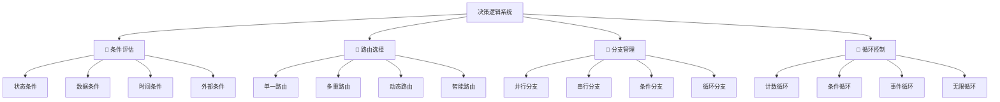
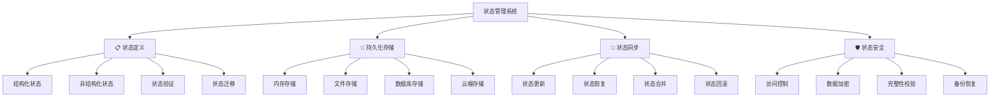
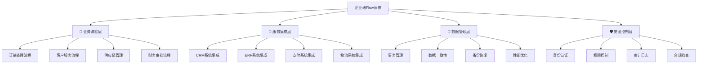
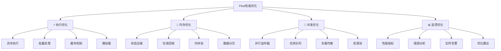

# 第6章：Flow工作流高级应用

> 🌊 掌控AI的流动！深入Flow工作流，实现事件驱动、条件分支的高级AI应用。

## 📋 章节大纲

本章将全面介绍：

1. **🌊 Flow工作流核心概念** - 理解Flow的本质和优势
2. **⚡ 事件驱动架构设计** - 构建响应式AI工作流
3. **🔀 条件分支和决策逻辑** - 实现智能路由和分支
4. **💾 状态管理和持久化** - 管理复杂的工作流状态
5. **🎭 复杂Flow场景实战** - 企业级工作流案例
6. **🚀 Flow性能优化技巧** - 提升工作流执行效率
7. **🔧 Flow调试和监控** - 工作流的调试和监控方法
8. **🎪 综合实战案例** - 完整的企业级Flow应用

## 🎯 学习目标

完成本章学习后，你将能够：
- ✅ 深度理解Flow工作流的核心概念和架构
- ✅ 熟练使用事件驱动模式构建复杂工作流
- ✅ 实现条件分支、循环和复杂决策逻辑
- ✅ 掌握Flow状态管理和持久化技术
- ✅ 设计和实现企业级的AI工作流系统
- ✅ 优化Flow性能并进行有效的调试监控

---

## 6.1 Flow工作流核心概念🌊

### 🎮 游戏化理解：剧情编辑器

Flow工作流就像游戏中的剧情编辑器：

- **📜 剧情脚本**：Flow类定义整个工作流
- **🎬 场景节点**：每个方法是一个场景
- **🔗 剧情分支**：条件路由决定故事走向
- **💾 存档系统**：状态管理保存进度
- **⚡ 事件触发**：装饰器系统控制剧情流转

### 📊 Flow架构全景

```mermaid
graph TD
    A[Flow工作流系统] --> B[🎯 装饰器系统]
    A --> C[💾 状态管理]
    A --> D[⚡ 事件驱动]
    A --> E[🔀 路由控制]
    A --> F[🔄 执行引擎]

    B --> B1[@start - 启动点]
    B --> B2[@listen - 监听器]
    B --> B3[@router - 路由器]
    B --> B4[@persist - 持久化]

    C --> C1[结构化状态]
    C --> C2[非结构化状态]
    C --> C3[状态持久化]
    C --> C4[状态恢复]

    D --> D1[方法完成事件]
    D --> D2[条件触发事件]
    D --> D3[错误处理事件]
    D --> D4[生命周期事件]

    E --> E1[条件路由]
    E --> E2[动态分支]
    E --> E3[并行执行]
    E --> E4[循环控制]

    F --> F1[异步执行]
    F --> F2[依赖解析]
    F --> F3[错误恢复]
    F --> F4[性能监控]
```

### 🏗️ Flow基础架构

#### 1. Flow类的核心结构

<augment_code_snippet path="src/crewai/flow/flow.py" mode="EXCERPT">
````python
class Flow(Generic[T], metaclass=FlowMeta):
    """Flow基类，支持事件驱动的工作流"""

    # 装饰器系统
    _start_methods: List[str] = []              # 启动方法
    _listeners: Dict[str, tuple] = {}           # 监听器映射
    _routers: Set[str] = set()                  # 路由器集合
    _router_paths: Dict[str, List[str]] = {}    # 路由路径

    # 状态管理
    initial_state: Union[Type[T], T, None] = None
    _state: T                                   # 当前状态

    # 执行控制
    _method_outputs: List[Any] = []             # 方法输出历史
    _method_execution_counts: Dict[str, int] = {} # 执行计数
    _pending_and_listeners: Dict[str, Set[str]] = {} # 待处理监听器
````
</augment_code_snippet>

#### 2. 基础Flow示例

```python
# 🌊 基础Flow工作流示例
from crewai.flow.flow import Flow, start, listen, router
from pydantic import BaseModel
from typing import Dict, Any

class SimpleFlowState(BaseModel):
    """简单Flow状态模型"""
    user_input: str = ""
    processed_data: str = ""
    result: str = ""
    step_count: int = 0

class SimpleFlow(Flow[SimpleFlowState]):
    """简单的Flow工作流示例"""

    @start()
    def initialize_flow(self):
        """🎬 流程初始化"""
        print("🚀 Flow工作流启动")
        self.state.user_input = "Hello CrewAI Flow!"
        self.state.step_count += 1

        return {
            "message": "Flow已初始化",
            "input": self.state.user_input
        }

    @listen(initialize_flow)
    def process_input(self, initialization_result):
        """📝 处理输入数据"""
        print(f"📝 处理输入: {self.state.user_input}")

        # 模拟数据处理
        processed = f"已处理: {self.state.user_input.upper()}"
        self.state.processed_data = processed
        self.state.step_count += 1

        return {
            "processed": processed,
            "step": self.state.step_count
        }

    @listen(process_input)
    def generate_result(self, process_result):
        """🎯 生成最终结果"""
        print(f"🎯 生成结果，当前步骤: {self.state.step_count}")

        result = f"最终结果: {self.state.processed_data} - 完成于步骤{self.state.step_count}"
        self.state.result = result
        self.state.step_count += 1

        return {
            "final_result": result,
            "total_steps": self.state.step_count
        }

# 使用示例
def run_simple_flow():
    """运行简单Flow示例"""
    flow = SimpleFlow()
    result = flow.kickoff()

    print(f"\n🎉 Flow执行完成!")
    print(f"最终状态: {flow.state}")
    print(f"最终结果: {result}")

# 运行示例
if __name__ == "__main__":
    run_simple_flow()
```

### 🎯 Flow vs Crew 对比分析

#### 核心差异对比

| 特性 | Crew | Flow |
|------|------|------|
| **设计理念** | 团队协作模式 | 事件驱动工作流 |
| **执行模式** | 顺序/层级执行 | 事件触发执行 |
| **状态管理** | 任务间传递 | 全局状态管理 |
| **条件控制** | 有限的条件控制 | 丰富的条件路由 |
| **复杂度** | 适合中等复杂度 | 适合高复杂度 |
| **扩展性** | Agent和Task扩展 | 方法和事件扩展 |

#### 使用场景选择

```python
# 🤔 何时使用Crew vs Flow

# ✅ 使用Crew的场景：
# - 明确的角色分工（研究员、分析师、写作者）
# - 线性或简单的工作流程
# - 团队协作模拟
# - 快速原型开发

class ResearchCrew:
    """适合使用Crew的研究场景"""
    def create_research_crew(self):
        return Crew(
            agents=[researcher, analyst, writer],
            tasks=[research_task, analysis_task, writing_task],
            process=Process.sequential
        )

# ✅ 使用Flow的场景：
# - 复杂的条件分支逻辑
# - 事件驱动的响应式系统
# - 需要状态持久化
# - 多阶段的复杂工作流

class ComplexBusinessFlow(Flow[BusinessState]):
    """适合使用Flow的复杂业务场景"""

    @start()
    def receive_request(self):
        """接收业务请求"""
        pass

    @router(receive_request)
    def classify_request(self):
        """根据请求类型路由"""
        if self.state.request_type == "urgent":
            return "urgent_path"
        elif self.state.request_type == "standard":
            return "standard_path"
        else:
            return "review_path"

    @listen("urgent_path")
    def handle_urgent(self):
        """处理紧急请求"""
        pass

    @listen("standard_path")
    def handle_standard(self):
        """处理标准请求"""
        pass
```

---

## 6.2 事件驱动架构设计⚡

### 🎮 游戏化理解：技能连锁系统

事件驱动架构就像游戏中的技能连锁系统：

- **⚡ 技能触发**：一个技能的完成触发下一个技能
- **🔗 连锁反应**：技能之间形成复杂的连锁关系
- **🎯 条件激活**：满足特定条件才能激活某些技能
- **🌟 组合技能**：多个技能同时完成才能触发终极技能

### 📊 事件驱动模式详解

```mermaid
graph TD
    A[事件驱动架构] --> B[🎯 装饰器系统]
    A --> C[⚡ 事件传播]
    A --> D[🔀 条件逻辑]
    A --> E[🔄 执行控制]

    B --> B1[@start - 无条件启动]
    B --> B2[@listen - 单一监听]
    B --> B3[@router - 条件路由]
    B --> B4[and_ - 全部完成]
    B --> B5[or_ - 任一完成]

    C --> C1[方法完成事件]
    C --> C2[路由选择事件]
    C --> C3[错误处理事件]
    C --> C4[状态变更事件]

    D --> D1[简单条件判断]
    D --> D2[复杂逻辑组合]
    D --> D3[动态条件评估]
    D --> D4[状态依赖条件]

    E --> E1[异步执行管理]
    E --> E2[依赖关系解析]
    E --> E3[执行顺序控制]
    E --> E4[错误传播处理]
```

### 🎯 装饰器系统深度解析

#### 1. @start装饰器 - 流程起点

```python
# 🎬 @start装饰器详解
from crewai.flow.flow import Flow, start, listen, and_, or_

class StartDecoratorDemo(Flow):
    """@start装饰器示例"""

    # ✅ 无条件启动 - 最常用
    @start()
    def unconditional_start(self):
        """无条件启动方法"""
        print("🚀 Flow无条件启动")
        return "启动完成"

    # ✅ 条件启动 - 依赖其他方法
    @start("trigger_method")
    def conditional_start(self):
        """条件启动方法"""
        print("🎯 条件满足，启动Flow")
        return "条件启动完成"

    # ✅ 复杂条件启动
    @start(and_("method_a", "method_b"))
    def complex_start(self):
        """复杂条件启动"""
        print("🌟 复杂条件满足，启动Flow")
        return "复杂启动完成"

    # 辅助方法
    def trigger_method(self):
        """触发方法"""
        return "触发器激活"

    def method_a(self):
        return "A完成"

    def method_b(self):
        return "B完成"

# 使用示例
demo_flow = StartDecoratorDemo()
result = demo_flow.kickoff()
```

#### 2. @listen装饰器 - 事件监听

```python
# 👂 @listen装饰器详解
class ListenDecoratorDemo(Flow):
    """@listen装饰器示例"""

    @start()
    def initialize(self):
        """初始化方法"""
        print("🎬 初始化Flow")
        return {"status": "initialized", "data": "初始数据"}

    # ✅ 简单监听 - 监听单个方法
    @listen(initialize)
    def simple_listener(self, init_result):
        """简单监听器"""
        print(f"👂 监听到初始化完成: {init_result}")
        return f"处理了: {init_result['data']}"

    # ✅ 多重监听 - 同一个方法被多个监听器监听
    @listen(initialize)
    def another_listener(self, init_result):
        """另一个监听器"""
        print(f"👂 另一个监听器收到: {init_result}")
        return "并行处理完成"

    # ✅ 链式监听 - 监听器的监听器
    @listen(simple_listener)
    def chain_listener(self, simple_result):
        """链式监听器"""
        print(f"🔗 链式监听: {simple_result}")
        return "链式处理完成"

    # ✅ 条件监听 - 使用逻辑操作符
    @listen(and_(simple_listener, another_listener))
    def conditional_listener(self, *results):
        """条件监听器 - 等待多个方法完成"""
        print(f"🎯 条件监听器激活，收到结果: {results}")
        return "条件监听完成"

    @listen(or_(chain_listener, conditional_listener))
    def final_listener(self, result):
        """最终监听器 - 任一条件满足即可"""
        print(f"🏁 最终监听器: {result}")
        return "Flow完成"

# 使用示例
listen_demo = ListenDecoratorDemo()
result = listen_demo.kickoff()
```

#### 3. @router装饰器 - 智能路由

```python
# 🔀 @router装饰器详解
from enum import Enum

class ProcessingType(Enum):
    """处理类型枚举"""
    FAST = "fast"
    ACCURATE = "accurate"
    BALANCED = "balanced"

class RouterState(BaseModel):
    """路由状态模型"""
    processing_type: ProcessingType = ProcessingType.BALANCED
    data_size: int = 0
    priority: str = "normal"
    user_preference: str = "default"

class RouterDecoratorDemo(Flow[RouterState]):
    """@router装饰器示例"""

    @start()
    def analyze_request(self):
        """分析请求"""
        print("🔍 分析请求特征")

        # 模拟请求分析
        import random
        self.state.data_size = random.randint(1, 1000)
        self.state.priority = random.choice(["low", "normal", "high", "urgent"])
        self.state.user_preference = random.choice(["fast", "accurate", "balanced"])

        return {
            "data_size": self.state.data_size,
            "priority": self.state.priority,
            "preference": self.state.user_preference
        }

    @router(analyze_request)
    def route_processing(self):
        """智能路由决策"""
        print(f"🔀 路由决策 - 数据大小: {self.state.data_size}, 优先级: {self.state.priority}")

        # 复杂的路由逻辑
        if self.state.priority == "urgent":
            return "urgent_processing"
        elif self.state.data_size > 500:
            if self.state.user_preference == "fast":
                return "fast_processing"
            else:
                return "batch_processing"
        elif self.state.user_preference == "accurate":
            return "accurate_processing"
        else:
            return "balanced_processing"

    # 不同的处理路径
    @listen("urgent_processing")
    def handle_urgent(self):
        """紧急处理路径"""
        print("🚨 紧急处理模式")
        return "紧急处理完成 - 用时最短"

    @listen("fast_processing")
    def handle_fast(self):
        """快速处理路径"""
        print("⚡ 快速处理模式")
        return "快速处理完成 - 速度优先"

    @listen("accurate_processing")
    def handle_accurate(self):
        """精确处理路径"""
        print("🎯 精确处理模式")
        return "精确处理完成 - 质量优先"

    @listen("balanced_processing")
    def handle_balanced(self):
        """平衡处理路径"""
        print("⚖️ 平衡处理模式")
        return "平衡处理完成 - 速度质量兼顾"

    @listen("batch_processing")
    def handle_batch(self):
        """批量处理路径"""
        print("📦 批量处理模式")
        return "批量处理完成 - 大数据优化"

    # 汇总结果
    @listen(or_("urgent_processing", "fast_processing", "accurate_processing",
                "balanced_processing", "batch_processing"))
    def finalize_result(self, processing_result):
        """汇总最终结果"""
        print(f"🏁 处理完成: {processing_result}")
        return {
            "final_result": processing_result,
            "route_taken": "智能路由选择",
            "state": self.state.dict()
        }

# 使用示例
router_demo = RouterDecoratorDemo()
result = router_demo.kickoff()
print(f"\n🎉 路由演示完成: {result}")
```

### 🔗 高级条件组合

#### 1. 复杂逻辑组合

```python
# 🧠 复杂逻辑组合示例
from crewai.flow.flow import and_, or_

class ComplexLogicFlow(Flow):
    """复杂逻辑组合示例"""

    @start()
    def start_parallel_tasks(self):
        """启动并行任务"""
        print("🚀 启动多个并行任务")
        return "并行任务启动"

    # 并行执行的任务
    @listen(start_parallel_tasks)
    def task_validation(self):
        """数据验证任务"""
        print("✅ 执行数据验证")
        import time
        time.sleep(1)  # 模拟处理时间
        return "验证完成"

    @listen(start_parallel_tasks)
    def task_preprocessing(self):
        """数据预处理任务"""
        print("🔧 执行数据预处理")
        import time
        time.sleep(1.5)  # 模拟处理时间
        return "预处理完成"

    @listen(start_parallel_tasks)
    def task_authorization(self):
        """权限验证任务"""
        print("🔐 执行权限验证")
        import time
        time.sleep(0.8)  # 模拟处理时间
        return "权限验证完成"

    @listen(start_parallel_tasks)
    def task_resource_check(self):
        """资源检查任务"""
        print("📊 执行资源检查")
        import time
        time.sleep(1.2)  # 模拟处理时间
        return "资源检查完成"

    # 复杂条件组合
    @listen(and_(task_validation, task_preprocessing))
    def data_ready(self, validation_result, preprocessing_result):
        """数据准备完成 - 需要验证和预处理都完成"""
        print(f"📋 数据准备完成: {validation_result}, {preprocessing_result}")
        return "数据已准备就绪"

    @listen(and_(task_authorization, task_resource_check))
    def environment_ready(self, auth_result, resource_result):
        """环境准备完成 - 需要权限和资源都就绪"""
        print(f"🏗️ 环境准备完成: {auth_result}, {resource_result}")
        return "环境已准备就绪"

    # 最终条件：数据和环境都准备好
    @listen(and_(data_ready, environment_ready))
    def start_main_processing(self, data_status, env_status):
        """开始主要处理 - 需要数据和环境都准备好"""
        print(f"🎯 开始主要处理: {data_status}, {env_status}")
        return "主要处理已启动"

    # 备用路径：如果某些任务失败，仍可继续
    @listen(or_(task_validation, task_preprocessing))
    def partial_data_ready(self, result):
        """部分数据准备完成"""
        print(f"⚠️ 部分数据准备完成: {result}")
        return "部分数据可用"

    # 应急处理：在主处理或部分处理任一完成后执行
    @listen(or_(start_main_processing, partial_data_ready))
    def emergency_fallback(self, result):
        """应急后备处理"""
        print(f"🆘 应急处理激活: {result}")
        return "应急处理完成"

# 使用示例
complex_flow = ComplexLogicFlow()
result = complex_flow.kickoff()
```

---

## 6.3 条件分支和决策逻辑🔀

### 🎮 游戏化理解：剧情分支系统

条件分支就像游戏中的剧情分支系统：

- **🎭 选择节点**：玩家的选择决定剧情走向
- **🔮 条件判断**：基于角色属性和游戏状态
- **🌳 分支树**：复杂的多层分支结构
- **🎯 结局收束**：不同分支最终汇聚到结局

### 📊 决策逻辑架构



### 🎯 智能决策系统

#### 1. 基于状态的决策

```python
# 🧠 基于状态的智能决策系统
from enum import Enum
from datetime import datetime, timedelta
import random

class UserType(Enum):
    """用户类型"""
    GUEST = "guest"
    MEMBER = "member"
    VIP = "vip"
    ADMIN = "admin"

class RequestPriority(Enum):
    """请求优先级"""
    LOW = 1
    NORMAL = 2
    HIGH = 3
    URGENT = 4

class BusinessFlowState(BaseModel):
    """业务流程状态"""
    user_type: UserType = UserType.GUEST
    request_priority: RequestPriority = RequestPriority.NORMAL
    data_size: int = 0
    processing_time_limit: int = 30  # 秒
    retry_count: int = 0
    max_retries: int = 3
    error_occurred: bool = False
    business_hours: bool = True
    system_load: float = 0.5  # 0.0 - 1.0

class IntelligentDecisionFlow(Flow[BusinessFlowState]):
    """智能决策流程"""

    @start()
    def analyze_request(self):
        """🔍 分析请求特征"""
        print("🔍 开始分析请求...")

        # 模拟请求分析
        self.state.user_type = random.choice(list(UserType))
        self.state.request_priority = random.choice(list(RequestPriority))
        self.state.data_size = random.randint(1, 10000)
        self.state.system_load = random.uniform(0.1, 0.9)
        self.state.business_hours = datetime.now().hour >= 9 and datetime.now().hour <= 17

        print(f"📊 请求分析完成:")
        print(f"   用户类型: {self.state.user_type.value}")
        print(f"   优先级: {self.state.request_priority.value}")
        print(f"   数据大小: {self.state.data_size}")
        print(f"   系统负载: {self.state.system_load:.2f}")
        print(f"   工作时间: {self.state.business_hours}")

        return "请求分析完成"

    @router(analyze_request)
    def route_by_priority(self):
        """🎯 基于优先级的路由决策"""
        print("🎯 执行优先级路由决策...")

        # 复杂的决策逻辑
        if self.state.request_priority == RequestPriority.URGENT:
            return "urgent_path"
        elif self.state.request_priority == RequestPriority.HIGH:
            if self.state.user_type in [UserType.VIP, UserType.ADMIN]:
                return "high_priority_vip_path"
            else:
                return "high_priority_normal_path"
        elif self.state.request_priority == RequestPriority.NORMAL:
            if self.state.system_load > 0.8:
                return "queue_path"
            else:
                return "normal_path"
        else:  # LOW priority
            if not self.state.business_hours:
                return "delayed_path"
            else:
                return "low_priority_path"

    # 紧急处理路径
    @listen("urgent_path")
    def handle_urgent_request(self):
        """🚨 紧急请求处理"""
        print("🚨 紧急请求处理中...")

        # 紧急处理逻辑
        processing_time = min(5, self.state.processing_time_limit)

        return {
            "status": "urgent_completed",
            "processing_time": processing_time,
            "message": "紧急请求已优先处理"
        }

    # VIP高优先级路径
    @listen("high_priority_vip_path")
    def handle_vip_high_priority(self):
        """👑 VIP高优先级处理"""
        print("👑 VIP高优先级处理中...")

        return {
            "status": "vip_completed",
            "processing_time": 10,
            "message": "VIP用户高优先级处理完成",
            "bonus": "额外服务已提供"
        }

    # 普通高优先级路径
    @listen("high_priority_normal_path")
    def handle_normal_high_priority(self):
        """⚡ 普通用户高优先级处理"""
        print("⚡ 普通用户高优先级处理中...")

        return {
            "status": "high_completed",
            "processing_time": 15,
            "message": "高优先级处理完成"
        }

    # 正常处理路径
    @listen("normal_path")
    def handle_normal_request(self):
        """📋 正常请求处理"""
        print("📋 正常请求处理中...")

        # 根据数据大小调整处理时间
        processing_time = min(20, self.state.data_size // 100 + 5)

        return {
            "status": "normal_completed",
            "processing_time": processing_time,
            "message": "正常请求处理完成"
        }

    # 队列处理路径
    @listen("queue_path")
    def handle_queued_request(self):
        """⏳ 队列处理"""
        print("⏳ 请求已加入处理队列...")

        # 模拟队列等待
        queue_time = int(self.state.system_load * 30)

        return {
            "status": "queued_completed",
            "processing_time": queue_time,
            "message": f"队列处理完成，等待时间: {queue_time}秒"
        }

    # 低优先级路径
    @listen("low_priority_path")
    def handle_low_priority(self):
        """🐌 低优先级处理"""
        print("🐌 低优先级处理中...")

        return {
            "status": "low_completed",
            "processing_time": 30,
            "message": "低优先级处理完成"
        }

    # 延迟处理路径
    @listen("delayed_path")
    def handle_delayed_request(self):
        """🌙 延迟到工作时间处理"""
        print("🌙 非工作时间，请求已延迟...")

        return {
            "status": "delayed",
            "processing_time": 0,
            "message": "请求已安排在下个工作日处理",
            "scheduled_time": "明日9:00"
        }

    # 结果汇总
    @listen(or_("urgent_path", "high_priority_vip_path", "high_priority_normal_path",
                "normal_path", "queue_path", "low_priority_path", "delayed_path"))
    def finalize_processing(self, result):
        """🏁 处理结果汇总"""
        print(f"🏁 处理完成: {result}")

        # 记录处理统计
        final_result = {
            "request_id": f"REQ_{datetime.now().strftime('%Y%m%d_%H%M%S')}",
            "user_type": self.state.user_type.value,
            "priority": self.state.request_priority.value,
            "result": result,
            "timestamp": datetime.now().isoformat()
        }

        return final_result

# 使用示例
def run_intelligent_decision_demo():
    """运行智能决策演示"""
    print("🎯 智能决策系统演示")
    print("=" * 50)

    for i in range(3):
        print(f"\n🔄 第 {i+1} 次请求处理:")
        flow = IntelligentDecisionFlow()
        result = flow.kickoff()
        print(f"📊 最终结果: {result}")
        print("-" * 30)

# 运行演示
if __name__ == "__main__":
    run_intelligent_decision_demo()
```

#### 2. 动态条件评估

```python
# 🔮 动态条件评估系统
class DynamicConditionState(BaseModel):
    """动态条件状态"""
    metrics: Dict[str, float] = {}
    thresholds: Dict[str, float] = {}
    conditions_met: List[str] = []
    evaluation_count: int = 0

class DynamicConditionFlow(Flow[DynamicConditionState]):
    """动态条件评估流程"""

    def __init__(self):
        super().__init__()
        # 初始化阈值
        self.state.thresholds = {
            "cpu_usage": 0.8,
            "memory_usage": 0.9,
            "response_time": 2.0,
            "error_rate": 0.05,
            "user_satisfaction": 0.7
        }

    @start()
    def collect_metrics(self):
        """📊 收集系统指标"""
        print("📊 收集系统指标...")

        # 模拟指标收集
        self.state.metrics = {
            "cpu_usage": random.uniform(0.3, 0.95),
            "memory_usage": random.uniform(0.4, 0.95),
            "response_time": random.uniform(0.5, 3.0),
            "error_rate": random.uniform(0.01, 0.1),
            "user_satisfaction": random.uniform(0.5, 0.95)
        }

        self.state.evaluation_count += 1

        print(f"📈 指标收集完成 (第{self.state.evaluation_count}次):")
        for metric, value in self.state.metrics.items():
            threshold = self.state.thresholds[metric]
            status = "⚠️" if value > threshold else "✅"
            print(f"   {metric}: {value:.3f} (阈值: {threshold}) {status}")

        return self.state.metrics

    @router(collect_metrics)
    def evaluate_conditions(self):
        """🔮 动态条件评估"""
        print("🔮 评估系统条件...")

        # 清空之前的条件
        self.state.conditions_met = []

        # 评估各种条件
        if self.state.metrics["cpu_usage"] > self.state.thresholds["cpu_usage"]:
            self.state.conditions_met.append("high_cpu")

        if self.state.metrics["memory_usage"] > self.state.thresholds["memory_usage"]:
            self.state.conditions_met.append("high_memory")

        if self.state.metrics["response_time"] > self.state.thresholds["response_time"]:
            self.state.conditions_met.append("slow_response")

        if self.state.metrics["error_rate"] > self.state.thresholds["error_rate"]:
            self.state.conditions_met.append("high_errors")

        if self.state.metrics["user_satisfaction"] < self.state.thresholds["user_satisfaction"]:
            self.state.conditions_met.append("low_satisfaction")

        # 根据条件数量决定路由
        condition_count = len(self.state.conditions_met)

        if condition_count == 0:
            return "healthy_system"
        elif condition_count <= 2:
            return "minor_issues"
        elif condition_count <= 4:
            return "major_issues"
        else:
            return "critical_issues"

    @listen("healthy_system")
    def handle_healthy_system(self):
        """✅ 处理健康系统"""
        print("✅ 系统运行正常")
        return {
            "status": "healthy",
            "action": "continue_monitoring",
            "message": "系统各项指标正常"
        }

    @listen("minor_issues")
    def handle_minor_issues(self):
        """⚠️ 处理轻微问题"""
        print(f"⚠️ 发现轻微问题: {self.state.conditions_met}")

        # 轻微问题的处理策略
        actions = []
        if "high_cpu" in self.state.conditions_met:
            actions.append("优化CPU使用")
        if "slow_response" in self.state.conditions_met:
            actions.append("优化响应时间")

        return {
            "status": "minor_issues",
            "action": "optimization",
            "actions": actions,
            "message": "执行轻微优化措施"
        }

    @listen("major_issues")
    def handle_major_issues(self):
        """🚨 处理重大问题"""
        print(f"🚨 发现重大问题: {self.state.conditions_met}")

        # 重大问题的处理策略
        actions = ["增加资源", "负载均衡", "性能调优"]

        return {
            "status": "major_issues",
            "action": "intervention",
            "actions": actions,
            "message": "执行重大干预措施"
        }

    @listen("critical_issues")
    def handle_critical_issues(self):
        """💥 处理严重问题"""
        print(f"💥 发现严重问题: {self.state.conditions_met}")

        # 严重问题的处理策略
        actions = ["紧急扩容", "故障转移", "服务降级", "通知管理员"]

        return {
            "status": "critical_issues",
            "action": "emergency",
            "actions": actions,
            "message": "执行紧急应对措施"
        }

    # 处理结果汇总
    @listen(or_("healthy_system", "minor_issues", "major_issues", "critical_issues"))
    def log_evaluation_result(self, result):
        """📝 记录评估结果"""
        print(f"📝 评估结果已记录: {result['status']}")

        # 动态调整阈值（学习机制）
        if result["status"] == "healthy":
            # 系统健康时可以稍微提高阈值
            for key in self.state.thresholds:
                self.state.thresholds[key] *= 1.01
        elif result["status"] == "critical_issues":
            # 出现严重问题时降低阈值
            for key in self.state.thresholds:
                self.state.thresholds[key] *= 0.95

        return {
            "evaluation_id": f"EVAL_{self.state.evaluation_count}",
            "result": result,
            "conditions_met": self.state.conditions_met,
            "updated_thresholds": self.state.thresholds
        }

# 使用示例
def run_dynamic_condition_demo():
    """运行动态条件评估演示"""
    print("🔮 动态条件评估系统演示")
    print("=" * 50)

    flow = DynamicConditionFlow()

    # 运行多次评估
    for i in range(5):
        print(f"\n🔄 第 {i+1} 次评估:")
        result = flow.kickoff()
        print(f"📊 评估结果: {result}")
        print("-" * 30)

# 运行演示
if __name__ == "__main__":
    run_dynamic_condition_demo()
```

---

## 6.4 状态管理和持久化💾

### 🎮 游戏化理解：存档系统

状态管理就像游戏中的存档系统：

- **💾 自动存档**：关键节点自动保存进度
- **🔄 手动存档**：玩家主动保存当前状态
- **📂 多存档槽**：支持多个存档文件
- **⚡ 快速读档**：快速恢复到指定状态
- **🔒 存档加密**：保护存档数据安全

### 📊 状态管理架构



### 🏗️ 结构化状态管理

#### 1. 复杂状态模型设计

```python
# 🏗️ 复杂状态模型设计
from pydantic import BaseModel, Field, validator
from typing import Dict, List, Optional, Any
from datetime import datetime
from enum import Enum

class TaskStatus(Enum):
    """任务状态枚举"""
    PENDING = "pending"
    IN_PROGRESS = "in_progress"
    COMPLETED = "completed"
    FAILED = "failed"
    CANCELLED = "cancelled"

class UserRole(Enum):
    """用户角色枚举"""
    GUEST = "guest"
    USER = "user"
    ADMIN = "admin"
    SUPER_ADMIN = "super_admin"

class TaskInfo(BaseModel):
    """任务信息模型"""
    task_id: str
    name: str
    status: TaskStatus = TaskStatus.PENDING
    created_at: datetime = Field(default_factory=datetime.now)
    updated_at: datetime = Field(default_factory=datetime.now)
    progress: float = Field(0.0, ge=0.0, le=1.0)
    metadata: Dict[str, Any] = Field(default_factory=dict)

    @validator('progress')
    def validate_progress(cls, v):
        return max(0.0, min(1.0, v))

class UserInfo(BaseModel):
    """用户信息模型"""
    user_id: str
    username: str
    role: UserRole = UserRole.USER
    permissions: List[str] = Field(default_factory=list)
    last_active: datetime = Field(default_factory=datetime.now)
    preferences: Dict[str, Any] = Field(default_factory=dict)

class SystemMetrics(BaseModel):
    """系统指标模型"""
    cpu_usage: float = 0.0
    memory_usage: float = 0.0
    disk_usage: float = 0.0
    network_io: float = 0.0
    active_connections: int = 0
    last_updated: datetime = Field(default_factory=datetime.now)

class ComplexWorkflowState(BaseModel):
    """复杂工作流状态模型"""
    # 基础信息
    workflow_id: str = Field(default_factory=lambda: f"WF_{datetime.now().strftime('%Y%m%d_%H%M%S')}")
    name: str = "默认工作流"
    version: str = "1.0.0"
    created_at: datetime = Field(default_factory=datetime.now)
    updated_at: datetime = Field(default_factory=datetime.now)

    # 用户和权限
    current_user: Optional[UserInfo] = None
    authorized_users: List[UserInfo] = Field(default_factory=list)

    # 任务管理
    tasks: Dict[str, TaskInfo] = Field(default_factory=dict)
    task_queue: List[str] = Field(default_factory=list)
    completed_tasks: List[str] = Field(default_factory=list)
    failed_tasks: List[str] = Field(default_factory=list)

    # 系统状态
    system_metrics: SystemMetrics = Field(default_factory=SystemMetrics)
    error_log: List[Dict[str, Any]] = Field(default_factory=list)

    # 业务数据
    business_data: Dict[str, Any] = Field(default_factory=dict)
    configuration: Dict[str, Any] = Field(default_factory=dict)

    # 执行统计
    execution_count: int = 0
    total_execution_time: float = 0.0
    average_execution_time: float = 0.0

    def add_task(self, task_id: str, name: str, metadata: Dict[str, Any] = None):
        """添加任务"""
        task = TaskInfo(
            task_id=task_id,
            name=name,
            metadata=metadata or {}
        )
        self.tasks[task_id] = task
        self.task_queue.append(task_id)
        self.updated_at = datetime.now()

    def update_task_status(self, task_id: str, status: TaskStatus, progress: float = None):
        """更新任务状态"""
        if task_id in self.tasks:
            self.tasks[task_id].status = status
            self.tasks[task_id].updated_at = datetime.now()
            if progress is not None:
                self.tasks[task_id].progress = progress

            # 更新任务队列
            if status == TaskStatus.COMPLETED and task_id not in self.completed_tasks:
                self.completed_tasks.append(task_id)
                if task_id in self.task_queue:
                    self.task_queue.remove(task_id)
            elif status == TaskStatus.FAILED and task_id not in self.failed_tasks:
                self.failed_tasks.append(task_id)
                if task_id in self.task_queue:
                    self.task_queue.remove(task_id)

            self.updated_at = datetime.now()

    def log_error(self, error_type: str, message: str, details: Dict[str, Any] = None):
        """记录错误"""
        error_entry = {
            "timestamp": datetime.now().isoformat(),
            "type": error_type,
            "message": message,
            "details": details or {}
        }
        self.error_log.append(error_entry)
        self.updated_at = datetime.now()

    def update_execution_stats(self, execution_time: float):
        """更新执行统计"""
        self.execution_count += 1
        self.total_execution_time += execution_time
        self.average_execution_time = self.total_execution_time / self.execution_count
        self.updated_at = datetime.now()

class ComplexStateFlow(Flow[ComplexWorkflowState]):
    """复杂状态管理流程"""

    @start()
    def initialize_workflow(self):
        """🎬 初始化工作流"""
        print("🎬 初始化复杂工作流...")

        # 设置基础信息
        self.state.name = "复杂业务处理流程"
        self.state.version = "2.0.0"

        # 创建默认用户
        default_user = UserInfo(
            user_id="user_001",
            username="admin",
            role=UserRole.ADMIN,
            permissions=["read", "write", "execute", "admin"]
        )
        self.state.current_user = default_user
        self.state.authorized_users.append(default_user)

        # 添加初始任务
        self.state.add_task("init_task", "初始化任务", {"priority": "high"})
        self.state.add_task("data_validation", "数据验证", {"priority": "medium"})
        self.state.add_task("business_logic", "业务逻辑处理", {"priority": "high"})
        self.state.add_task("result_generation", "结果生成", {"priority": "medium"})

        # 设置配置
        self.state.configuration = {
            "max_retry_count": 3,
            "timeout_seconds": 300,
            "enable_logging": True,
            "enable_metrics": True
        }

        print(f"✅ 工作流初始化完成: {self.state.workflow_id}")
        print(f"📋 待处理任务: {len(self.state.task_queue)}")

        return "工作流初始化完成"

    @listen(initialize_workflow)
    def process_task_queue(self):
        """📋 处理任务队列"""
        print("📋 开始处理任务队列...")

        start_time = datetime.now()
        processed_tasks = []

        # 处理队列中的任务
        for task_id in self.state.task_queue.copy():
            task = self.state.tasks[task_id]
            print(f"🔄 处理任务: {task.name} ({task_id})")

            try:
                # 模拟任务处理
                self.state.update_task_status(task_id, TaskStatus.IN_PROGRESS, 0.0)

                # 模拟处理时间和进度
                import time
                for progress in [0.25, 0.5, 0.75, 1.0]:
                    time.sleep(0.1)  # 模拟处理时间
                    self.state.update_task_status(task_id, TaskStatus.IN_PROGRESS, progress)

                # 任务完成
                self.state.update_task_status(task_id, TaskStatus.COMPLETED, 1.0)
                processed_tasks.append(task_id)
                print(f"✅ 任务完成: {task.name}")

            except Exception as e:
                # 任务失败
                self.state.update_task_status(task_id, TaskStatus.FAILED, 0.0)
                self.state.log_error("task_execution", f"任务执行失败: {str(e)}", {"task_id": task_id})
                print(f"❌ 任务失败: {task.name}")

        # 更新执行统计
        execution_time = (datetime.now() - start_time).total_seconds()
        self.state.update_execution_stats(execution_time)

        return {
            "processed_tasks": processed_tasks,
            "execution_time": execution_time,
            "completed_count": len(self.state.completed_tasks),
            "failed_count": len(self.state.failed_tasks)
        }

    @listen(process_task_queue)
    def update_system_metrics(self, processing_result):
        """📊 更新系统指标"""
        print("📊 更新系统指标...")

        # 模拟系统指标收集
        import random
        self.state.system_metrics.cpu_usage = random.uniform(0.2, 0.8)
        self.state.system_metrics.memory_usage = random.uniform(0.3, 0.9)
        self.state.system_metrics.disk_usage = random.uniform(0.1, 0.7)
        self.state.system_metrics.network_io = random.uniform(0.1, 0.5)
        self.state.system_metrics.active_connections = random.randint(10, 100)
        self.state.system_metrics.last_updated = datetime.now()

        print(f"📈 系统指标已更新:")
        print(f"   CPU使用率: {self.state.system_metrics.cpu_usage:.2f}")
        print(f"   内存使用率: {self.state.system_metrics.memory_usage:.2f}")
        print(f"   磁盘使用率: {self.state.system_metrics.disk_usage:.2f}")

        return "系统指标更新完成"

    @listen(update_system_metrics)
    def generate_workflow_report(self):
        """📊 生成工作流报告"""
        print("📊 生成工作流报告...")

        report = {
            "workflow_info": {
                "id": self.state.workflow_id,
                "name": self.state.name,
                "version": self.state.version,
                "created_at": self.state.created_at.isoformat(),
                "updated_at": self.state.updated_at.isoformat()
            },
            "execution_stats": {
                "execution_count": self.state.execution_count,
                "total_execution_time": self.state.total_execution_time,
                "average_execution_time": self.state.average_execution_time
            },
            "task_summary": {
                "total_tasks": len(self.state.tasks),
                "completed_tasks": len(self.state.completed_tasks),
                "failed_tasks": len(self.state.failed_tasks),
                "pending_tasks": len(self.state.task_queue)
            },
            "system_metrics": self.state.system_metrics.dict(),
            "error_summary": {
                "total_errors": len(self.state.error_log),
                "recent_errors": self.state.error_log[-5:] if self.state.error_log else []
            }
        }

        print("📋 工作流报告生成完成")
        return report

# 使用示例
def run_complex_state_demo():
    """运行复杂状态管理演示"""
    print("💾 复杂状态管理系统演示")
    print("=" * 50)

    flow = ComplexStateFlow()
    result = flow.kickoff()

    print(f"\n📊 最终报告:")
    print(f"工作流ID: {result['workflow_info']['id']}")
    print(f"执行次数: {result['execution_stats']['execution_count']}")
    print(f"平均执行时间: {result['execution_stats']['average_execution_time']:.3f}秒")
    print(f"任务完成率: {result['task_summary']['completed_tasks']}/{result['task_summary']['total_tasks']}")

    return result

# 运行演示
if __name__ == "__main__":
    run_complex_state_demo()
```

### 💾 持久化存储系统

#### 1. 文件持久化

```python
# 💾 文件持久化系统
import json
import pickle
import os
from pathlib import Path
from typing import Optional, Dict, Any
from crewai.flow.persistence import FlowPersistence

class FileFlowPersistence(FlowPersistence):
    """文件持久化实现"""

    def __init__(self, storage_dir: str = "flow_storage", format: str = "json"):
        """
        初始化文件持久化

        Args:
            storage_dir: 存储目录
            format: 存储格式 ('json' 或 'pickle')
        """
        self.storage_dir = Path(storage_dir)
        self.storage_dir.mkdir(exist_ok=True)
        self.format = format

    def save_state(self, flow_id: str, state: Dict[str, Any]) -> bool:
        """保存状态到文件"""
        try:
            file_path = self.storage_dir / f"{flow_id}.{self.format}"

            if self.format == "json":
                # JSON格式保存
                with open(file_path, 'w', encoding='utf-8') as f:
                    json.dump(state, f, ensure_ascii=False, indent=2, default=str)
            elif self.format == "pickle":
                # Pickle格式保存
                with open(file_path, 'wb') as f:
                    pickle.dump(state, f)

            print(f"💾 状态已保存到: {file_path}")
            return True

        except Exception as e:
            print(f"❌ 保存状态失败: {str(e)}")
            return False

    def load_state(self, flow_id: str) -> Optional[Dict[str, Any]]:
        """从文件加载状态"""
        try:
            file_path = self.storage_dir / f"{flow_id}.{self.format}"

            if not file_path.exists():
                print(f"⚠️ 状态文件不存在: {file_path}")
                return None

            if self.format == "json":
                # JSON格式加载
                with open(file_path, 'r', encoding='utf-8') as f:
                    state = json.load(f)
            elif self.format == "pickle":
                # Pickle格式加载
                with open(file_path, 'rb') as f:
                    state = pickle.load(f)

            print(f"📂 状态已加载: {file_path}")
            return state

        except Exception as e:
            print(f"❌ 加载状态失败: {str(e)}")
            return None

    def delete_state(self, flow_id: str) -> bool:
        """删除状态文件"""
        try:
            file_path = self.storage_dir / f"{flow_id}.{self.format}"

            if file_path.exists():
                file_path.unlink()
                print(f"🗑️ 状态文件已删除: {file_path}")
                return True
            else:
                print(f"⚠️ 状态文件不存在: {file_path}")
                return False

        except Exception as e:
            print(f"❌ 删除状态失败: {str(e)}")
            return False

    def list_states(self) -> List[str]:
        """列出所有状态文件"""
        try:
            pattern = f"*.{self.format}"
            files = list(self.storage_dir.glob(pattern))
            flow_ids = [f.stem for f in files]
            return flow_ids
        except Exception as e:
            print(f"❌ 列出状态失败: {str(e)}")
            return []

class PersistentFlow(Flow[ComplexWorkflowState]):
    """支持持久化的Flow"""

    def __init__(self, persistence: Optional[FlowPersistence] = None):
        # 使用文件持久化
        if persistence is None:
            persistence = FileFlowPersistence()

        super().__init__(persistence=persistence)

    @start()
    def initialize_with_persistence(self):
        """🎬 带持久化的初始化"""
        print("🎬 初始化带持久化的工作流...")

        # 尝试恢复之前的状态
        if hasattr(self, '_persistence') and self._persistence:
            existing_states = self._persistence.list_states()
            if existing_states:
                print(f"📂 发现已存在的状态: {existing_states}")

                # 可以选择恢复最新的状态
                latest_state_id = existing_states[-1]
                print(f"🔄 尝试恢复状态: {latest_state_id}")

        # 设置基础信息
        self.state.name = "持久化工作流"
        self.state.add_task("persistent_task_1", "持久化任务1")
        self.state.add_task("persistent_task_2", "持久化任务2")

        # 保存初始状态
        self.save_current_state()

        return "持久化初始化完成"

    @listen(initialize_with_persistence)
    def process_with_checkpoints(self):
        """🔄 带检查点的处理"""
        print("🔄 执行带检查点的处理...")

        # 处理第一个任务
        task_id = "persistent_task_1"
        self.state.update_task_status(task_id, TaskStatus.IN_PROGRESS)
        self.save_current_state()  # 检查点1

        # 模拟处理
        import time
        time.sleep(0.5)

        self.state.update_task_status(task_id, TaskStatus.COMPLETED)
        self.save_current_state()  # 检查点2

        # 处理第二个任务
        task_id = "persistent_task_2"
        self.state.update_task_status(task_id, TaskStatus.IN_PROGRESS)
        self.save_current_state()  # 检查点3

        time.sleep(0.5)

        self.state.update_task_status(task_id, TaskStatus.COMPLETED)
        self.save_current_state()  # 检查点4

        return "带检查点的处理完成"

    def save_current_state(self):
        """💾 保存当前状态"""
        if hasattr(self, '_persistence') and self._persistence:
            state_dict = self.state.dict()
            success = self._persistence.save_state(self.state.workflow_id, state_dict)
            if success:
                print(f"💾 状态已保存: {self.state.workflow_id}")
            else:
                print(f"❌ 状态保存失败: {self.state.workflow_id}")

    def load_state_by_id(self, workflow_id: str) -> bool:
        """📂 根据ID加载状态"""
        if hasattr(self, '_persistence') and self._persistence:
            state_dict = self._persistence.load_state(workflow_id)
            if state_dict:
                # 重建状态对象
                self.state = ComplexWorkflowState(**state_dict)
                print(f"📂 状态已恢复: {workflow_id}")
                return True
            else:
                print(f"❌ 状态恢复失败: {workflow_id}")
                return False
        return False

# 使用示例
def run_persistence_demo():
    """运行持久化演示"""
    print("💾 持久化系统演示")
    print("=" * 50)

    # 创建持久化Flow
    persistence = FileFlowPersistence(storage_dir="demo_storage", format="json")
    flow = PersistentFlow(persistence=persistence)

    # 第一次运行
    print("\n🔄 第一次运行:")
    result1 = flow.kickoff()
    workflow_id = flow.state.workflow_id
    print(f"📊 工作流ID: {workflow_id}")

    # 创建新的Flow实例并恢复状态
    print(f"\n🔄 恢复状态并继续:")
    flow2 = PersistentFlow(persistence=persistence)

    # 恢复之前的状态
    if flow2.load_state_by_id(workflow_id):
        print(f"✅ 状态恢复成功")
        print(f"📋 恢复的任务数: {len(flow2.state.tasks)}")
        print(f"✅ 已完成任务: {len(flow2.state.completed_tasks)}")

    # 列出所有保存的状态
    print(f"\n📂 所有保存的状态:")
    all_states = persistence.list_states()
    for state_id in all_states:
        print(f"   - {state_id}")

    return result1

# 运行演示
if __name__ == "__main__":
    run_persistence_demo()
```

#### 2. 数据库持久化

```python
# 🗄️ 数据库持久化系统
import sqlite3
import json
from datetime import datetime
from typing import Optional, Dict, Any, List

class DatabaseFlowPersistence(FlowPersistence):
    """数据库持久化实现"""

    def __init__(self, db_path: str = "flow_states.db"):
        """
        初始化数据库持久化

        Args:
            db_path: 数据库文件路径
        """
        self.db_path = db_path
        self._init_database()

    def _init_database(self):
        """初始化数据库表"""
        try:
            conn = sqlite3.connect(self.db_path)
            cursor = conn.cursor()

            # 创建状态表
            cursor.execute('''
                CREATE TABLE IF NOT EXISTS flow_states (
                    id INTEGER PRIMARY KEY AUTOINCREMENT,
                    flow_id TEXT UNIQUE NOT NULL,
                    state_data TEXT NOT NULL,
                    created_at TIMESTAMP DEFAULT CURRENT_TIMESTAMP,
                    updated_at TIMESTAMP DEFAULT CURRENT_TIMESTAMP,
                    version INTEGER DEFAULT 1,
                    metadata TEXT
                )
            ''')

            # 创建状态历史表
            cursor.execute('''
                CREATE TABLE IF NOT EXISTS flow_state_history (
                    id INTEGER PRIMARY KEY AUTOINCREMENT,
                    flow_id TEXT NOT NULL,
                    state_data TEXT NOT NULL,
                    version INTEGER NOT NULL,
                    created_at TIMESTAMP DEFAULT CURRENT_TIMESTAMP,
                    operation TEXT,
                    description TEXT
                )
            ''')

            conn.commit()
            conn.close()
            print(f"🗄️ 数据库初始化完成: {self.db_path}")

        except Exception as e:
            print(f"❌ 数据库初始化失败: {str(e)}")

    def save_state(self, flow_id: str, state: Dict[str, Any], metadata: Dict[str, Any] = None) -> bool:
        """保存状态到数据库"""
        try:
            conn = sqlite3.connect(self.db_path)
            cursor = conn.cursor()

            state_json = json.dumps(state, default=str)
            metadata_json = json.dumps(metadata or {}, default=str)
            current_time = datetime.now().isoformat()

            # 检查是否已存在
            cursor.execute('SELECT version FROM flow_states WHERE flow_id = ?', (flow_id,))
            existing = cursor.fetchone()

            if existing:
                # 更新现有记录
                new_version = existing[0] + 1
                cursor.execute('''
                    UPDATE flow_states
                    SET state_data = ?, updated_at = ?, version = ?, metadata = ?
                    WHERE flow_id = ?
                ''', (state_json, current_time, new_version, metadata_json, flow_id))

                # 保存到历史表
                cursor.execute('''
                    INSERT INTO flow_state_history
                    (flow_id, state_data, version, operation, description)
                    VALUES (?, ?, ?, ?, ?)
                ''', (flow_id, state_json, new_version, "UPDATE", "状态更新"))

            else:
                # 插入新记录
                cursor.execute('''
                    INSERT INTO flow_states
                    (flow_id, state_data, created_at, updated_at, metadata)
                    VALUES (?, ?, ?, ?, ?)
                ''', (flow_id, state_json, current_time, current_time, metadata_json))

                # 保存到历史表
                cursor.execute('''
                    INSERT INTO flow_state_history
                    (flow_id, state_data, version, operation, description)
                    VALUES (?, ?, ?, ?, ?)
                ''', (flow_id, state_json, 1, "CREATE", "状态创建"))

            conn.commit()
            conn.close()
            print(f"🗄️ 状态已保存到数据库: {flow_id}")
            return True

        except Exception as e:
            print(f"❌ 数据库保存失败: {str(e)}")
            return False

    def load_state(self, flow_id: str, version: Optional[int] = None) -> Optional[Dict[str, Any]]:
        """从数据库加载状态"""
        try:
            conn = sqlite3.connect(self.db_path)
            cursor = conn.cursor()

            if version is None:
                # 加载最新版本
                cursor.execute('''
                    SELECT state_data, version FROM flow_states
                    WHERE flow_id = ?
                ''', (flow_id,))
            else:
                # 加载指定版本
                cursor.execute('''
                    SELECT state_data, version FROM flow_state_history
                    WHERE flow_id = ? AND version = ?
                ''', (flow_id, version))

            result = cursor.fetchone()
            conn.close()

            if result:
                state_data, loaded_version = result
                state = json.loads(state_data)
                print(f"🗄️ 状态已从数据库加载: {flow_id} (版本: {loaded_version})")
                return state
            else:
                print(f"⚠️ 数据库中未找到状态: {flow_id}")
                return None

        except Exception as e:
            print(f"❌ 数据库加载失败: {str(e)}")
            return None

    def get_state_history(self, flow_id: str) -> List[Dict[str, Any]]:
        """获取状态历史"""
        try:
            conn = sqlite3.connect(self.db_path)
            cursor = conn.cursor()

            cursor.execute('''
                SELECT version, created_at, operation, description
                FROM flow_state_history
                WHERE flow_id = ?
                ORDER BY version DESC
            ''', (flow_id,))

            results = cursor.fetchall()
            conn.close()

            history = []
            for version, created_at, operation, description in results:
                history.append({
                    "version": version,
                    "created_at": created_at,
                    "operation": operation,
                    "description": description
                })

            return history

        except Exception as e:
            print(f"❌ 获取历史失败: {str(e)}")
            return []

    def list_states(self) -> List[Dict[str, Any]]:
        """列出所有状态"""
        try:
            conn = sqlite3.connect(self.db_path)
            cursor = conn.cursor()

            cursor.execute('''
                SELECT flow_id, created_at, updated_at, version
                FROM flow_states
                ORDER BY updated_at DESC
            ''')

            results = cursor.fetchall()
            conn.close()

            states = []
            for flow_id, created_at, updated_at, version in results:
                states.append({
                    "flow_id": flow_id,
                    "created_at": created_at,
                    "updated_at": updated_at,
                    "version": version
                })

            return states

        except Exception as e:
            print(f"❌ 列出状态失败: {str(e)}")
            return []

# 使用示例
def run_database_persistence_demo():
    """运行数据库持久化演示"""
    print("🗄️ 数据库持久化系统演示")
    print("=" * 50)

    # 创建数据库持久化
    db_persistence = DatabaseFlowPersistence("demo_flow.db")

    # 创建Flow
    flow = PersistentFlow(persistence=db_persistence)
    result = flow.kickoff()

    workflow_id = flow.state.workflow_id
    print(f"📊 工作流ID: {workflow_id}")

    # 查看状态历史
    print(f"\n📚 状态历史:")
    history = db_persistence.get_state_history(workflow_id)
    for entry in history:
        print(f"   版本 {entry['version']}: {entry['operation']} - {entry['description']} ({entry['created_at']})")

    # 列出所有状态
    print(f"\n📂 所有状态:")
    all_states = db_persistence.list_states()
    for state in all_states:
        print(f"   - {state['flow_id']} (版本: {state['version']}, 更新: {state['updated_at']})")

    return result

# 运行演示
if __name__ == "__main__":
    run_database_persistence_demo()
```

---

## 6.5 复杂Flow场景实战🎭

### 🎮 游戏化理解：大型副本攻略

复杂Flow场景就像游戏中的大型副本：

- **🏰 多阶段副本**：分阶段的复杂业务流程
- **👥 团队配合**：多个Crew协同工作
- **🎯 Boss战机制**：关键决策点和挑战
- **💎 奖励机制**：流程完成后的价值输出

### 📊 企业级Flow架构



### 🏢 企业订单处理系统

#### 1. 完整的订单处理Flow

```python
# 🏢 企业级订单处理系统
from enum import Enum
from decimal import Decimal
from typing import List, Optional, Dict, Any
from datetime import datetime, timedelta

class OrderStatus(Enum):
    """订单状态"""
    PENDING = "pending"
    VALIDATED = "validated"
    PAYMENT_PROCESSING = "payment_processing"
    PAID = "paid"
    INVENTORY_RESERVED = "inventory_reserved"
    SHIPPED = "shipped"
    DELIVERED = "delivered"
    CANCELLED = "cancelled"
    REFUNDED = "refunded"

class PaymentMethod(Enum):
    """支付方式"""
    CREDIT_CARD = "credit_card"
    BANK_TRANSFER = "bank_transfer"
    DIGITAL_WALLET = "digital_wallet"
    CASH_ON_DELIVERY = "cash_on_delivery"

class OrderItem(BaseModel):
    """订单项目"""
    product_id: str
    product_name: str
    quantity: int
    unit_price: Decimal
    total_price: Decimal

    @validator('total_price', always=True)
    def calculate_total(cls, v, values):
        return values.get('quantity', 0) * values.get('unit_price', 0)

class CustomerInfo(BaseModel):
    """客户信息"""
    customer_id: str
    name: str
    email: str
    phone: str
    address: str
    vip_level: int = 0  # 0=普通, 1=银卡, 2=金卡, 3=钻石

class OrderProcessingState(BaseModel):
    """订单处理状态"""
    # 订单基础信息
    order_id: str = Field(default_factory=lambda: f"ORD_{datetime.now().strftime('%Y%m%d_%H%M%S')}")
    status: OrderStatus = OrderStatus.PENDING
    created_at: datetime = Field(default_factory=datetime.now)
    updated_at: datetime = Field(default_factory=datetime.now)

    # 客户和订单信息
    customer: Optional[CustomerInfo] = None
    items: List[OrderItem] = Field(default_factory=list)
    total_amount: Decimal = Decimal('0.00')
    payment_method: Optional[PaymentMethod] = None

    # 处理状态
    validation_passed: bool = False
    payment_confirmed: bool = False
    inventory_reserved: bool = False
    shipping_arranged: bool = False

    # 系统信息
    processing_notes: List[str] = Field(default_factory=list)
    error_log: List[Dict[str, Any]] = Field(default_factory=list)
    estimated_delivery: Optional[datetime] = None

    def add_note(self, note: str):
        """添加处理备注"""
        self.processing_notes.append(f"{datetime.now().isoformat()}: {note}")
        self.updated_at = datetime.now()

    def log_error(self, error_type: str, message: str, details: Dict[str, Any] = None):
        """记录错误"""
        error_entry = {
            "timestamp": datetime.now().isoformat(),
            "type": error_type,
            "message": message,
            "details": details or {}
        }
        self.error_log.append(error_entry)
        self.updated_at = datetime.now()

class OrderProcessingFlow(Flow[OrderProcessingState]):
    """订单处理工作流"""

    @start()
    def receive_order(self):
        """📥 接收订单"""
        print("📥 接收新订单...")

        # 模拟订单数据
        customer = CustomerInfo(
            customer_id="CUST_001",
            name="张三",
            email="zhangsan@example.com",
            phone="13800138000",
            address="北京市朝阳区xxx街道xxx号",
            vip_level=2  # 金卡客户
        )

        items = [
            OrderItem(
                product_id="PROD_001",
                product_name="智能手机",
                quantity=1,
                unit_price=Decimal('2999.00'),
                total_price=Decimal('2999.00')
            ),
            OrderItem(
                product_id="PROD_002",
                product_name="手机壳",
                quantity=2,
                unit_price=Decimal('29.90'),
                total_price=Decimal('59.80')
            )
        ]

        self.state.customer = customer
        self.state.items = items
        self.state.total_amount = sum(item.total_price for item in items)
        self.state.payment_method = PaymentMethod.CREDIT_CARD

        self.state.add_note(f"订单接收完成，总金额: ¥{self.state.total_amount}")

        print(f"📋 订单详情:")
        print(f"   订单号: {self.state.order_id}")
        print(f"   客户: {customer.name} (VIP等级: {customer.vip_level})")
        print(f"   商品数量: {len(items)}")
        print(f"   总金额: ¥{self.state.total_amount}")

        return "订单接收完成"

    @listen(receive_order)
    def validate_order(self):
        """✅ 订单验证"""
        print("✅ 开始订单验证...")

        validation_errors = []

        # 验证客户信息
        if not self.state.customer or not self.state.customer.email:
            validation_errors.append("客户邮箱信息缺失")

        # 验证订单项目
        if not self.state.items:
            validation_errors.append("订单无商品项目")

        for item in self.state.items:
            if item.quantity <= 0:
                validation_errors.append(f"商品 {item.product_name} 数量无效")
            if item.unit_price <= 0:
                validation_errors.append(f"商品 {item.product_name} 价格无效")

        # 验证总金额
        calculated_total = sum(item.total_price for item in self.state.items)
        if abs(calculated_total - self.state.total_amount) > Decimal('0.01'):
            validation_errors.append("订单总金额计算错误")

        if validation_errors:
            self.state.status = OrderStatus.CANCELLED
            for error in validation_errors:
                self.state.log_error("validation", error)
            self.state.add_note(f"订单验证失败: {'; '.join(validation_errors)}")
            print(f"❌ 订单验证失败: {validation_errors}")
            return "订单验证失败"
        else:
            self.state.validation_passed = True
            self.state.status = OrderStatus.VALIDATED
            self.state.add_note("订单验证通过")
            print("✅ 订单验证通过")
            return "订单验证通过"

    @router(validate_order)
    def route_by_validation(self):
        """🔀 根据验证结果路由"""
        if self.state.validation_passed:
            return "process_payment"
        else:
            return "handle_validation_failure"

    @listen("process_payment")
    def process_payment(self):
        """💳 处理支付"""
        print("💳 开始处理支付...")

        self.state.status = OrderStatus.PAYMENT_PROCESSING
        self.state.add_note("开始支付处理")

        # 模拟支付处理
        import random
        import time

        # VIP客户支付成功率更高
        success_rate = 0.95 if self.state.customer.vip_level >= 2 else 0.85
        payment_success = random.random() < success_rate

        # 模拟支付处理时间
        time.sleep(1)

        if payment_success:
            self.state.payment_confirmed = True
            self.state.status = OrderStatus.PAID
            self.state.add_note(f"支付成功，支付方式: {self.state.payment_method.value}")
            print("✅ 支付成功")
            return "支付成功"
        else:
            self.state.status = OrderStatus.CANCELLED
            self.state.log_error("payment", "支付失败", {"payment_method": self.state.payment_method.value})
            self.state.add_note("支付失败，订单已取消")
            print("❌ 支付失败")
            return "支付失败"

    @listen("handle_validation_failure")
    def handle_validation_failure(self):
        """❌ 处理验证失败"""
        print("❌ 处理验证失败...")

        # 通知客户
        notification_message = f"订单 {self.state.order_id} 验证失败，请检查订单信息"
        self.state.add_note(f"已通知客户: {notification_message}")

        return "验证失败处理完成"

    @router(process_payment)
    def route_by_payment(self):
        """🔀 根据支付结果路由"""
        if self.state.payment_confirmed:
            return "reserve_inventory"
        else:
            return "handle_payment_failure"

    @listen("reserve_inventory")
    def reserve_inventory(self):
        """📦 预留库存"""
        print("📦 开始预留库存...")

        # 模拟库存检查和预留
        inventory_issues = []

        for item in self.state.items:
            # 模拟库存检查
            available_stock = random.randint(0, 10)
            if available_stock < item.quantity:
                inventory_issues.append(f"商品 {item.product_name} 库存不足 (需要: {item.quantity}, 可用: {available_stock})")

        if inventory_issues:
            self.state.log_error("inventory", "库存不足", {"issues": inventory_issues})
            self.state.add_note(f"库存预留失败: {'; '.join(inventory_issues)}")
            print(f"❌ 库存预留失败: {inventory_issues}")
            return "库存预留失败"
        else:
            self.state.inventory_reserved = True
            self.state.status = OrderStatus.INVENTORY_RESERVED
            self.state.add_note("库存预留成功")
            print("✅ 库存预留成功")
            return "库存预留成功"

    @listen("handle_payment_failure")
    def handle_payment_failure(self):
        """❌ 处理支付失败"""
        print("❌ 处理支付失败...")

        # 通知客户并提供重试选项
        notification_message = f"订单 {self.state.order_id} 支付失败，请重新尝试支付"
        self.state.add_note(f"已通知客户: {notification_message}")

        return "支付失败处理完成"

    @router(reserve_inventory)
    def route_by_inventory(self):
        """🔀 根据库存结果路由"""
        if self.state.inventory_reserved:
            return "arrange_shipping"
        else:
            return "handle_inventory_failure"

    @listen("arrange_shipping")
    def arrange_shipping(self):
        """🚚 安排发货"""
        print("🚚 开始安排发货...")

        # 根据VIP等级选择配送方式
        if self.state.customer.vip_level >= 3:
            shipping_method = "次日达"
            delivery_days = 1
        elif self.state.customer.vip_level >= 2:
            shipping_method = "2日达"
            delivery_days = 2
        else:
            shipping_method = "标准配送"
            delivery_days = 3

        self.state.estimated_delivery = datetime.now() + timedelta(days=delivery_days)
        self.state.shipping_arranged = True
        self.state.status = OrderStatus.SHIPPED

        self.state.add_note(f"发货安排完成，配送方式: {shipping_method}, 预计送达: {self.state.estimated_delivery.strftime('%Y-%m-%d')}")

        print(f"✅ 发货安排完成")
        print(f"   配送方式: {shipping_method}")
        print(f"   预计送达: {self.state.estimated_delivery.strftime('%Y-%m-%d')}")

        return "发货安排完成"

    @listen("handle_inventory_failure")
    def handle_inventory_failure(self):
        """❌ 处理库存不足"""
        print("❌ 处理库存不足...")

        # 退款处理
        self.state.status = OrderStatus.REFUNDED
        self.state.add_note("由于库存不足，已安排退款")

        # 通知客户
        notification_message = f"订单 {self.state.order_id} 由于库存不足已退款，我们深表歉意"
        self.state.add_note(f"已通知客户: {notification_message}")

        return "库存不足处理完成"

    # 最终汇总
    @listen(or_("arrange_shipping", "handle_validation_failure", "handle_payment_failure", "handle_inventory_failure"))
    def finalize_order_processing(self, result):
        """🏁 订单处理完成"""
        print(f"🏁 订单处理完成: {result}")

        # 生成处理报告
        processing_report = {
            "order_id": self.state.order_id,
            "final_status": self.state.status.value,
            "customer_name": self.state.customer.name if self.state.customer else "未知",
            "total_amount": float(self.state.total_amount),
            "processing_time": (self.state.updated_at - self.state.created_at).total_seconds(),
            "validation_passed": self.state.validation_passed,
            "payment_confirmed": self.state.payment_confirmed,
            "inventory_reserved": self.state.inventory_reserved,
            "shipping_arranged": self.state.shipping_arranged,
            "estimated_delivery": self.state.estimated_delivery.isoformat() if self.state.estimated_delivery else None,
            "notes_count": len(self.state.processing_notes),
            "errors_count": len(self.state.error_log)
        }

        print(f"📊 处理报告: {processing_report}")
        return processing_report

# 使用示例
def run_order_processing_demo():
    """运行订单处理演示"""
    print("🏢 企业级订单处理系统演示")
    print("=" * 60)

    # 运行多个订单处理
    for i in range(3):
        print(f"\n🔄 处理第 {i+1} 个订单:")
        print("-" * 40)

        flow = OrderProcessingFlow()
        result = flow.kickoff()

        print(f"\n📊 订单 {i+1} 处理结果:")
        print(f"   状态: {result['final_status']}")
        print(f"   处理时间: {result['processing_time']:.2f}秒")
        print(f"   备注数量: {result['notes_count']}")
        print(f"   错误数量: {result['errors_count']}")

        if result['estimated_delivery']:
            print(f"   预计送达: {result['estimated_delivery']}")

# 运行演示
if __name__ == "__main__":
    run_order_processing_demo()
```

---

## 6.6 Flow性能优化技巧🚀

### 🎮 游戏化理解：性能调优系统

Flow性能优化就像游戏中的性能调优：

- **⚡ 帧率优化**：提升Flow执行速度
- **💾 内存管理**：优化状态存储和访问
- **🔄 并发处理**：合理利用并行执行
- **📊 性能监控**：实时监控和调优

### 📊 性能优化策略



### ⚡ 高性能Flow设计

#### 1. 异步并发优化

```python
# ⚡ 高性能异步Flow设计
import asyncio
import time
from concurrent.futures import ThreadPoolExecutor, as_completed
from typing import List, Dict, Any, Callable
import threading

class PerformanceMetrics(BaseModel):
    """性能指标"""
    execution_time: float = 0.0
    memory_usage: float = 0.0
    cpu_usage: float = 0.0
    concurrent_tasks: int = 0
    cache_hits: int = 0
    cache_misses: int = 0

class OptimizedFlowState(BaseModel):
    """优化的Flow状态"""
    flow_id: str = Field(default_factory=lambda: f"OPT_{int(time.time())}")
    metrics: PerformanceMetrics = Field(default_factory=PerformanceMetrics)
    cache: Dict[str, Any] = Field(default_factory=dict)
    task_results: Dict[str, Any] = Field(default_factory=dict)
    processing_queue: List[str] = Field(default_factory=list)

class HighPerformanceFlow(Flow[OptimizedFlowState]):
    """高性能Flow实现"""

    def __init__(self):
        super().__init__()
        self.executor = ThreadPoolExecutor(max_workers=8)
        self.cache_lock = threading.Lock()
        self.metrics_lock = threading.Lock()

    def get_cached_result(self, key: str) -> Any:
        """获取缓存结果"""
        with self.cache_lock:
            if key in self.state.cache:
                with self.metrics_lock:
                    self.state.metrics.cache_hits += 1
                return self.state.cache[key]
            else:
                with self.metrics_lock:
                    self.state.metrics.cache_misses += 1
                return None

    def set_cached_result(self, key: str, value: Any):
        """设置缓存结果"""
        with self.cache_lock:
            self.state.cache[key] = value

    def expensive_computation(self, data: str, computation_id: str) -> str:
        """模拟耗时计算"""
        # 检查缓存
        cached_result = self.get_cached_result(computation_id)
        if cached_result is not None:
            print(f"💾 缓存命中: {computation_id}")
            return cached_result

        # 执行计算
        print(f"🔄 执行计算: {computation_id}")
        time.sleep(0.5)  # 模拟耗时操作
        result = f"计算结果_{computation_id}_{len(data)}"

        # 缓存结果
        self.set_cached_result(computation_id, result)
        return result

    @start()
    def initialize_parallel_tasks(self):
        """🎬 初始化并行任务"""
        print("🎬 初始化高性能Flow...")

        start_time = time.time()

        # 准备多个并行任务
        tasks = [
            ("task_1", "数据处理任务1"),
            ("task_2", "数据处理任务2"),
            ("task_3", "数据处理任务3"),
            ("task_4", "数据处理任务4"),
            ("task_5", "数据处理任务5")
        ]

        self.state.processing_queue = [task[0] for task in tasks]

        initialization_time = time.time() - start_time
        with self.metrics_lock:
            self.state.metrics.execution_time += initialization_time

        print(f"✅ 初始化完成，准备 {len(tasks)} 个任务")
        return tasks

    @listen(initialize_parallel_tasks)
    def process_tasks_in_parallel(self, tasks):
        """🔄 并行处理任务"""
        print("🔄 开始并行处理任务...")

        start_time = time.time()

        # 使用线程池并行执行
        futures = []
        for task_id, task_data in tasks:
            future = self.executor.submit(self.expensive_computation, task_data, task_id)
            futures.append((task_id, future))

        # 收集结果
        results = {}
        completed_count = 0

        for task_id, future in futures:
            try:
                result = future.result(timeout=10)  # 10秒超时
                results[task_id] = result
                completed_count += 1
                print(f"✅ 任务完成: {task_id}")
            except Exception as e:
                print(f"❌ 任务失败: {task_id} - {str(e)}")
                results[task_id] = f"错误: {str(e)}"

        self.state.task_results = results

        processing_time = time.time() - start_time
        with self.metrics_lock:
            self.state.metrics.execution_time += processing_time
            self.state.metrics.concurrent_tasks = len(tasks)

        print(f"🏁 并行处理完成，成功: {completed_count}/{len(tasks)}")
        return results

    @listen(process_tasks_in_parallel)
    def optimize_memory_usage(self, results):
        """💾 优化内存使用"""
        print("💾 开始内存优化...")

        start_time = time.time()

        # 清理不需要的缓存项
        cache_size_before = len(self.state.cache)

        # 保留最近使用的缓存项（简单LRU策略）
        if cache_size_before > 10:
            # 保留最后5个缓存项
            cache_items = list(self.state.cache.items())
            self.state.cache = dict(cache_items[-5:])

        cache_size_after = len(self.state.cache)

        # 压缩结果数据
        compressed_results = {}
        for key, value in results.items():
            if isinstance(value, str) and len(value) > 100:
                # 对长字符串进行简单压缩（实际应用中可使用gzip等）
                compressed_results[key] = value[:50] + "...[压缩]"
            else:
                compressed_results[key] = value

        optimization_time = time.time() - start_time
        with self.metrics_lock:
            self.state.metrics.execution_time += optimization_time

        print(f"🗑️ 内存优化完成:")
        print(f"   缓存清理: {cache_size_before} -> {cache_size_after}")
        print(f"   结果压缩: {len(results)} 项")

        return compressed_results

    @listen(optimize_memory_usage)
    def generate_performance_report(self, optimized_results):
        """📊 生成性能报告"""
        print("📊 生成性能报告...")

        # 计算缓存命中率
        total_cache_requests = self.state.metrics.cache_hits + self.state.metrics.cache_misses
        cache_hit_rate = (self.state.metrics.cache_hits / total_cache_requests * 100) if total_cache_requests > 0 else 0

        performance_report = {
            "flow_id": self.state.flow_id,
            "execution_metrics": {
                "total_execution_time": self.state.metrics.execution_time,
                "concurrent_tasks": self.state.metrics.concurrent_tasks,
                "tasks_per_second": self.state.metrics.concurrent_tasks / self.state.metrics.execution_time if self.state.metrics.execution_time > 0 else 0
            },
            "cache_metrics": {
                "cache_hits": self.state.metrics.cache_hits,
                "cache_misses": self.state.metrics.cache_misses,
                "hit_rate_percent": cache_hit_rate
            },
            "memory_metrics": {
                "cache_size": len(self.state.cache),
                "result_size": len(optimized_results)
            },
            "optimization_suggestions": self._generate_optimization_suggestions()
        }

        print(f"📈 性能报告生成完成:")
        print(f"   总执行时间: {performance_report['execution_metrics']['total_execution_time']:.3f}秒")
        print(f"   任务处理速度: {performance_report['execution_metrics']['tasks_per_second']:.2f} 任务/秒")
        print(f"   缓存命中率: {performance_report['cache_metrics']['hit_rate_percent']:.1f}%")

        return performance_report

    def _generate_optimization_suggestions(self) -> List[str]:
        """生成优化建议"""
        suggestions = []

        # 基于缓存命中率的建议
        total_requests = self.state.metrics.cache_hits + self.state.metrics.cache_misses
        if total_requests > 0:
            hit_rate = self.state.metrics.cache_hits / total_requests
            if hit_rate < 0.5:
                suggestions.append("缓存命中率较低，建议增加缓存大小或优化缓存策略")
            elif hit_rate > 0.9:
                suggestions.append("缓存命中率很高，当前缓存策略效果良好")

        # 基于执行时间的建议
        if self.state.metrics.execution_time > 5.0:
            suggestions.append("执行时间较长，建议增加并发度或优化算法")
        elif self.state.metrics.execution_time < 1.0:
            suggestions.append("执行效率很高，当前优化策略效果良好")

        # 基于并发任务数的建议
        if self.state.metrics.concurrent_tasks > 10:
            suggestions.append("并发任务较多，建议监控资源使用情况")

        return suggestions

# 性能基准测试
class PerformanceBenchmark:
    """性能基准测试"""

    def __init__(self):
        self.results = []

    def run_benchmark(self, iterations: int = 5):
        """运行基准测试"""
        print(f"🏃 开始性能基准测试 ({iterations} 次迭代)")
        print("=" * 50)

        for i in range(iterations):
            print(f"\n🔄 第 {i+1} 次测试:")

            start_time = time.time()
            flow = HighPerformanceFlow()
            result = flow.kickoff()
            end_time = time.time()

            test_result = {
                "iteration": i + 1,
                "total_time": end_time - start_time,
                "flow_execution_time": result["execution_metrics"]["total_execution_time"],
                "tasks_per_second": result["execution_metrics"]["tasks_per_second"],
                "cache_hit_rate": result["cache_metrics"]["hit_rate_percent"]
            }

            self.results.append(test_result)

            print(f"   总时间: {test_result['total_time']:.3f}秒")
            print(f"   Flow执行时间: {test_result['flow_execution_time']:.3f}秒")
            print(f"   处理速度: {test_result['tasks_per_second']:.2f} 任务/秒")

        self._generate_benchmark_report()

    def _generate_benchmark_report(self):
        """生成基准测试报告"""
        if not self.results:
            return

        # 计算统计数据
        total_times = [r["total_time"] for r in self.results]
        flow_times = [r["flow_execution_time"] for r in self.results]
        speeds = [r["tasks_per_second"] for r in self.results]
        hit_rates = [r["cache_hit_rate"] for r in self.results]

        print(f"\n📊 基准测试报告:")
        print("=" * 50)
        print(f"测试次数: {len(self.results)}")
        print(f"\n总执行时间:")
        print(f"   平均: {sum(total_times)/len(total_times):.3f}秒")
        print(f"   最快: {min(total_times):.3f}秒")
        print(f"   最慢: {max(total_times):.3f}秒")

        print(f"\nFlow执行时间:")
        print(f"   平均: {sum(flow_times)/len(flow_times):.3f}秒")
        print(f"   最快: {min(flow_times):.3f}秒")
        print(f"   最慢: {max(flow_times):.3f}秒")

        print(f"\n处理速度:")
        print(f"   平均: {sum(speeds)/len(speeds):.2f} 任务/秒")
        print(f"   最快: {max(speeds):.2f} 任务/秒")
        print(f"   最慢: {min(speeds):.2f} 任务/秒")

        print(f"\n缓存命中率:")
        print(f"   平均: {sum(hit_rates)/len(hit_rates):.1f}%")
        print(f"   最高: {max(hit_rates):.1f}%")
        print(f"   最低: {min(hit_rates):.1f}%")

# 使用示例
def run_performance_optimization_demo():
    """运行性能优化演示"""
    print("🚀 Flow性能优化演示")
    print("=" * 50)

    # 单次运行演示
    print("\n🔄 单次运行演示:")
    flow = HighPerformanceFlow()
    result = flow.kickoff()

    print(f"\n📊 性能结果:")
    print(f"执行时间: {result['execution_metrics']['total_execution_time']:.3f}秒")
    print(f"处理速度: {result['execution_metrics']['tasks_per_second']:.2f} 任务/秒")
    print(f"缓存命中率: {result['cache_metrics']['hit_rate_percent']:.1f}%")

    # 基准测试
    print(f"\n🏃 基准测试:")
    benchmark = PerformanceBenchmark()
    benchmark.run_benchmark(3)

# 运行演示
if __name__ == "__main__":
    run_performance_optimization_demo()
```

---

## 6.7 Flow调试和监控🔧

### 🎮 游戏化理解：调试控制台

Flow调试就像游戏中的调试控制台：

- **🔍 实时监控**：查看Flow执行状态
- **📊 性能分析**：分析执行瓶颈
- **🐛 错误追踪**：定位和修复问题
- **📈 指标仪表盘**：可视化监控数据

### 📊 调试监控工具

```python
# 🔧 Flow调试和监控工具
import logging
import traceback
from datetime import datetime
from typing import Dict, List, Any, Optional
from dataclasses import dataclass
import json

@dataclass
class FlowEvent:
    """Flow事件"""
    timestamp: datetime
    event_type: str
    method_name: str
    data: Dict[str, Any]
    duration: Optional[float] = None
    error: Optional[str] = None

class FlowDebugger:
    """Flow调试器"""

    def __init__(self, flow_instance):
        self.flow = flow_instance
        self.events: List[FlowEvent] = []
        self.method_timings: Dict[str, List[float]] = {}
        self.error_count = 0
        self.logger = self._setup_logger()

    def _setup_logger(self):
        """设置日志记录器"""
        logger = logging.getLogger(f"FlowDebugger_{self.flow.__class__.__name__}")
        logger.setLevel(logging.DEBUG)

        if not logger.handlers:
            handler = logging.StreamHandler()
            formatter = logging.Formatter(
                '%(asctime)s - %(name)s - %(levelname)s - %(message)s'
            )
            handler.setFormatter(formatter)
            logger.addHandler(handler)

        return logger

    def log_method_start(self, method_name: str, inputs: Dict[str, Any] = None):
        """记录方法开始"""
        event = FlowEvent(
            timestamp=datetime.now(),
            event_type="method_start",
            method_name=method_name,
            data={"inputs": inputs or {}}
        )
        self.events.append(event)
        self.logger.debug(f"🎬 方法开始: {method_name}")

    def log_method_end(self, method_name: str, outputs: Any = None, duration: float = None):
        """记录方法结束"""
        event = FlowEvent(
            timestamp=datetime.now(),
            event_type="method_end",
            method_name=method_name,
            data={"outputs": outputs},
            duration=duration
        )
        self.events.append(event)

        # 记录执行时间
        if duration is not None:
            if method_name not in self.method_timings:
                self.method_timings[method_name] = []
            self.method_timings[method_name].append(duration)

        self.logger.debug(f"🏁 方法结束: {method_name} (耗时: {duration:.3f}s)")

    def log_error(self, method_name: str, error: Exception):
        """记录错误"""
        error_info = {
            "error_type": type(error).__name__,
            "error_message": str(error),
            "traceback": traceback.format_exc()
        }

        event = FlowEvent(
            timestamp=datetime.now(),
            event_type="error",
            method_name=method_name,
            data=error_info,
            error=str(error)
        )
        self.events.append(event)
        self.error_count += 1

        self.logger.error(f"❌ 错误发生: {method_name} - {str(error)}")

    def get_execution_summary(self) -> Dict[str, Any]:
        """获取执行摘要"""
        total_events = len(self.events)
        method_counts = {}
        total_duration = 0.0

        for event in self.events:
            method_counts[event.method_name] = method_counts.get(event.method_name, 0) + 1
            if event.duration:
                total_duration += event.duration

        # 计算平均执行时间
        avg_timings = {}
        for method, timings in self.method_timings.items():
            avg_timings[method] = {
                "avg_time": sum(timings) / len(timings),
                "min_time": min(timings),
                "max_time": max(timings),
                "call_count": len(timings)
            }

        return {
            "total_events": total_events,
            "error_count": self.error_count,
            "total_duration": total_duration,
            "method_counts": method_counts,
            "method_timings": avg_timings,
            "success_rate": (total_events - self.error_count) / total_events if total_events > 0 else 0
        }

    def generate_debug_report(self) -> str:
        """生成调试报告"""
        summary = self.get_execution_summary()

        report = f"""
🔧 Flow调试报告
{'='*50}
Flow类: {self.flow.__class__.__name__}
生成时间: {datetime.now().isoformat()}

📊 执行统计:
- 总事件数: {summary['total_events']}
- 错误数量: {summary['error_count']}
- 成功率: {summary['success_rate']:.1%}
- 总执行时间: {summary['total_duration']:.3f}秒

📈 方法统计:
"""

        for method, stats in summary['method_timings'].items():
            report += f"""
- {method}:
  * 调用次数: {stats['call_count']}
  * 平均时间: {stats['avg_time']:.3f}秒
  * 最快时间: {stats['min_time']:.3f}秒
  * 最慢时间: {stats['max_time']:.3f}秒
"""

        if self.error_count > 0:
            report += f"\n❌ 错误详情:\n"
            error_events = [e for e in self.events if e.event_type == "error"]
            for i, event in enumerate(error_events[-5:], 1):  # 显示最近5个错误
                report += f"{i}. {event.method_name}: {event.error}\n"

        return report

class MonitoredFlow(Flow):
    """带监控的Flow基类"""

    def __init__(self, *args, **kwargs):
        super().__init__(*args, **kwargs)
        self.debugger = FlowDebugger(self)
        self._original_methods = {}
        self._wrap_methods()

    def _wrap_methods(self):
        """包装方法以添加监控"""
        # 获取所有装饰器标记的方法
        for attr_name in dir(self):
            attr = getattr(self, attr_name)
            if callable(attr) and hasattr(attr, '_flow_decorator'):
                self._wrap_method(attr_name, attr)

    def _wrap_method(self, method_name: str, original_method):
        """包装单个方法"""
        def wrapped_method(*args, **kwargs):
            start_time = time.time()

            # 记录方法开始
            self.debugger.log_method_start(method_name, {"args": args, "kwargs": kwargs})

            try:
                # 执行原方法
                result = original_method(*args, **kwargs)

                # 记录方法结束
                duration = time.time() - start_time
                self.debugger.log_method_end(method_name, result, duration)

                return result

            except Exception as e:
                # 记录错误
                self.debugger.log_error(method_name, e)
                raise

        # 保留原方法的属性
        wrapped_method._flow_decorator = getattr(original_method, '_flow_decorator', None)
        wrapped_method.__name__ = original_method.__name__

        # 替换方法
        setattr(self, method_name, wrapped_method)

# 使用示例：带监控的Flow
class DebuggableFlow(MonitoredFlow):
    """可调试的Flow示例"""

    @start()
    def start_process(self):
        """开始处理"""
        print("🎬 开始处理...")
        time.sleep(0.1)
        return "处理开始"

    @listen(start_process)
    def process_data(self):
        """处理数据"""
        print("📊 处理数据...")
        time.sleep(0.2)

        # 模拟可能的错误
        import random
        if random.random() < 0.3:  # 30%概率出错
            raise ValueError("数据处理错误")

        return "数据处理完成"

    @listen(process_data)
    def finalize_process(self):
        """完成处理"""
        print("🏁 完成处理...")
        time.sleep(0.1)
        return "处理完成"

def run_debugging_demo():
    """运行调试演示"""
    print("🔧 Flow调试和监控演示")
    print("=" * 50)

    # 运行多次以收集统计数据
    for i in range(5):
        print(f"\n🔄 第 {i+1} 次运行:")

        try:
            flow = DebuggableFlow()
            result = flow.kickoff()
            print(f"✅ 运行成功: {result}")
        except Exception as e:
            print(f"❌ 运行失败: {str(e)}")

        # 显示调试信息
        if hasattr(flow, 'debugger'):
            summary = flow.debugger.get_execution_summary()
            print(f"📊 统计: 事件{summary['total_events']}个, 错误{summary['error_count']}个, 耗时{summary['total_duration']:.3f}秒")

    # 生成最终调试报告
    if 'flow' in locals() and hasattr(flow, 'debugger'):
        print(flow.debugger.generate_debug_report())

# 运行演示
if __name__ == "__main__":
    run_debugging_demo()
```

---

## 🎯 第6章总结

### 🏆 学习成果

通过本章学习，你已经掌握了：

✅ **Flow核心概念**：深入理解Flow工作流的本质和架构设计
✅ **事件驱动编程**：熟练使用装饰器系统构建响应式工作流
✅ **条件分支控制**：实现复杂的决策逻辑和智能路由
✅ **状态管理技术**：掌握结构化状态设计和持久化存储
✅ **企业级应用**：能够设计和实现复杂的业务流程
✅ **性能优化技巧**：提升Flow执行效率和资源利用率
✅ **调试监控方法**：有效调试和监控Flow运行状态

### 🌟 核心要点回顾

1. **Flow vs Crew选择**
   - Flow适合复杂的事件驱动场景
   - Crew适合明确的团队协作场景
   - 根据业务复杂度选择合适的模式

2. **装饰器系统**
   - `@start()`: 定义流程起点
   - `@listen()`: 监听方法完成事件
   - `@router()`: 实现条件路由
   - `and_()`, `or_()`: 复杂条件组合

3. **状态管理最佳实践**
   - 使用Pydantic模型定义结构化状态
   - 实现适当的持久化策略
   - 考虑状态的版本管理和迁移

4. **性能优化策略**
   - 合理使用缓存机制
   - 实现异步并发处理
   - 监控和优化内存使用
   - 建立性能基准测试

### 🚀 进阶方向

1. **高级Flow模式**
   - 实现Flow的嵌套和组合
   - 设计可重用的Flow组件
   - 探索Flow的动态配置

2. **企业集成**
   - 与现有系统的深度集成
   - 实现企业级的安全和合规
   - 构建Flow的治理体系

3. **云原生部署**
   - 容器化Flow应用
   - 实现弹性伸缩
   - 构建分布式Flow系统

### 🎪 实践练习

#### 基础练习
1. **简单事件流**：创建一个包含3个步骤的线性Flow
2. **条件分支**：实现一个带有2个分支的决策Flow
3. **状态持久化**：为Flow添加文件持久化功能

#### 进阶练习
1. **并行处理**：设计一个并行处理多个任务的Flow
2. **错误恢复**：实现带有错误处理和重试机制的Flow
3. **性能监控**：为Flow添加详细的性能监控功能

#### 高级练习
1. **企业工作流**：设计一个完整的业务审批流程
2. **微服务集成**：创建一个集成多个外部服务的Flow
3. **实时监控系统**：构建一个Flow执行的实时监控仪表盘

### 📚 延伸阅读

- CrewAI Flow官方文档
- 事件驱动架构设计模式
- 工作流引擎设计原理
- 分布式系统状态管理
- 企业级流程自动化最佳实践

---

**下一章预告**：第7章将深入探讨CrewAI的企业级功能与最佳实践，包括监控、持久化、安全、部署等关键主题，助你构建生产级的AI应用系统！ 🚀

**恭喜你完成了Flow工作流的学习！** 🎉 你现在已经具备了构建复杂AI工作流的能力，可以应对各种企业级的业务场景。继续保持学习的热情，向着CrewAI专家的目标前进！
