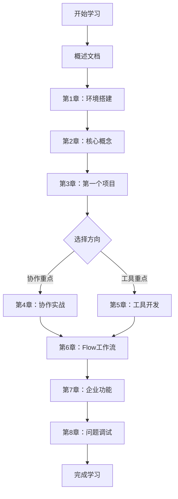

# CrewAI学习实践指南

> 🚀 一份完整的CrewAI多智能体框架学习指南，从基础概念到企业级应用，助你掌握多智能体协作开发

## 📚 文档结构

### 核心文档
- [**概述**](./CrewAI学习指南-概述.md) - 学习指南总览和使用说明
- [**第1章**](./CrewAI学习指南-第1章.md) - CrewAI框架概述与环境搭建  
- [**第2章**](./CrewAI学习指南-第2章.md) - 核心概念详解（Agent、Task、Crew、Flow）
- [**第3章**](./CrewAI学习指南-第3章.md) - 创建第一个智能体项目
- [**第4章**](./CrewAI学习指南-第4章.md) - 多智能体协作实战
- [**第5章**](./CrewAI学习指南-第5章.md) - 工具集成与自定义开发
- [**第6章**](./CrewAI学习指南-第6章.md) - Flow工作流高级应用
- [**第7章**](./CrewAI学习指南-第7章.md) - 企业级功能与最佳实践
- [**第8章**](./CrewAI学习指南-第8章.md) - 常见问题与调试技巧

## 🎯 学习路径

## 📖 使用说明

### 学习方式
1. **按顺序学习**：建议按章节顺序学习，每章都有前置知识依赖
2. **理论+实践**：每章都包含理论讲解和实践代码，务必动手实践
3. **源码分析**：深入理解CrewAI内部机制，提升开发能力

### 文档特色
- 🎮 **游戏化学习**：轻松有趣的讲解方式，让学习如同打游戏般上瘾
- 🔍 **源码深度分析**：基于实际源码进行详细解释
- 📊 **可视化图表**：使用Mermaid图表展示概念关系
- 💡 **实战案例**：每章都有完整的实践项目
- 🛠️ **最佳实践**：总结企业级开发经验

## 🔧 前置要求

- **Python 3.10+**
- **基础编程经验**
- **API使用经验**（推荐）
- **AI/LLM基础概念**（推荐）

## 🚀 快速开始

1. 从 [概述文档](./CrewAI学习指南-概述.md) 开始了解整体框架
2. 跟随 [第1章](./CrewAI学习指南-第1章.md) 完成环境搭建
3. 按顺序学习各章节内容
4. 完成每章的实践练习

## 📞 获取帮助

- 查阅相关章节和官方文档
- 在CrewAI社区论坛搜索问题
- 参与开源项目贡献

---

**开始你的CrewAI学习之旅吧！** 🎉
